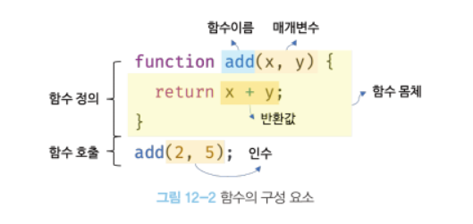

# 12. 함수

생성일: 2022년 3월 1일 오후 9:00

## 12. 1 함수란?

**→ 입력을 받아 출력을 내보내는 일련의 과정을 정의한 것**

**→ 일련의 과정을 문으로 구현하고 코드블록으로 감싸서 하나의 실행 단위로 정의한 것**



- 함수는 함수 정의를 통해 생성한다.
- 인수(argument)를 매개변수(parameter)를 통해 함수에 전달하면서 함수의 실행을 지시하는 것을 함수호출이라고 한다.

```jsx
// 함수 정의
function add(){
	return x + y;
}

var result = add(2, 5);

// 함수 add에 인수를 전달하고 호출
console.log(result);   // 7
```

---

## 12. 2 함수를 사용하는 이유

**→ 동일한 작업을 반복적으로 하는 것을 피하기 위해서(코드의 재사용)**

**→ 유지보수의 편의성과 가독성을 향상시킨다.**

---

## 12. 3 함수 리터럴

- 자바스크립트 함수는 객체 타입의 값이다
- 함수리터럴은 function 키워드, 함수이름, 매개변수 목록, 함수 몸체로 구성된다.

```jsx
var f = function add(x, y){
	return x + y;
};
```


<aside>
💡 **함수 리터럴은 평가되어 값을 생성하고 그 값은 객체다. 하지만 일반 객체와는 다르게 함수는 호출할 수 있다**.

</aside>

---

## 12. 4 함수 정의

**함수의 정의 방식에는 4가지가 있다.**


### 12. 4. 1 함수 선언문


**→ 함수 선언문은 리터럴과 형태가 동일하지만 이름을 생략 할 수는 없다.**


**→ 함수 선언문은 표현식이 아니라 문이다.**


**→ 기명함수 리터럴을 단독으로 사용시에는 함수 선언문으로 해석하고, 함수 리터럴을 변수에 할당 할 때에는 함수 리터럴 표현식으로 해석한다.**

```jsx
// 기명함수 리터럴을 단독으로 사용하면 함수 선언문으로 해석된다.
// 함수 선언문에서는 함수 이름을 생략 할 수 없다.
function foo(){console.log('foo');}
foo();   // foo

// 함수 리터럴을 피연산자로 사용하면 함수 선언문이 아니라 함수 리터럴 표현식으로 해석된다.
(function bar() {console.log('bar');});
bar();   // referenceError: bar is not defined
```


**자바스크립트엔진은 함수를 호출하기 위해 암묵적으로 함수 이름과 동일한 이름의 식별자를 생성하고 함수 객체를 할당한다.**

### 12. 4. 2 함수 표현식

**함수는 값처럼 변수에 할당 가능하고 프로퍼티의 값도 될 수 있으며 배열의 요소가 될 수도 있다.** 

**이렇듯 값의 성질을 갖는 객체를 일급객체라고 한다.**

→ 함수 리터럴로 생성 된 함수 객체를 변수에 할당 할 수 있는데 이러한 방식을 함수 표현식이라고 한다.

```jsx
var add = function(x, y){
	return x + y;
};

console.log(add(2, 5));  // 7
```

**함수 리터럴의 경우에는 함수 이름을 생략 할 수 있는데 이를 익명함수라고 한다.**

```jsx
// 기명 함수 표현식
var add = function foo(x, y){
	return x + y;
};
// 함수 객체를 가리키는 식별자로 호출
console.log(add(2, 5));   // 7

// 함수 이름으로 호출하면 referenceError가 발생함
// 함수 이름은 함수 몸체 내부에서만 유효한 식별자이다.
console.log(foo(2, 5));  // referenceError
```

### 12. 4. 3 함수  생성 시점과 함수 호이스팅

```jsx
// 함수 참조
console.dir(add);   // f add(x, y)
console.dir(sub);   // undefined

// 함수 호출
console.log(add(2, 5));  // 7
console.log(sub(2, 5));  // typeError

// 함수 선언문
function add(x, y){
	return x + y;
}

// 함수 표현식
var sub = function(x, y) {
	return x - y;
};
```

함수 선언문으로 정의한 함수와 함수 표현식으로 정의한 함수의 생성 시점은 다르다

**→ 선언문의 경우 런타임 이전에 먼저 실행되기 때문에 함수 선언문이 코드의 선두로 끌어 올려진 것 처럼 동작하게 된다. 이를 함수 호이스팅이라고 한다.**

함수 호이스팅과 변수 호이스팅에는 차이가 있는데, 변수 호이스팅은 undefined로 초기화 되지만 함수 호이스팅의 경우 함수 객체로 초기화된다.

### 12. 4. 4 Function 생성자 함수

Function 생성자 함수로 함수를 생성하는 방식은 일반적이지도 바람직하지도 않다ㅣ.

### 12. 4. 5 화살표 함수

```jsx
// 화살표 함수
const add = (x, y) => x + y;
console.log(add(2, 5)); // 7
```

---

## 12. 5 함수 호출

### 12. 5. 1 매개변수와 인수

- 함수를 실행하기 위해 함수 내부로 값을 전달하고자 할 때에는 매개변수를 통해 인수를 전달한다.
- 인수는 표현식이여야하며, 개수와 타입에 제한이 없다.


<매개변수가 생성되는 단계>

1. 함수 호출
2. 암묵적으로 매개변수 생성
3. undefined로 초기화 된 뒤 인수 순서대로 할당

→ 매개변수의 스코프는 함수 내부이다.

```jsx
function add(x, y){
	console.log(x, y)   // 2 5
  return x + y;
}

add(2, 5);
// add의 매개변수는 함수 몸체에서만 참조할 수 있다.
console.log(x, y); // referenceError x is not defined
```

- 함수는 매개변수와 인수의 수가 일치하는지 체크하지 않기 때문에 개수가 일치하지 않더라도 에러가 발생되지는 않는다.
- 인수가 부족해서 인수가 할당되지 않은 값은 undefined다.

```jsx
function add(x, y){
	return x + y;
}
console.log(add(2));   // NaN -> 매개변수 y는 인수로 전달되지 않았기 때문에 undefined이고
                       // 2 + undefined 이므로 NaN을 반환한다.
console.log(add(2, 3, 4)); // 매개변수보다 인수가 많은 경우 초과된 인수는 무시된다.
                           // (arguments 객체의 프로퍼티로 보관됨)
```

### 12. 5. 2 인수 확인

자바스크립트의 경우 인수와 매개변수의 개수 일치여부를 확인하지 않고, 매개변수의 타입을 사전에 지정 할 수 없기 때문에 적절한 인수가 전달 되었는지 확인해야한다.


인수가 전달되지 않은 경우에는 단축평가로 매개변수에 기본값을 할당 할 수도 있다.


ES6에 도입 된 매개변수 기본값을 사용하면 인수체크 및 초기화를 간소화 할 수 있다.


→ 단 매개변수 기본값은 인수가 undefined 인 경우와 전달되지 않았을 경우에만 유효하다.

### 12. 5. 3 매개변수의 최대 개수

함수의 매개변수는 개수가 많아질 수록 순서가 헷갈리기 때문에 개수는 적을 수록 좋다.

→ 매개변수는 3개 이상 넘지 않는 것을 권고함

### 12. 5. 4 반환문

함수는 return 키워드와 표현식으로 이루어진 반환문으로 함수 실행 결과를 외부로 반환 할 수 있다.

```jsx
function multiply(x, y){
	return x * y;   // 반환문
}
var result = multiply(3, 5);
console.log(result); // 15
```

<반환문의 역할>

1. 함수의 실행을 중단하고 함수 몸체를 빠져나간다.
2. 반환문은 return 키워드 뒤에 오는 표현식을 평가해 반환한다(return 뒤에 반환값으로 사용 할 표현식을 명시적으로 지정하지 않으면 undefined가 반환된다.)

```jsx
function foo(){
   // 반환문을 생략하면 암묵적으로 undefined가 반환된다.
}

console.log(foo());   // undefined;
```


→ 반환문은 함수 몸체 내부에서만 사용 할 수 있음

---

## 12. 6 참조에 의한 전달과 외부상태의 변경


→ 객체의 복사본을 새롭게 생성해 객체를 불변객체로 만들어 사용하면 값이 변경되는 부작용을 막을 수 있다.

---

## 12. 7 다양한 함수의 형태

### 12. 7. 1 즉시 실행 함수

- 즉시 실행 함수는 한 번만 호출되고 다시 호출 할 수 없다. 일반적으로 익명함수를 사용한다.
- 즉시 실행 함수는 반드시 그룹연산자로 감싸야 한다.
- 즉시 실행 함수도 일반함수와 같이 값을 반환 할 수 있고 인수를 전달할 수도 있다.

```jsx
(function(){
	var a = 3;
  var b = 5;
  return a * b;
}());

// 즉시 실행 함수도 일반함수처럼 값을 반환 할 수 있고, 인수를 전달 할 수 있다.
var res = (function(a, b){
  return a * b;
}(3, 5));
```

### 12. 7. 2 재귀 함수

- 재귀함수는 자기 자신을 호출한다.
- 반복되는 처리를 위해 사용한다.
- 재귀함수는 자신을 무한 재귀호출하기 때문에 호출을 멈출 수 있는 탈출 조건을 만들어야한다.

```jsx
function countdown(n){
	if(n < 0) return;
  console.log(n);
  countdown(n-1);  // 재귀호출
}
countdown(10);
```

→ 반복문을 사용해도 되지만 더 직관적으로 이해하기 쉬울 때만 한정적으로 사용해야한다.

### 12. 7. 3 중첩 함수

- 함수 내부에 정의된 함수를 중첩함수 또는 내부함수라고 한다.
- 중첩함수는 외부함수를 돕는 헬퍼의 역할을 한다.
- 외부함수 내에서만 호출 할 수 있다.

```jsx
function outer(){
	var x = 1;

// 중첩 함수
function inner(){
	var y = 2;
  // 외부 함수의 변수를 참조 할 수 있다.
  console.log(x + y);   // 3
	}
  inner();
}
outer();
```

### 12. 7. 4 콜백 함수

- 함수의 매개변수를 통해 다른 함수의 내부로 전달되는 함수를 콜백함수라고 하고, 매개변수를 통해 함수의 외부에서 콜백함수를 전달받은 함수를 고차함수라고 한다.


→ 콜백함수도 중첩 함수와 같이 헬퍼함수의 역할을 하지만 중첩함수는 고정 되어 있어 교체하기 곤란한 반면, 콜백함수는 함수 외부에서 고차함수 내부로 주입해서 자유롭게 교체 할 수 있는 장점이 있다.

### 12. 7. 5 순수함수와 비순수 함수

- 외부 상태에 의존하지 않고 변경하지도 않는 함수를 순수함수, 외부 상태에 의존하거나 변경하는 함수를 비순수함수라고 한다.
- 순수함수는 하나 이상의 인수를 전달받고, 인수의 불변성을 유지한다.
- 비순수함수는 함수 외부의 상태를 참조해서 그것을 변경한다.


