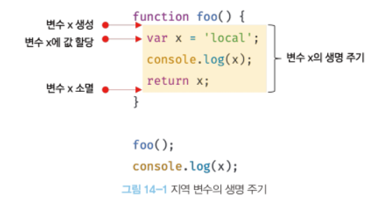

# 14. 전역 변수의 문제점

생성일: 2022년 3월 6일 오후 2:45

## 14. 1 변수의 생명주기

### 14. 1. 1  지역변수의 생명주기

```jsx
funciton foo(){
	var x = 'local';
  console.log(x); // local
  return x;
}

foo();
console.log(x);  // ReferenceError -> 지역변수는 해당 함수가 호출되기 전까지 생성 X
```

**전역변수의 경우 선언문의 위치와 관계 없이 변수 선언이 가장 먼저 실행되지만, 지역변수의 경우 함수의 생명주기와 일치하기 때문에 함수가 종료되면 지역변수도 소멸된다.**

**→ 지역변수의 생명주기는 함수의 생명주기와 같다.**



- 변수란 값을 담기위한 메모리 공간 그 자체 혹은 그것을 식별하기 위해 붙인 이름이다.
- 변수의 생명주기는 메모리 공간이 확보 된 시점부터 메모리 공간이 해제되어 메모리 풀에 반환하는 시점까지다.
- 할당 된 메모리는 더이상 참조되지 않을 때 가비지 콜렉터에 의해 해제 되어 가용 메모리 풀에 반환된다.

```jsx
var x = 'global';

function foo(){
	console.log(x); // 'undefined'
  var x = 'local';
}

foo();
console.log(x);  // global
```

→  foo()가 호출 되는 시점에서 이미 지역변수 'x'가 선언 되었기 때문에 undefined로 초기화 되어 

     있으므로 지역변수 ‘x’를 참조하고 그 값을 출력함 

→ 호이스팅은 스코프의 단위이다. (전역변수는 전역스코프, 지역변수는 지역스코프 내에서)

### 14. 1. 2 전역 변수의 생명주기

- 전역코드는 함수와 달리 호출도 없고, 리턴값도 없이 실행되기 때문에 마지막문이 실행 되어서 더 이상 실행 할 문이 없을 때 종료한다.
- var 키워드로 생성한 전역변수는 전역 객체의 프로퍼티이다. (전역 객체란 어떤 객체보다도 가장 먼저 생성되는 특수한 객체, ES11에서는 globalThis로 통일됨)

       따라서 전역 객체의 생명주기와 일치함


## 14. 2 전역 변수의 문제점

1. **암묵적 결합 : 코드 어디서든 변수를 참조하고 값을 할당 할 수 있기 때문에 의도치 않게 상태가 변경 될 수 있는 위험이 있다.**
2. **긴 생명주기 : 생명주기가 길기 때문에 그만큼 메모리도 오랜 기간 소비하게 된다.**
3. **스코프 체인상에서 종점에 존재 : 변수 검색 시 가장 마지막에 검색 된다는 것을 의미하고 따라서 전역 변수의 검색속도가 가장 느리다.**
4. **네임스페이스 오염 : 파일이 분리 되어 있는 경우라도 해도 하나의 전역 스코프를 공유하기 때문에 같은 이름의 전역변수나 전역함수가 같은 스코프내에 존재하면 문제를 가져 올 확률이 커진다.**

## 14. 3 전역 변수의 사용을 억제하는 방법

- 변수의 스코프는 좁을수록 좋다

### 14. 3. 1 즉시 실행 함수

- 모든 코드를 즉시 실행함수로 감싸면모든 변수는 즉시 실행함수의 지역 변수가 되므로 전역 변수의 사용을 제한 할 수 있다.

```jsx
(function (){
	var foo = 10;  // 즉시 실행 함수의 지역 변수
}());

console.log(foo); // referenceError
```

### 14. 3. 2 네임스페이스 객체

- 전역에 네임스페이스 역할을 담당 할 객체를 생성하고 전역변수처럼 사용하고 싶은 변수를 프로퍼티로 추가하는 방법

```jsx
var MYAPP = {};  // 전역 네임스페이스 객체

MYAPP.person = {
	name: 'Lee';
	address: 'Seoul';
};

console.log(MYAPP.person.name);  // Lee
```

### 14. 3. 3 모듈 패턴

- 클로저를 기반으로 동작하고 전역변수의 억제와 캡슐화를 구현 할 수 있다.
- 외부에 노출하고 싶은 객체나 함수를 반환함 → 외부에 노출되는 멤버는 퍼블릭 멤버라고 한다 그 외에 숨기고 싶은 변수나 함수는 반환하지 않으면 프라이빗 멤버가 된다

```jsx
var Counter = (function(){
// private 변수
var num = 0;

// 외부로 공개할 데이터나 메서드를 프로퍼티로 추가한 객체를 반환
return {
	increase(){
		return ++num;
	},
	decrease(){
		return --num;
	},
};
}());

console.log(Counter.num()); // undefined
console.log(Counter.increase());  // 1
console.log(Counter.increase());  // 2
console.log(Counter.increase());  // 3
console.log(Counter.increase());  // 0

```

### 14. 3. 4 ES6모듈

- 파일 자체의 독자적인 모듈 스코프를 제공하므로 모듈 내에 var로 선언한 변수는 전역변수도, window 객체도 아니다.
- 모던 브라우저에서는 ES6 모듈을 사용 할 수 있다(구형 브라우저에서는 동작하지 않음)

 

```jsx
<script type="module" src="lib.mjs"></script>
<script type="module" src="app.mjs"></script>
```