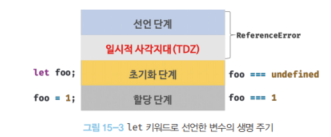

# 15. let, const 키워드와 블록 레벨 스코프 - 22.03.04

---


## var 키워드로 선언한 변수의 문제점

var 키워드로 선언된 변수는 다음 특징이 있다. 

### 변수 중복 선언 허용

var 키워드로 선언한 변수는 같은 스코프내에서 중복 선언을 허용한다.

```jsx
var x = 1;
var y = 2;

//같은 스코프내에서 중복 선언을 허용한다. 
var x = 180;

//초기화문이 없는 중복 선언문은 무시한다. 
var y ;
```

### 함수 레벨 스코프

var 키워드로 선언한 변수는 함수의 코드 블록만 지역 스코프로 인정한다.

```jsx
var x = 1;
if(true){
	//변수 x가 중복 선언된다. 
	var x = 10;
}

//for문에서 선언된 x도 중복 선언된다. 
for(var x = 0 ; x<1;x++){
	 ...
}
```

### 변수 호이스팅

var 키워드로 선언하면 변수 호이스팅에 의해 변수 선언문 이전에 참조할 수 있다. 

프로그램의 흐름에 맞지 않아 가독성을 떨어뜨리고 오류를 발생시킬 수 있다.

```jsx
console.log(foo); //초기화 이전에 실행되기 때문에 undefined

foo = 123; //초기화 

console.log(foo); //초기화된 이후이므로 123 출력

//런타임 이전에 실행되어 undefined 할당
var foo;
```

## let 키워드

### 변수 중복 선언 금지

let 키워드로 이름이 같은 변수를 중복 선언하면 문법에러가 발생한다.

```jsx
let bar = 123;

let bar = 133; //SyntaxError
```

### 블록 레벨 스코프

let 키워드로 선연한 변수는 모든 코드 블록( 함수, if문, for문, while 문 ...) 을 지역 스코프로 인정한다.

```jsx
let foo = 1;

{
	let foo = 2;
	let bar = 3;
}

console.log(foo); //1
console.log(bar); //ReferneceError : bar is not defined
```

전역 변수 foo와 지역 변수 foo를 별개의 변수로 생각한다. 

지역 변수인 bar는 전역에서 참조할 수 없다.

**⇒ 블록 레벨 스코프를 따른다.** 

### 변수 호이스팅

let 키워드 변수는 변수 호이스팅이 발생하지 않는 것처럼 동작한다.

```jsx
console.log(foo); //ReferneceError
let foo;
```

선언이전에 참조시 문법 에러가 발생한다.

<aside>
🖊️ **let 키워드 변수는 선언단계와 초기화 단계가 분리되어 진행된다.** 
런타임 이전에 자바스크립트 엔진에 의해 암묵적으로 선언단계까 실행되지만,
초기화 단계는 변수 선언문에 도달했을 때 실행한다.

</aside>

let 키워드 변수는 스코프 시작 지점부터 초기화 단계까지 변수를 참조할 수 없는데 이 구간을 **일시적 사각지대** 라고 한다. 

```jsx
console.log(foo); //Error

let foo;
conosole.log(foo); //undefined

foo = 1;
console.log(foo); //1
```



**하지만 let 키워드 변수에서 변수 호이스팅이 발생하지 않는 것은 아니다.** 

그렇게 보이는 것!!뿐이다.

```jsx
let foo = 1;
{
	console.log(foo); //ReferenceError
	let foo =2;
}
```

변수 호이스팅이 발생하지 않는다면 전역 변수 foo 값을 출력해야 하는데 호이스팅이 발생하므로 참조 에러가 발생하는 것이다. 

### 전역 객체와 let

let  전역 변수는 전역 객체으 프로퍼티가 아니다. let  전역 변수는 보이지 않는 개념적인 블록 내에 존재하게 된다.  

## const 키워드

상수를 선언하기 위해 사용한다. 

### 선언과 초기화

const 키워드 변수는 반드시 선언과 동시에 초기화를 해야한다.

그렇지 않으면 문법 에러가 발생한다.

```jsx
const foo; //SyntaxError : Missing initializer in const declaration
```

const 키워드 변수도 마찬가지로 블록 레벨 스코프를 가지며, 변수 호이스팅이 발생하지 않는 것처럼 동작한다. 

```jsx
{
	console.log(foo); //ReferenceError
	const foo = 1;
	console.log(foo); //1
}

console.log(foo); //ReferenceError
```

### 재할당 금지

const 키워드는 재할당이 금지된다.

```jsx
const foo = 1;
foo = 2; // TypeError
```

### 상수

**const 키워드는 재할당을 금지할 뿐 <<불변>>을 의미하는 것이 아니다.** 

```jsx
const person  = {
	name : 'lee'
};
//재할당 없이 값을 변경했으므로 괜찮!
person.name = 'kim';

console.log(person);
```

## var vs let vs const

변수 선언에는 기본적으로 const를 사용하고 let은 재할당이 필요한 경우 사용하는 것이 좋다.

**var 키워드는 사용하지 말자!!!!**

**let 키워드**

*재할당이 필요*한 경우 사용하자

**const 키워드** 

*default*로 사용하자!!

> **2022-03-04 TIL** 
1. let 키워드는 중복 선언이 안된다!!
2. const는 재할당이 안되는 거지 값 변경이 안되는 건 아니다
3. 디폴트로 const를 사용하고 재할당을 할 경우에 let을 쓰자
4. var는 버려라!
>
