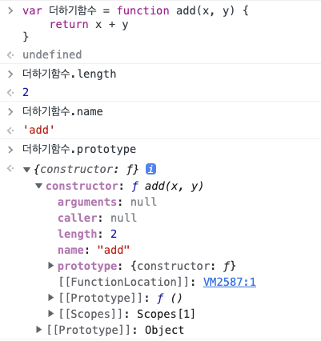

# 딥다이브 12장 함수 발표록 (1)

### 루피님

1. 자바스크립트의 함수는 객체 타입의 값이라는 것을 ‘처음으로' 알았다
2. 중요한 포인트! 함수는 함수 이름으로 호출하는 것이 아니라 함수 객체를 가리키는 식별자로 호출한다!
3. 기명 함수는 상황에 따라 함수 선언문 또는 함수 리터럴 표현식으로 해석된다.
    1. 변수에 할당하는 경우에는 함수 리터럴 표현식 또는 그룹연산자로 하나의 값으로 표현될 떄 함수표현식이 되고
    2. 그 외에는 함수 선언문 또는 객체 리터럴로 볼 수 있다
4. 자바스크립트 엔진은 함수를 호출하기 위해 암묵적으로 함수 이름과 동일한 이름의 식별자를 생성하고 함수 객체를 할당한다

### 열두님

1. 나는 함수가 객체인 것을 알고 있었다.
2. 함수와 객체가 무엇이 다르냐 내게 물으면, “함수는 함수요, 객체는 객체로다"라고 답해왔지만,
일반 객체는 호출이 불가하지만, 함수는 호출할 수 있다의 차이라는 것을 알았.
3. 함수는 함수 객체만의 고유한 프로퍼티를 갖는다.

( 뽀또님: 함수 객체의 프로토타입 안에 다양한 프로퍼티가 존재한다 )

### 명성님

1. 함수 선언은 값이 될수 없는 문, 함수 표현식은 값이 될수 있음
2. 변수에 할당하느냐 안하느냐의 차이지만, 함수 표현식은 값이므로 변수에 할당할 수 있어서 값이 된다.
3. 그리고 써먹을 수 있어야 한다

```jsx
const calledJson = (
	async () => {
		const infoData = await (await fetch(`http://www.naver.com`)).json()
	}
)
```

- 그룹 연산자를 통해서 함수 자체를 값으로 만들었기 때문에 위의 코드는 에러가 나지 않는다
- 여기서 그냥 문과 표현식의 차이를 깊게 알 수 있었다

### 꽁치님

1. 함수가 객체라는 것을 처음 알았다.
    
    
    

### 뽀또님

1. 중복된 횟수에 비례해서 코드 수정에 걸리는 시간이 증가하며, 사람은 실수 하기 마련이므로 실수할 가능성도 높아지므로 중복코드를 억제하고 재사용성을 높이는 유지보수 편의성을 높여야한다.
2. 코드는 동작하는 것만이 존재 목적은 아니다. 코드는 개발자를 위한 문서이기도 하다. **따라서 사람이 이해가능한 코드가 좋은 코드이다.**
3. 매개변수는 순서에 의미가 있다. 따라서 매개변수가 많아지면 함수를 호출할 때 전달해야 할 인수의 순서를 고려해야한다.

### 초생님

1. 함수를 값이라고 생각해본적이 없었는데 객체타입의 값으로 식별자를 통해 호출하는 것을 알았다.
2. 그래서 선언식과 표현식의 차이가 발생하는데 
선언문으로 함수를 선언했을 때는 자바스크립트 엔진이 암묵적으로 함수 이름이랑 똑같은 식별자를 선언 해준는 것을 알았다