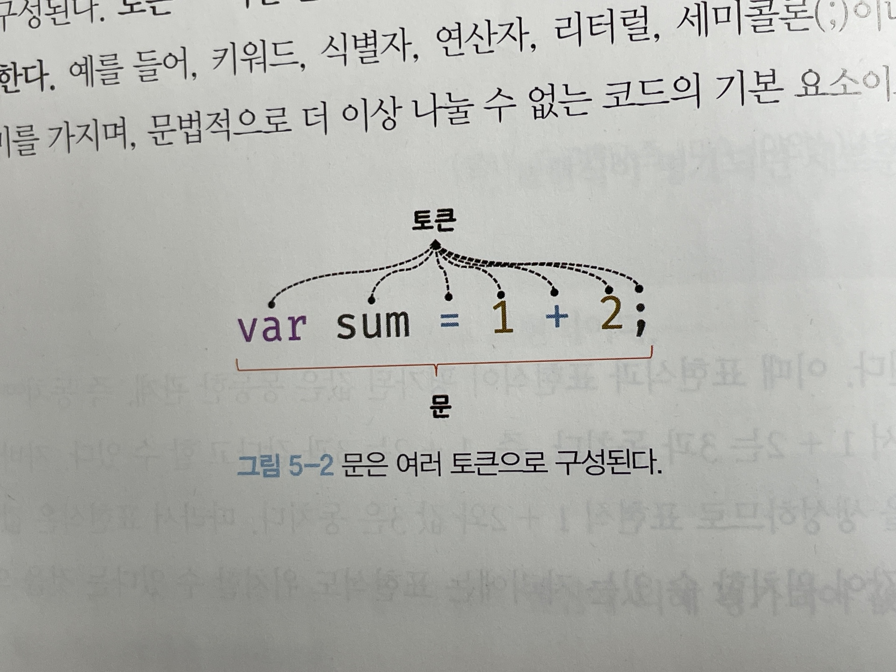
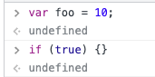
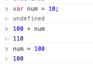

# [JavaScript] 표현식과 문

## 값

---

- **값(value): 표현식(Expression)이 평가되어 생성된 결과**

```jsx
10 + 20; // 30
// 10 + 20 은 평가되어 숫자 값 30을 생성한다
```

⇒ 모든 값은 데이터 타입을 가지며, 메모리에 2진수, 즉 비트의 나열로 저장됨

- 변수는 하나의 값을 저장하기위해 확보한 메모리 공간 자체 또는 그 메모리 공간을 식별하기 위해 붙인 이름
따라서 변수에 할당되는 것은 ‘값'!!

```jsx
var sum = 10 + 20;
// 변수에는 10 + 20 이 평가되어 생성된 숫자값 30이 할당된다
```

## 리터럴

---

- **리터럴(literal): 사람이 이해할 수 있는 문자 또는 약속된 기호를 사용해 값을 생성하는 표기법**
- 리터럴은 사람이 이해할 수 있는 문자 또는 미리 약속된 기호(’’, “”, {}, [], // 등)로 표기한 코드임
자바스크립트 엔진은 코드가 실행되는 시점인 런타임에 리터럴을 평가해 값을 생성함
**즉 리터럴은 값을 생성하기 위해 미리 약속한 표기법**

## 표현식

---

- **표현식(expression): 값으로 평가될 수 있는 문(statement), 즉 표현식이 평가되어 새로운 값을 생성하거나 기존값을 참조함**

```jsx
var score = 100
```

위 예제의 100은 리터럴이고, 리터럴 100은 런타임 때 평가되어 값을 생성하므로 이 자체가 표현식임

```jsx
var score = 50 + 50
```

50 + 50 은 리터럴과 연산자로 이루어져 있음
50 + 50 은 평가되어 숫자값 100 을 생성하므로 표현식!

> 이처럼 표현식은 리터럴, 식별자(변수, 함수 등), 연산자, 함수 호출 등의 조합으로 이루어질 수 있음
다양한 표현식은 값으로 평가된다는 점에서 모두 동일함
> 
> 
> **⇒ 즉, 값으로 평가될 수 있는 문은 모두 표현식**
> 

## 문

---

- **문(statement): 프로그램을 구성하는 기본 단위이자 최소 실행 단위**

> 문은 여러 토큰으로 구성됨
> 
> 
> **토큰(token)이란 문법적인 의미를 가지며, 문법적으로 더 이상 나눌 수 없는 코드의 기본 요소를 의미함**
> ex. 키워드, 식별자, 연산자, 리터럴, 세미콜론(;), 마침표(.) 등의 특수기호는 문법적인 의미를 가지며, 문법적으로 더 이상 나눌 수 없는 기본 요소는 모두 토큰임
> 
> 
> 
- 문은 선언문, 할당문, 조건문, 반복문 등으로 구분됨

```jsx
// 변수 선언문
var x;

// 할당문
x = 5

// 함수 선언문
function foo() { ... }

// 조건문
if ( x > 1 ) { console.log(x) }

// 반복문
for (var i = 0; i < 2; i++) { console.log(i); ]
```

## 세미콜론과 세미콜론 자동 삽입 기능

---

- 세미콜론(;)은 문의 종료를 나타냄
- 단 0개 이상의 문을 중괄호로 묶은 코드블록({ ... })은 세미콜론을 붙이지 않음
    
    ```jsx
    if ( x > 1 ) {
    	console.log(x)
    }
    ```
    
- 세미콜론은 옵션이기 때문에 생략이 가능함

## 표현식인 문과 표현식이 아닌 문

---

- 표현식은 문의 일부일 수도 있고 그 자체로 문이 될 수도 있음

```jsx
// 변수 선언문은 값으로 평가될 수 없으므로 표현식이 아니다.
var x;

// 1, 2, 1+2, x = 1+2 는 모두 표현식이다.
// x = 1 + 2 는 표현식이면서 완전한 문이기도 하다.
x = 1 + 2
```

- 표현식인 문: 값으로 평가될 수 있는 문
    - ex) 할당문
- 표현식이 아닌 문: 값으로 평가될 수 없는 문
    - ex) 변수 선언문

> **표현식인 문과 표현식이 아닌 문을 구별하는 가장 간단하고 명료한 방법은 변수에 할당해 보는 것!!**
> 
> 
> ---
> 
> ```jsx
> var foo = var x; // SyntaxError
> 
> var x;
> ```
> 
> - 위에처럼 표현식이 아닌 문은 값처럼 사용할 수 없음
> - 즉 변수 선언문은 표현식이 아님
> 
> ```jsx
> x = 100
> 
> var foo = x = 100;
> console.log(foo) // 100
> ```
> 
> - 할당문은 그 자체가 표현식이지만 완전한 문이기도 함. 즉 할당문은 표현식
> - 표현식인 문은 값처럼 변수에 할당할 수 있음

<aside>
💻 크롬 개발자도구에서 표현식이 아닌 문을 실행하면 언제나 Undefined 를 출력함

⇒ 이를 **완료값**이라고 함



크롬 개발자 도구에서 표현식인 문을 실행하면 언제나 평가된 값을 반환함



</aside>