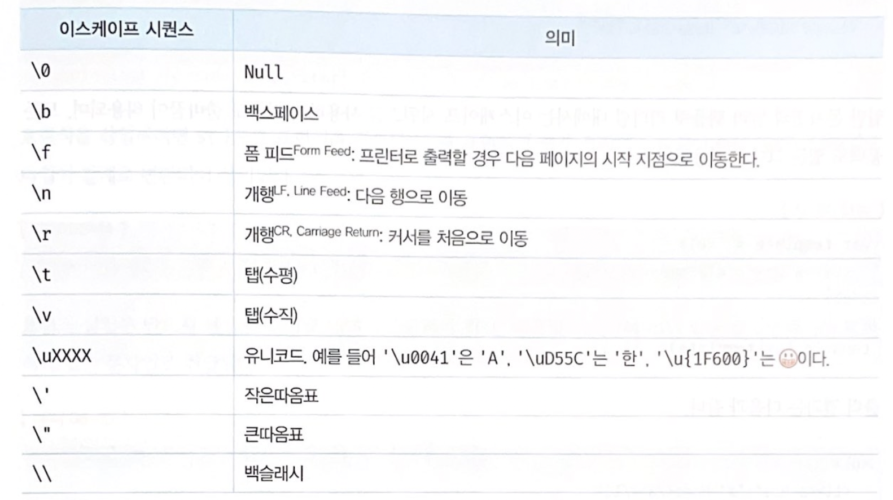

# [JavaScript] 데이터 타입

# 숫자(Number) 타입

(JavaScript Deep Dive 60쪽)

- 정수, 실수, 2진수, 8진수, 16진수, 음수 등등 모두 하나의 Number 타입으로 취급됨

- 추가 Number 타입
    - Infinity : 양의 무한대
    - -Infinity : 음의 무한대
    - NaN : 산술 연산 불가

```jsx
console.log(10 / 0) // Infinity
console.log(10 / -0) // -Infinity
console.log(1 * 'string') // NaN
```

# 문자열(String) 타입

(JavaScript Deep Dive 61쪽)

- '작은따옴표' or '큰따옴표' or `백틱` 으로 감싸면 문자열로 취급됨
- 일반 문자열 내에서는 줄바꿈이 허용되지 않음



- 줄바꿈이 필요하거나 등등에는 이런 이스케이프 시퀀스를 사용

# 불리언(Boolean) 타입

true or false

# Undefined 타입

```jsx
var foo;
console.log(foo) // undefined
```

변수를 선언한 이후 값을 할당하지 않은 변수를 참조하면 undefined 가 반환됨

변수가 없는 초기화된 값은 undefined 이지만 개발자가 의도적으로 undefined 를 할당하는 것은 권장X

# Null 타입

- null 타입의 값은 null 이 유일함 ( Null, NULL 과는 다름 )
- 프로그래밍에서 null 은 변수에 값이 없음을 의도적으로 명시할 때 사용함

# Symbol 타입

- ES6 에서 도입된 7번째 데이터 타입으로 변경 불가능한 원시 타입의 값
- 다른 값과 중복되지 않는 유일무이한 값이기 때문에 충돌 위험이 없는 유일한 프로퍼티 키를 만들기 위해 사용함

### Symbol 함수

심벌 값은 Symbol 함수를 호출하여야만 생성할 수 있고, 이 때 생성된 심벌 값은 외부로 노출되지 않아 확인할 수 없으며, 다른 값과절대 중복되지 않는 유일무이한 값임

```jsx
// Symbol 함수를 호출하여 유일무이한 심벌 값을 생성한다.
const mySymbol = Symbol()
console.log(typeof mySymbol) // symbol

// 심벌 값은 외부로 노출되지 않아 확인할 수 없다.
console.log(mySymbol) // Symbol()
```

( 자세한 설명은 JavaScript Deep Dive 605쪽 )

# 객체 타입

- 자바스크립트의 데이터 타입은 크게 원시 타입과 객체 타입으로 분류됨
- 앞서 살펴본 6가지 타입 이외의 모든 값은 모두 객체 타입

# 데이터 타입의 필요성

---

### 데이터 타입에 의한 메모리 공간의 확보와 참조

```jsx
var score = 100;
```

> 위 코드가 실행되면 컴퓨터는 숫자값 100을 저장하기 위해 메모리 공간을 확보한 다음, 확보된 메모리에 숫자값 100을 2진수로 저장함
자바스크립트 엔진은 변수에 할당되는 값의 데이터 타입에 따라 확보해야 할 메모리 공간의 크기가 결정됨
> 

### 데이터 타입에 의한 값의 해석

데이터 타입이 필요한 이유

1. 값을 저장할 때 확보해야 하는 메모리 공간의 크기를 결정하기 위해
2. 값을 참조할 때 한 번에 읽어 들여야 할 메모리 공간의 크기를 결정하기 위해
3. 메모리에서 읽어 들인 2진수를 어떻게 해석할지 결정하기 위해

<aside>
💡 **동적 타입 언어 JavaScript**

- 정적 타입 언어는 변수의 타입을 변경할 수 없고, 선언한 타입에 맞는 값만 할당할 수 있어서 컴파일 시점에 **'타입 체크'**를 하기 때문에 안정성을 확보함
**- 자바스크립트의 변수는 선언이 아닌 할당에 의해 타입이 결정(타입 추론type inference)된다. 그리고 재할당에 의해 변수의 타입은 언제든지 변할 수 있음**

✔︎ 변수는 꼭 필요한 경우에 한해 제한적으로 사용한다. 변수 남발X
✔︎ 변수의 스코프는 최대한 좁게 만든다.
✔︎ 전역 변수는 최대한 사용하지 않는다.
✔︎ 변수보다는 상수를 사용의 값의 변경을 억제한다. (const 키워드)
✔︎ 변수 이름은 변수의 목적이나 의미를 파악할 수 있도록 짓는다.

</aside>