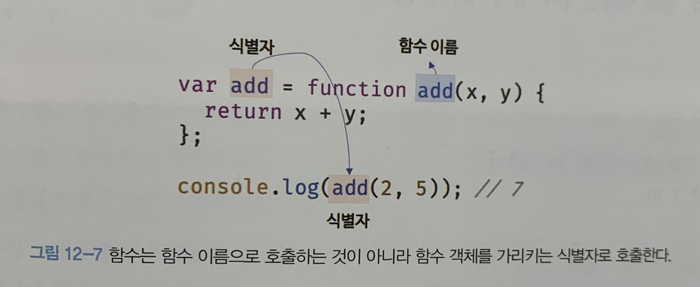

# [JavaScript] 함수(1)

## 함수란?

---

```jsx
function add(x, y) {
	return x + y
}

add(2, 5) // 7
```

- 프로그래밍 언어의 함수는 일련의 과정을 문(statement)으로 구현하고 코드 블록으로 감싸서 하나의 실행 단위로 정의한 것
- 함수 내부로 입력을 전달받는 변수를 매개변수(parameter), 입력을 인수(argument), 출력을 반환값(return value)이라 함

## 함수를 사용하는 이유

---

- 함수는 한번 정의해서 여러번 재사용이 가능하기 때문에 유용함
- 코드의 중복을 억제하고 유지보수의 편의성을 높이고, 실수의 가능성을 줄여 코드의 신뢰성을 높임

## 함수 리터럴

---

- 자바스크립트의 함수는 객체 타입의 값이라서, 객체 리터럴로 선언할 수 있고 변수에 함수 리터럴을 할당할 수도 있음
    
    ```jsx
    var f = function add(x, y) {
    	return x + y
    }
    ```
    
- 리터럴은 값을 생성하기 위한 표기법임
- 함수 리터럴을 변수에 할당한다는 것에서, 함수 리터럴도 평가되어 값을 생성하며, 이 값은 객체이기 때문에,
⇒ **함수는 객체다!!!**
- 일반 객체와 달리 함수는 호출할 수 있고 고유한 프로퍼티를 가짐
    
    ( 18장 “함수와 일급 객체"에서..)
    

## 함수 정의

---

> **함수를 정의하는 4가지 방식**
> 
> 
> ---
> 
> 1. 함수 선언문
>     
>     ```jsx
>     function add(x, y) {
>     	return x + y
>     }
>     ```
>     
> 2. 함수 표현식
>     
>     ```jsx
>     var add = function (x, Y) {
>     	return x + y
>     }
>     ```
>     
> 3. `Function` 생성자 함수
>     
>     ```jsx
>     var add = new Function('x', 'y', 'return x + y')
>     ```
>     
> 4. 화살표 함수(ES6)
>     
>     ```jsx
>     var add = (x, y) => x + y
>     ```
>     

### 1. 함수 선언문

- 함수 선언문을 사용해 함수를 정의하는 방식
- 함수 리터럴과 형태가 동일하나, **함수 선언문은 함수 이름을 생략할 수 없음!!**
- 함수 선언문은 ‘표현식이 아닌 문'임
    
    ```jsx
    // 함수 선언문은 표현식이 아닌 문이므로 변수에 할당할 수 없다
    // 하지만 함수 선언문이 변수에 할당되는 것처럼 보인다
    var add = function add(x, y) {
    	return x + y
    }
    
    console.log(add(2, 5)) // 7
    ```
    
    - 본래 ‘표현식이 아닌 문'은 변수에 할당할 수 없기 때문에 함수 선언문 또한 변수에 할당할 수 없을 것 같지만
    위의 코드에서 함수 선언문은 함수 리터럴로도 해석될 여지가 있기 때문에 변수에 할당이 가능함
    - 즉, 자바스크립트 엔진은 함수 리터럴을 단독으로 사용하면 → **함수 선언문**으로 해석,
    함수 리터럴을 변수에 할당하거나 피연산자로 사용하면 → **함수 리터럴 표현식**으로 해석

```jsx
function foo() { console.log('foo') }
foo()  // foo

(function bar() { console.log('bar') })
bar()  // ReferenceError: bar is not defined
```

- 이 코드에서 `foo` 함수는 함수 리터럴이 단독으로 사용되어 함수 선언문으로 해석
- `bar` 함수는 그룹 연산자의 피연산자로 들어가 함수 리터럴 표현식으로 해석됨
    
    → 그룹연산자 `()` 의 피연산자는 값으로 평가될 수 있는 표현식이어야 하지만, 표현식이 아닌 문인 함수 선언문은 피연산자로 사용할 수 없음
    

> **왜 이렇게 될까?**
> 
> 
> ---
> 
> 자바스크립트 엔진은 **함수 선언문을 해석해 함수 객체를 생성함**
> 
> 이때 함수 이름은 함수 몸체 내부에서만 유효한 식별자이지, 함수 이름과 별도로 생성된 ‘함수 객체'를 식별할 식별자가 필요하게 되고,
> **함수 객체를 가리키는 식별자가 따로 선언되지 않았다면 암묵적으로 함수 이름과 동일한 식별자를 생성하고, 거기에 함수 객체를 할당함**
> 
> 
> 

### 2. 함수 표현식

- 자바스크립트의 함수는 객체 타입의 값이고, 
변수에 할당할 수도, 프로퍼티 값이 될수도 있고, 배열의 요소가 될 수도 있음
- 이처럼 값의 성질을 갖는 객체를 일급 객체라고 하며, **자바스크립트의 함수는 일급 객체임**
- 함수는 일급 객체이므로, 함수 리터럴로 생성한 함수 객체를 변수에 할당할 수 있음 → 이러한 함수 정의 방식을 함수 표현식이라고 함
- 변수에 할당하는 함수 리터럴의 함수 이름은 생략할 수 있고, 이러한 함수를 **익명 함수**라고 하고
함수의 이름을 선언하면 **기명 함수**라고 함

<aside>
💻 **함수 선언문은 “표현식이 아닌 문"이고, 함수 표현식은 “표현식인 문"이다.**

</aside>

### 함수 생성 시점과 함수 호이스팅

```jsx
// 함수 참조
console.dir(add) // f add(x, y)
console.dir(sub) // undefined

// 함수 호출
console.log(add(2, 5)) // 7
console.log(sub(2, 5)) // TypeError: sub is not a function

// 함수 선언문
function add(x, y) {
	return x + y
}

// 함수 표현식
var sub = function (x, y) {
	return x - y
}
```

- 위 코드처럼 함수 선언문으로 정의한 함수는 함수 선언문 이전에 호출할 수 있음
- 반면 함수 표현식으로 정의한 함수는 함수 표현식 이전에 호출할 수 없음
    
    **⇒ 함수 선언문으로 정의한 함수와 함수 표현식으로 정의한 함수의 생성 시점이 다르기 때문!!**
    

> **Why?**
> 
> 
> ---
> 
> 모든 선언문과 같이 함수 선언문도 런타임 이전에 자바스크립트에 의해 먼저 실행됨
> 
> **→ 즉, 함수 선언문으로 함수를 정의하면 런타임 이전에 함수 객체가 먼저 생성됨 (함수 객체로 초기화가 이루어짐)**
> 
> → 따라서 함수 선언문 이전에 함수를 참조할 수 있고, 이로 인해 **함수 호이스팅**이 발생함
> 
> `var` 키워드로 선언한 변수 또한 런타임 이전에 먼저 실행되어 식별자를 생성하지만 `**undefined` 로 초기화**되기 때문에
> `var` 키워드로 정의한 함수 표현식은 `var` 키워드 이전에 ‘참조’하면 `undefined` 가 되고,
> 때문에 `var` 키워드 이전에 ‘호출’하면 에러가 발생함
> 
> **⇒ 즉, 함수 표현식의 함수 리터럴도 변수 할당문이 실행되는 시점(런타임)에 평가되어 함수 객체가 됨**
> 
> 따라서 엄밀히 말하면 `var` 키워드에 함수 표현식을 할당한 것은 함수 호이스팅이 아닌, ‘변수 호이스팅'이 발생함
> 

<aside>
💻 함수 호이스팅은 함수를 호출하기 전에 반드시 함수를 선언해야 하는 당연한 규칙을 무시하기 때문에,
함수 선언문 대신 함수 표현식을 사용할 것을 권장하기도 한다.

</aside>

### 3. Function 생성자 함수

- 자바스크립트가 제공하는 빌트인 함수인 `Function` 생성자 함수에 매개변수 목록과 함수 몸체를 문자열로 전달하여 `new 연산자` 와 함께 호출하면
함수 객체를 생성해서 반환함

```jsx
var add = new Function('x', 'y', 'return x + y')

console.log(add(2, 5)) // 7
```

- `Function` 생성자 함수로 함수를 생성하는 방식은 일반적이지도 않고 바람직하지도 않음
    
    ( 클로저(closure)를 생성하지도 않고, 함수 선언문 or 함수 표현식으로 생성한 함수와도 다르게 동작함)
    

### 4. 화살표 함수

- 화살표 함수는 생성자 함수로 사용할 수 없고,
- 기존 함수와 `this` 바인딩 방식도 다르고,
- `prototype` 프로퍼티가 없으며,
- `arguments` 객체를 생성하지 않음

( 26.3절 “화살표 함수"에서.. )

## 함수 호출

---

### 매개변수와 인수

- 함수를 실행하기 위해 외부에서 내부로 값을 전달해야할 때, 매개변수(parameter, 인자)를 통해 인수(argument)를 전달한ㄷ
- 인수는 값으로 표현될 수 있는 표현식이어야 한다

```jsx
// 함수 선언문
function add(x, y) {
	return x + y
}

// 함수 호출
// 인수 1과 2가 매개변수 x와 y에 순서대로 할당되로 함수 몸체의 문들이 실행된다
var result = add(1, 2)
```

- 매개변수는 함수를 정의할 떄 선언하며, 함수 몸체 내부에서 변수와 동일하게 취급된다.
- 함수가 호출되면 함수 몸체 내에서 암묵적으로 매개변수가 생성되고 일반 변수와 마찬가지로 `undefined` 로 초기화된 이후 인수가 순서대로 할당된다.
- 매개변수는 함수 몸체 내부에서만 참조할 수 있기 때문에, 매개변수의 스코프는 함수 내부다

```jsx
function add(x, y) {
	return x + y
}

console.log(add(2)) // NaN
```

- 매개변수의 개수만큼 인수를 전달하지 않아도 에러가 발생하지는 않는다.
    
    → 다만 인수가 전달되지 않은 매개변수는 `undefined` 가 된다.
    

```jsx
function add(x, y) {
	return x + y
}

console.log(add(2, 5, 10)) // 7
```

- 필요한 매개변수의 개수보다 인수가 더 많이 들어가도 에러가 뜨지 않으며, 버려지지 않고 암묵적으로 `arguments` 객체의 프로퍼티로 보관된다.

### 인수 확인

```jsx
function add(x, y) { return x + y }

console.log(add(2))          // NaN
console.log(add('a', 'b'))   // 'ab'
```

- 위의 코드는 문법상 어떠한 문제도 없이 자바스크립트 엔진은 위 코드를 실행한다
    
    > 1) 자바스크립트 함수는 매개변수와 인수의 개수가 일치하는지 확인하지 않는다.
    > 
    > 
    > 2) 자바스크립트는 동적 타입 언어다. 따라서 자바스크립트 함수는 매개변수의 타입을 사전에 지정할 수 없다.
    > 
1. `**typeof` 연산자 활용**
    
    ```jsx
    function add(x, y) {
    	if (typeof x !== 'number' || typeof y !== 'number') {
    		// 매개변수를 통해 전달된 인수의 타입이 부적절한 경우 에러를 발생시킨다.
    		throw new TypeError('인수는 모두 숫자값이어야 합니다.')
    	}
    	return x + y
    }
    ```
    
    - 위 코드와 같은 방법으로 함수에 들어오는 인수의 타입을 체크할 수 밖에 없다
2. **단축평가 활용**
    
    ```jsx
    function add(a, b, c) {
    	a = a || 0
    	b = b || 0
    	c = c || 0
    	return a + b + c
    }
    ```
    
    - 또는 입력되지 않은 인수의 기본값을 단축평가를 활용하여 할당할 수 있다
3. **ES6 매개변수 기본값**
    
    ```jsx
    function add(a = 0, b = 0, c = 0) {
    	return a + b + c
    }
    ```
    

### 매개변수의 최대 개수

- ECMAScript 사양에 매개변수의 최대 개수에 대해 명시적으로 제한되어 있지는 않다.
- 다만, 매개변수는 순서에 의미가 있고, 매개변수가 많아지면 전달해야할 인수의 순서도 고려해야 하기에
실수의 가능성을 줄이기 위해선 **매개변수 또한 0개에 가까울수록 좋다**

### 반환문

1. 반환문은 함수의 실행을 중단하고 함수 몸체를 빠져나가기 때문에 반환문 이후의 문은 무시된다.
    
    ```jsx
    function multiply(x, y) {
    	return x * y
    	// 반환문 이후의 문은 실행되지 않고 무시된다
    	console.log('실행되지 않는다')
    }
    ```
    
2. 함수 호출은 표현식이기 때문에, `return` 키워드가 반환하는 표현식의 평가 결과, 즉 반환값으로 평가됨
3. `return` 을 포함한 반환문은 생략할 수 있다. 이때 암묵적으로 `undefined` 를 반환한다.
4. 반환문은 함수 몸체 내부에서만 사용할 수 있다. 전역에서 반환문을 사용하면 문법 에러가 발생한다.
    
    <aside>
    💻 Node.js 는 모듈 시스템에 의해 파일별로 독립적인 파일 스코프를 가지기 때문에,
    Node.js 환경에서는 파일의 가장 바깥 영역에 반환문을 사용해도 에러가 발생하지 않는다!
    
    </aside>