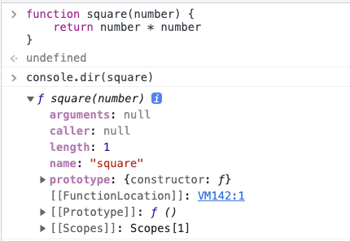
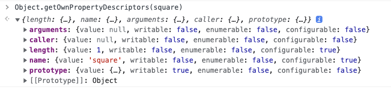

# [JavaScript] 함수와 일급 객체

# 일급 객체

---

<aside>
💻 다음과 같은 조건을 만족하는 객체를 **일급 객체** 라고 한다.

---

1. 무명의 리터럴로 생성할 수 있다. 즉, 런타임에 생성이 가능하다.
2. 변수나 자료구조(객체, 배열 등)에 저장할 수 있다.
3. 함수의 매개변수에 전달할 수 있다.
4. 함수의 반환값으로 사용할 수 있다.

⇒ 자바스크립트의 함수는 위 조건을 모두 만족하므로 일급객체다!!

</aside>

- 예시
    
    ```jsx
    // 1. 함수는 무명의 리터럴로 생성할 수 있다.
    // 2. 함수는 변수에 저장할 수 있다.
    // 런타임(할당 단계)에 함수 리터럴이 평가되어 함수 객체가 생성되고 변수에 할당된다.
    const increase = function (num) {
    	return ++num
    }
    
    const decrease = function (num) {
    	return --num
    }
    
    // 2. 함수는 객체에 저장할 수 있다.
    const auxs = { increase, decrease }
    
    // 3. 함수의 매개변수에 전달할 수 있다.
    // 4. 함수의 반환값으로 사용할 수 있다.
    function makeCounter(aux) {
    	let num = 0
    
    	return function() {
    		num = aux(num)
    		return num
    	}
    }
    
    // 3. 함수는 매개변수에게 함수를 전달할 수 있다.
    const increaser = makeCounter(auxs.increase)
    console.log(increaser()) // 1
    console.log(increaser()) // 2
    
    const decreaser = makeCounter(auxs.decrease)
    console.log(decreaser()) // -1
    console.log(decreaser()) // -2
    ```
    
- 함수가 일급 객체라는 것은 함수를 객체와 동일하게 사용할 수 있다는 의미다.
    
    ⇒ 근데 이미 함수가 객체다!!!
    
    - 객체는 값이므로 함수는 값과 동일하게 취급할 수 있다.
    - 따라서 함수는 값을 사용할 수 있는 곳이라면 어디든지 리터럴로 정의할 수 있으며 런타임에 함수 객체로 평가된다.
        
        ex) 변수 할당문, 객체의 프로퍼티값, 배열의 요소, 함수 호출의 인수, 함수 반환문
        
- 일급 객체로서 함수가 갖는 가장 큰 특징은,
**일반 객체와 같이 함수의 매개변수에 전달할 수 있으며, 함수의 반환값이 될 수도 있다는 점!!**
    
    ⇒ 함수형 프로그래밍을 가능케 하는 자바스크립트의 장점!
    

# 함수 객체의 프로퍼티

---

- 함수 객체의 내부를 파헤쳐보자
    
    
    
    함수 객체의 내부는 이렇게 생겼다.
    
- square 함수의 모든 프로퍼티의 프로퍼티 어트리뷰트를 `Object.getOwnPropertyDescriptors` 메서드로 확인해보자
    
    
    

- `__proto__` 는 square 함수의 프로퍼티가 아니다
    
    
    

- `__proto__` 는 `Object.prototype` 객체의 접근자 프로퍼티다.
- square 함수는 `Object.prototype` 객체로부터 `__proto__` 접근자 프로퍼티를 상속받는다.
    
    
    

> **이처럼 arguments, caller, length, name, prototype 프로퍼티는 모두 함수 객체의 프로퍼티다.**
> 
> 
> (이들 프로퍼티는 일반 객체에는 없는 함수 객체 고유의 프로퍼티)
> 
> 하지만 `__proto__` 는 접근자 프로퍼티이며, 함수 객체 고유의 프로퍼티가 아니라, `Object.prototype` 객체의 프로퍼티를 상속받은 것을 알 수 있다.
> 
> `Object.prototype` 객체의 프로퍼티는 모든 객체가 상속받아 사용할 수 있다.
> 
> 즉, `Object.prototype` 객체의 `__proto__` 접근자 프로퍼티는 모든 객체가 사용할 수 있다.
> 
> (자세한건 19장 프로토타입에서..)
> 

## 1. arguments 프로퍼티

- 함수 객체의 arguments 프로퍼티 값은 arguments 객체다.
- arguments 객체는 **함수 호출시 전달된 인수(argument)들의 정보를 담고 있는 순회 가능한(iterable) 유사 배열 객체**이며,
**함수 내부에서 지역 변수처럼 사용된다.**

- 자바스크립트는 함수의 매개변수와 인수의 개수가 이맃하는지 확인하지 않는다.
다라서 함수 호출시 매개변수 개수만큼 인수를 전달하지 않아도 에러가 발생한다.
    
    ```jsx
    function multiply(x, y) {
    	console.log(arguments)
    	return x + y
    }
    
    console.log(multiply())         // NaN
    console.log(multiply(1))        // NaN
    console.log(multiply(1, 2))     // 2
    console.log(multiply(1, 2, 3))  // 2
    ```
    
- 함수를 정의할 때 선언한 매개변수는 함수 몸체 내부에서 변수와 동일하게 취급된다.
즉, 함수가 호출되면 함수 몸체 내에서 암묵적으로 매개변수가 선언되고 undefined 로 초기화된 이후 인수가 할당된다.
- 인수를 적게 전달할 경우 인수가 전달되지 않은 매개변수는 undefined 로 남지만,
**넘치게 전달한 인수는 버려지는 것이 아니라 arguments 객체의 프로퍼티로 보관된다.**
    
    > **arguments 객체**
    > 
    > 
    > ---
    > 
    > 
    > 
    > arguments 객체는 인수를 프로퍼티 값으로 소유하며 프로퍼티 키는 인수의 순서를 나타낸다.
    > 
    > arguments 객체의 `callee` 프로퍼티는 호출되어 arguments 객체를 생성한 함수, 즉 함수 자신을 가리킨다
    > 
    > arguments 객체의 `length` 프로퍼티는 인수의 개수를 가리킨다.
    > 

<aside>
💻 **arguments 객체의 Symbol(Symbol.iterator) 프로퍼티**

---

arguments 객체의 `Symbol(Symbol.iterator)` 프로퍼티는 arguments 객체를 순회 가능한 자료구조인 이터러블(iterable)로 만들기 위한 프로퍼티다.

`Symbol.iterator` 를 프로퍼티 키로 사용한 메서드를 구현하는 것에 의해 이터러블이 된다.

```jsx
function multiply(x, y) {
	// 이터레이터
	const iterator = arguments[Symbol.iterator]()

	// 이터레이터의 next 메서드를 호출하여 이터러블 객체 arguments 를 순회
	console.log(iterable.next()) // { value: 1, done: false }
	console.log(iterable.next()) // { value: 2, done: false }
	console.log(iterable.next()) // { value: 3, done: false }
	console.log(iterable.next()) // { value: undefined, done: true }

	return x * y
}

multiply(1, 2, 3)
```

(이터러블에 대해서는 34장 “이터러블"에서 계속...)

</aside>

- 자바스크립트 엔진 자체로는 선언된 매개변수의 개수와 함수를 호출할 때 전달되는 인수의 개수를 확인하지 않기 때문에,
함수가 호출되면 인수 개수를 확인하고 이에 따라 함수의 동작을 달리 정의할 필요가 있을 수 있다.
⇒ 이때 유용한 것이 바로 `arguments` 객체!!
- arguments 객체는 매개변수 개수를 확정할 수 없는 **가변 인자 함수**를 구현할 때 유용하다
    
    ```jsx
    function sum() {
    	let res = 0
    
    	// arguments 객체는 length 프로퍼티가 있는 유사 배열 객체이므로 for 문으로 순회할 수 있다.
    	for (let i = 0; i < arguments.length; i++) {
    		res += arguments[i]
    	}
    
    	return res
    }
    
    console.log(sum())        // 0
    console.log(sum(1, 2))    // 3
    console.log(sum(1, 2, 3)) // 6
    ```
    
- arguments 객체는 배열 형태로 인자 정보를 담고 있지만 실제 배열이 아닌 **유사 배열 객체**다.
유사 배열 객체란 `length` 프로퍼티를 가진 객체로 `for` 문으로 순회할 수 있는 객체를 말한다
    
    <aside>
    💻 **유사 배열 객체와 이터러블**
    
    ---
    
    ES6 에서 도입된 이터레이션 프로토콜을 준수하면 순회 가능한 자료구조인 이터러블이 된다.
    
    이터러블의 개념이 없었던 ES5 에서의 arguments 객체는 유사 배열 객체였지만,
    ES6 이후로는 유사 배열 객체인 동시에 이터러블이다.
    
    </aside>
    

## 2. caller 프로퍼티

- `caller` 프로퍼티는 ECMAScript 사양에 포함되지 않은 비표준 프로퍼티다.
(앞으로 표준화될 예정도 없으므로 패스해도 무방)
- 함수 객체의 `caller` 프로퍼티는 함수 자신을 호출한 함수를 가리킨다.

```jsx
function foo(func) {
	return func()
}

function bar() {
	return 'caller: ' + bar.caller
}

// 브라우저에서 실행한 결과
console.log(foo(bar)) // caller: function foo(func) {...}
console.log(bar())    // caller: null
```

## 3. length 프로퍼티

- 함수 객체의 `length` 프로퍼티는 함수를 정의할 때 선언한 매개변수의 개수를 가리킨다.

```jsx
function foo() {}
console.log(foo.length) // 0

function bar(x) {
	return x
}
console.log(bar.length) // 1
```

- arguments 객체의 `length` 프로퍼티와 함수 객체의 `length` 프로퍼티의 값은 다를 수 있으므로 주의해야 한다
    
    → arguments 객체의 `length` 프로퍼티는 인자(argument)의 개수를,
    
    → 함수 객체의 `length` 프로퍼티는 매개변수(parameter)의 개수를 가리킨다.
    

## 4. name 프로퍼티

- 함수 객체의 `name` 프로퍼티는 함수 이름을 나타낸다.
- `name` 프로퍼티는 ES5 와 ES6 에서 동작이 다르므로 주의해야 한다.
    - 익명함수 표현식의 경우
        - ES5 : 빈 문자열
        - ES6 : 함수 객체를 가리키는 식별자

```jsx
// 기명 함수 표현식
var namedFunc = function foo() {}
console.log(namedFunc.name) // foo

// 익명 함수 표현식
var anonymousFunc = function () {}
// ES5: name 프로퍼티는 빈 문자열을 값으로 갖는다
// ES6: name 프로퍼티는 함수 객체를 가리키는 변수 이름(식별자)을 값으로 갖는다
console.log(anonymousFunc.name) // anonymousFunc

// 함수 선언문
function bar() {}
console.log(bar.name) // bar
```

> 함수 선언문에서 살펴본 바와 같이 함수 이름과 함수 객체를 가리키는 식별자는 다르다.
> 
> 
> 함수를 호출할 때는 함수 이름이 아닌 함수 객체를 가리키는 식별자로 호출한다!!
> 

## 5. __proto__ 프로퍼티

모든 객체는 `[[Prototype]]` 이라는 내부 슬롯을 갖는다.
`[[Prototype]]` 내부 슬롯은 객체지향 프로그래밍의 상속을 구현하는 프로토타입 객체를 가리킨다.
( 19장 프로로타입 부분에서 자세히.. )

`__proto__` 프로퍼티는 `[[Prototype]]` 내부 슬롯이 가리키는 프로토타입 객체에 접근하기 위해 사용하는 **접근자 프로퍼티**다.

내부 슬롯에는 직접 접근할 수 없고 접근 방법을 제공하는 경우에 한하여 접근할 수 있다.

`[[Prototype]]` 내부 슬롯 또한 직접 접근할 수 없으며, `__proto__` 접근자 프로퍼티를 통해 간접적으로 프로토타입 객체에 접근할 수 있다.

```jsx
const obj = { a: 1 }

// 객체 리터럴 방식으로 생성한 객체의 프로토타입 객체는 Object.prototype이다.
console.log(obj.__proto__ === Object.prototype) // true

// 객체 리터럴 방식으로 생성한 객체는 프로토타입 객체인 Object.prototype 의 프로퍼티를 상속받는다.
// hasOwnProperty 메서드는 Object.prototype 의 메서드다
console.log(obj.hasOwnProperty(’a’)) // true
console.log(obj.hasOwnProperty(’__proto__’)) // false
```

<aside>
💻 `**hasOwnProperty` 메서드**

---

`hasOwnProperty` 메서드는 전달받은 프로퍼티 키가 객체 고유의 프로퍼티 키인 경우에만 true 를 반환하고,
상속받은 프로토타입 프로퍼티 키인 경우 false 를 반환한다.

</aside>

## 6. prototype 프로퍼티

`prototype` 프로퍼티는 생성자 함수로 호출할 수 있는 객체, 즉 `constructor` 만이 소유하는 프로퍼티다.

일반 객체와 생성자 함수로 호출할 수 없는 `non-constructor` 에는 `prototype` 프로퍼티가 없다.

```jsx
// 함수 객체는 prototype 프로퍼티를 소유한다
(function() {}).hasOwnProperty(’prototype’) // true

// 일반 객체는 prototype 프로퍼티를 소유하지 않는다.
({}).hasOwnProperty(’prototype’) // false
```

`prototype` 프로퍼티는 함수가 객체를 생성하는 생성자 함수로 호출될 때 생성자 함수가 생성할 인스턴스의 프로토타입 객체를 가리킨다.

> **새로 알게 된 것 TIL (2022.03.08 화)**
> 
> 
> ---
> 
> (하나 같이 다 새로 알게 된 내용이다)
> 
> 1. __proto__ 는 Object.prototype 의 접근자 프로퍼티다.
> 2. Object.prototype 에는 직접 접근할 수 없기 때문에 __proto__ 를 통해서 간접적으로 접근할 수 있다.