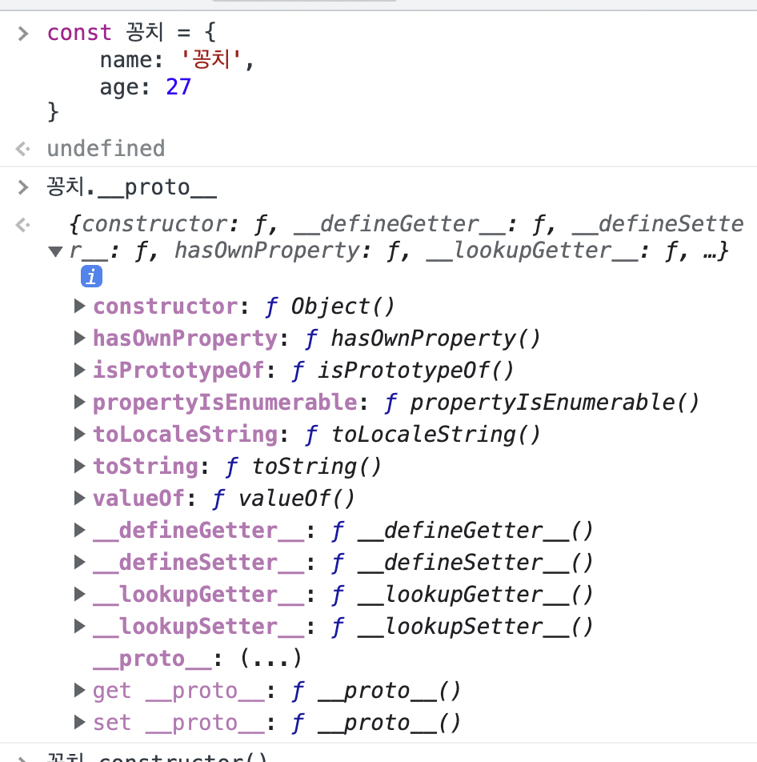

# [JavaScript] 프로토타입 (1)

> 자바스크립트는 명령형, 함수형, 프로토타입 기반, 객체지향 프로그래밍을 지원하는 멀티 패러다임 프로그랠밍 언어다.
> 
> 
> 자바스크립트에는 `public`, `private`, `proteted` 등이 없어 객체지향 언어가 아니라고 오해받지만,
> 클래스 기반 객체지향 프로그래밍 언어보다 더 강력한 **프로토타입 기반의 객체지향 프로그래밍 언어다.**
> 
> 자바스크립트는 객체 기반의 프로그래밍 언어이며, 자바스크립트를 이루고 있는 거의 모든것이 객체다.
> 

# 객체지향 프로그래밍

---

- 객체지향 프로그래밍이란?
    - 명령어 또는 함수의 목록으로 보는 전통적인 명령형 프로그래밍의 절차지향적인 관점에서 벗어나,
    여러 개의 독립적 단위, 즉 객체의 집합으로 프로그램을 표현하려는 프로그래밍 패러다임이다.
- **추상화(abstraction): 실체가 가진 다양한 속성 중에서 프로그램에 필요한 속성만 간추려 표현하는 것**

```jsx
// 이름과 주소 속성을 갖는 객체
const person = {
	name: 'KMin',
	address: 'Seoul'
}

console.log(person) // { name: 'KMin', address: 'Seoul' }
```

- 이때 프로그래머(subject, 주체)는 이름과 주소 속성으로 표현된 객체(object)인 person 을 다른 객체와 구별하여 인식할 수 있다.
    
    **⇒ 이처럼 속성을 통해 여러 개의 값을 하나의 단위로 구성한 복합적인 자료구조를 객체라 하며,**
    
    **⇒ 객체지향 프로그래밍은 독립적인 객체의 집합으로 프로그램을 표현하려는 프로그래밍 패러다임이다.**
    

```jsx
const circle = {
	raiuds: 5,

	getDiameter() {
		return 2 * this.radius
	}

	getPerimeter() {
		return 2 * Math.PI * this.radius
	}

	getArea() {
		return Math.PI * this.radius ** 2
	}
}
```

- 위의 코드처럼 객체지향 프로그래밍은 객체의 상태(state)를 나타내는 데이터와,
상세데이터를 조작할 수 있는 동작(behavior)을 하나의 논리적인 단위로 묶어 생각한다.
    
    ⇒ 이때 객체의 상태 데이터를 **프로퍼티**, 동작을 **메서드**라 부른다.
    

# 상속과 프로토타입

---

- 상속(inheritance)은 어떤 객체의 프로퍼티 또는 메서드를 다른 객체가 상속받아 그대로 사용할 수 있는 것을 말한다.
    
    → 때문에 불필요한 중복을 제거 가능
    

```jsx
function Circle(radius) {
	this.radius = radius
	this.getArea = function() {
		return Math.PI * this.radius ** 2
	}
}

const circle1 = new Circle(1)
const circle2 = new Circle(2)

console.log(circle1.getArea === circle2.getArea) // false
```

- 생성자 함수는 동일한 프로퍼티(메서드 포함) 구조를 갖는 객체를 여러개 생성할 때 유용하지만 문제가 있음
    - raiuds 프로퍼티의 경우 일반적으론 인스턴스마다 다름
    - 하지만 getArea 메서드의 경우 인스턴스들마다 불필요하게 반복되는 문제가 여전히 있음

⇒ 이 때 상속을 이용하여 불필요한 중복을 제거할 수 있고, **자바스크립트는 프로토타입을 기반으로 상속을 구현한다.**

```jsx
function Circle(radius) {
	this.radius = radius
}

Circle.prototype.getArea = function() {
	return Math.PI * this.radius * ** 2
}

const circle1 = new Circle(1)
const circle2 = new Circle(2)

console.log(circle1.getArea === circle2.getArea) // true
```

<aside>
💻 Circle 생성자 함수가 생성한 모든 인스턴스가 getArea 메서드를 공유해서 사용할 수 있도록 프로토타입에 추가한 모습

프로토타입은 Circle 생성자함수의 `prototype` 프로퍼티에 바인딩되어 있다.

Circle 생성자 함수가 생성한 모든 인스턴스는 자신의 프로토타입, 즉 상위(부모) 객체 역할을 하는 `Circle.prototype` 의 모든 프로퍼티와 메서드를 상속받는다.

</aside>

# 프로토타입 객체

---

### 프로토 타입 객체란?

- 객체 간 상속을 구현하기 위해 사용한다
    
    ⇒ **어떤 객체의 상위(부모) 객체 역할을 하는 객체**로서, **다른 객체에 공유 프로퍼티(+메서드)를 제공한다.**
    
- 모든 객체는 `[[Prototype]]` 이라는 내부 슬롯을 가지며, 이 내부 슬롯의 값은 프로토타입의 참조(null 인 경우도 있음)다.
- `[[Prototype]]` 에 저장되는 프로토타입은 객체 생성 방식에 의해 결정된다.
    
    → 즉, 객체가 생성될 때 객체 생성 방식에 따라 프로토타입이 결정되고 `[[Prototype]]` 에 저장된다.
    
    ex) 객체리터럴에 의해 생성된 객체의 프로토 타입은 Object.prototype,
    생성자 함수에 의해 생성된 객체의 프로토타입은 생성자 함수의 `prototype` 프로퍼티에 바인딩되어 있는 객체
    
- 모든 객체는 하나의 프로토타입을 갖고, 모든 프로토타입은 생성자 함수와 연결되어 있다.
    
    ⇒ 즉, 객체와 프로토타입과 생성자 함수는 서로 연결되어 있다.
    
    <aside>
    💻 `[[Prototype]]` 내부 슬롯에는 직접 접근할 수 없지만, `__proto__` 접근자 프로퍼티를 통해 자신의 프로토타입, 즉 자신의 `[[Prototype]]` 내부 슬롯이 가리키는 프로토타입에 간접적으로 접근할 수 있다.
    
    그리고 프로토타입은 자신의 constructor 프로퍼티를 통해 생성자 함수에 접근할 수 있고,
    생성자 함수는 자신의 `prototype` 프로퍼티를 통해 프로토타입에 접근할 수 있다.
    
    </aside>
    

## `__proto__` 접근자 프로퍼티

<aside>
💻 **모든 객체는 `__proto__` 접근자 프로퍼티를 통해 자신의 포로토타입, 즉 `[[Prototype]]` 내부 슬롯에 간접적으로 접근할 수 있다.**



`꽁치.__proto__` 를 열어보면 확인할 수 있는 것들이 꽁치 객체의 프로토타입인 `Object.prototype` 이다.

이처럼 모든 객체는 `__proto__` 로 `[[Prototype]]` 내부슬롯에 접근할 수 있다.

</aside>

### 1. `__proto__` 는 접근자 프로퍼티다.

---

16.1절 “내부 슬롯과 내부 메서드"에서 살펴보았듯`[[Prototype]]` 내부 슬롯은 프로퍼티가 아니다.

- 때문에 자바스크립트는 원칙적으로 내부 슬롯과 내부 메서드에 직접 접근이나 호출을 막는다.
- 하지만 일부 내부 슬롯과 메서드에 한해서만 간접적으로 접근을 허용했고, 그게 바로 `__proto__` 접근자 프로퍼티다.

접근자 프로퍼티는 자체적으로는 값(`[[Value]]` 프로퍼티)을 갖지는 않지만,
다른 데이터의 값을 읽거나 저장할 때 사용하는 접근자 함수, 즉 `[[Get]]`, `[[Set]]` 프로퍼티 어트리뷰트로 구성되어 있다.

> `Object.prototype` 의 접근자 프로퍼티인 `__proto__` 는 getter/setter 함수라고 부르는 접근자 함수를 통해,
`[[Prototype]]` 내부 슬롯의 값, 즉 프로토타입을 취득하거나 할당한다.
> 


```jsx
const obj = {}
const parent = { x: 1 }

// getter 함수인 get __proto__ 가 호출되어 obj 객체의 프로토타입을 취득
obj.__proto__
// setter 함수인 set __proto__ 가 호출되어 obj 객체의 포로토타입을 교체
obj.__proto__ = parent

console.log(obj.x) // 1
```

### 2. `__proto__` 접근자 프로퍼티는 상속을 통해 사용된다.

---

`__proto__` 접근자 프로퍼티는 객체가 직접 소유하는 프로퍼티가 아니라, `Object.prototype` 의 프로퍼티다.

모든 객체는 상속을 통해 `Object.prototype.__proto__` 접근자 프로퍼티를 사용할 수 있다.

```jsx
const person = { name: 'KMin' }

// person 객체는 __proto__ 를 소유하지 않는다.
console.log(person.hasOwnProperty('__proto__')) // false

// __proto__ 프로퍼티는 모든 객체의 프로토타입 객체인 Object.prototype 의 접근자 프로퍼티다.
console.log(Object.getOwnPropertyDescriptor(Object.prototype, '__proto__'))
// {get: f, set: f, enumerable: false, configurable: true}

// 모든 객체는 Object.prototype 의 접근자 프로퍼티 __proto__ 를 상속받아 사용할 수 있다.
console.log({}.__proto__ === Object.prototype) // true
```

<aside>
💻 `**Object.prototype**`

---

모든 객체는 프로토타입의 계층 구조인 프로토타입 체인에 묶여 있다.

자바스크립트 엔진은 객체의 프로퍼티에 접근하려할 때 먼저 본인 객체의 프로퍼티를 검색하고 
없다면 `__proto__` 접근자 프로퍼티가 가리키는 참조를 따라 자신의 부모 역할을 하는 프로토타입의 프로퍼티를 순차적으로 검색한다.

⇒ 여기서 프로토타입 체인의 종점, 최상위 객체가 `Object.prototype` 이다.

⇒ `Object.prototype` 의 프로퍼티와 메서드가 모든 객체에 상속된다.

</aside>

### 3. `__proto__` 접근자 프로퍼티를 통해 프로토타입에 접근하는 이유

---

`[[Prototype]]` 내부 슬롯의 값, 즉 포로토타입에 접근하기 위해 접근자 프로퍼티를 사용하는 이유는,
상호 참조에 의해 프로토타입 체인이 생성되는 것을 방지하기 위해서다.

```jsx
const parent = {}
const child = {}

// child 의 프로토타입을 parent 로 설정
child.__proto__ = parent
// parent 의 프로토타입을 child 로 설정
parent.__proto__ = child // TypeError: Cyclic __proto__ value
```

⇒ 이렇듯 parent 와 child 객체 서로가 서로의 프로토타입이 되는 비정상적인 프로토타입 체인이 만들어지는 문제를 방지하기 위해
`__proto__` 접근자 프로퍼티는 에러를 발생시킨다.

**프로토타입 체인은 단방향 링크드 리스트로 구현되어야 한다**

- 즉 프로퍼티 검색 방향이 한쪽 방향으로만 흘러가야 한다.
- 양방향이 될 경우 프로퍼티를 참조할 때 무한루프가 발생한다.

### 4. `__proto__` 접근자 프로퍼티를 코드 내에서 직접 사용하는 것은 권장하지 않는다.

---

모든 객체가 `__proto__` 접근자 프로퍼티를 사용할 수 있는 것은 아니다.

(직접 상속을 통해 다음과 같이 `Object.prototype` 을 상속받지 않는 객체를 생성할 수도 있기 때문)

```jsx
// obj 는 프로토타입 체인의 종점이다. 따라서 Object.__proto__를 상속받을 수 없다.
const obj = Object.create(null)

// obj 는 Object.__proto__를 상속받을 수 없다.
console.log(obj.__proto__) // undefined

// 따라서 __proto__ 보다 Object.getPrototypeOf 메서드를 사용하는 편이 좋다.
console.log(Object.getPrototypeOf(obj)) // null
```

> ⇒ 이처럼 `__proto__` 대신 프로토타입의 참조를 취득하고 싶은 경우에는 `Object.getPrototypeOf()` 메서드를 사용하고,
프로토타입을 교체하고 싶은 경우에는 `Object.setPrototypeOf()` 메서드를 사용할 것을 권장한다.
> 
> 
> 
> 

```jsx
const obj = {}
const parent = { x: 1 }

// obj 객체의 프로토타입을 취득
Object.getPrototypeOf(obj) // obj.__proto__
// obj 객체의 프로토타입을 교체
Object.setPrototypeOf(obj, parent) // obj.__proto__ = parent

console.log(obj.x) // 1
```

> Object.getPrototypeOf ⇒ ES5 이상
Object.setPrototypeOf ⇒ ES6 이상
> 

## 함수 객체의 `prototype` 프로퍼티

**함수 객체만이 소유하는 `prototype` 프로퍼티는 생성자 함수가 생성할 인스턴스의 프로토타입을 가리킨다**

> 함수 객체는 prototype 프로퍼티를 소유한다.
> 
> 
> 
> 
> 일반 객체는 prototype 프로퍼티를 소유하지 않는다.
> 
> 
> 

`prototype` 프로퍼티는 생성자 함수가 생성할 객체(인스턴스)의 프로토타입을 가리킨다

→ 따라서 생성자 함수로서 호출할 수 없는 함수, 즉 non-constructor 인 화살표함수와 ES6 메서드 축약 표현으로 정의한 메서드는 `prototype` 을 소유하지 않으며 프로토타입을 생성하지도 못 한다.

생성자 함수로 호출하기 위해 정의하지 않은 일반 함수도 `prototype` 을 소유하지만,
객체를 생성하지 않는 일반 함수의 `prototype` 프로퍼티는 아무런 의미가 없다.

**모든 객체가 가지고 있는(엄밀히 말하면 `Object.prototype` 으로부터 상속 받은) `__proto__` 접근자 프로퍼티와 함수 객체만이 가지고 있는 `prototype` 프로퍼티는 결국 동일한 프로토타입을 가리킨다.**

| 구분 | 소유 | 값 | 사용 주체 | 사용 목적 |
| --- | --- | --- | --- | --- |
| __proto__
접근자 프로퍼티 | 모든 객체 | 프로토타입의 참조 | 모든 객체 | 객체가 자신의 프로토타입에 접근 또는 교체하기 위해 사용 |
| prototype
프로퍼티 | constructor | 프로토타입의 참조 | 생성자 함수 | 생성자 함수가 자신이 생성할 객체(인스턴스)의 프로토타입을 할당하기 위해 사용 |

## 프로토타입의 `constructor` 프로퍼티와 생성자 함수

모든 프로토타입은 `constructor` 프로퍼티를 갖는다.

이 `constructor` 프로퍼티는 `prototype` 프로퍼티로 자신을 참조하고 있는 생성자 함수를 가리킨다.

```jsx
// 생성자 함수
function Person(name) {
	this.name = name
}

const me = new Person('KMin')

// me 객체의 생성자 함수는 Person 이다.
console.log(me.construtor === Person) // true
```

> Person 생성자 함수는 me 객체를 생성했다.
> 
> 
> 이때 me 객체는 프로토타입의 constructor 프로퍼티를 통해 생성자 함수와 연결된다.
> 
> me 객체에는 constructor 프로퍼티가 없지만 me 객체의 프로토타입인 Person.prototype 에는 constructor 프로퍼티가 있다.
> 
> 따라서 me 객체는 프로토타입인 Person.prototype 의 constructor 프로퍼티를 상속받아 사용할 수 있다.
> 

# 리터럴 표기법에 의해 생성된 객체의 생성자 함수와 프로토타입

---

생성자 함수에 의해 생성된 인스턴스(객체)는 프로토타입의 `constructor` 프로퍼티에 의해 생성자 함수와 연결된다.

이때 `constructor` 프로퍼티가 가리키는 생성자 함수는 인스턴스를 생성한 생성자 함수다.

```jsx
// obj 객체를 생성한 생성자 함수는 Object 이다.
const obj = new Object()
console.log(obj.constructor === Object) // true

// me 객체를 생성한 생성자 함수는 Person 이다.
function Person(name) {
	this.name = name
}
const me = new Person('KMin')
console.log(me.constructor === Person) // true
```

하지만 객체 리터럴 생성과 같이 인스턴스를 호출하지 생성하지 않는 객체 생성 방식도 있다.

리터럴로 생성된 객체도 프로토타입이 존재한다.

→ 하지만 리터럴로 생성된 객체는 프로토타입의 `constructor` 프로퍼티가 가리키는 생성자 함수가 반드시 객체를 생성한 생성자 함수라고 단정지을 수는 없다.!!

```jsx
// obj 객체는 Object 생성자 함수로 생성한 객체가 아니라 객체 리터럴로 생성했다.
const obj = {}

// 하지만 obj 객체의 생성자 함수는 Object 생성자 함수다
console.log(obj.constructor === Object)
```

> 그 이유는 Object 생성자 함수에 인수를 전달하지 않거나 undefined 또는 null 을 인수로 전달하면서 호출하면
내부적으로 추상 연산 `OrdinaryObjectCreate` 를 호출하여
`Object.prototype` 을 프로토타입으로 갖는 빈 객체를 생성하기 때문!
> 
> 
> 
> 

> **새로 알게된 것 TIL (2022.03.09 수)**
> 
> 
> ---
> 
> 1. 프로토타입은 객체 간 상속을 구현하기 위해 생겨났고, 모든 객체는 프로토타입을 상속 받는다.
> 2. [[Prototype]] 은 내부 슬롯이지 프로퍼티가 아니며, 상위 객체의 프로토타입에 접근하기 위해 있는 접근자 프로퍼티가 __proto__다.
> 3. __proto__는 객체가 직접 소유하는 것이 아니라 Object.prototype 꺼고 Object.prototype 의 접근자 프로퍼티이며, 단지 모든 객체가 Object.prototype 을 상속받기 때문에 __proto__ 또한 상속받아 사용할 수 있는 것이다.
> 4. __proto__ 는 서로가 서로의 프로토타입이 되는 것을 막아준다.
> 5. 생성자 함수로 생성한 객체나, 함수나 모든 프로토타입은 constructor 프로퍼티를 가진다.
>     1. 생성자 함수는 본인을 생성한 함수, 객체 등등 다 constructor 프로퍼티를 가지고 있다.
>     2. 놀랍게도 함수도 객체기 때문에 프로토타입을 파고파고 들면 Object 로 연결된다.
>     3. 객체 리터럴로 객체를 생성해도 constructor 는 Object 다.