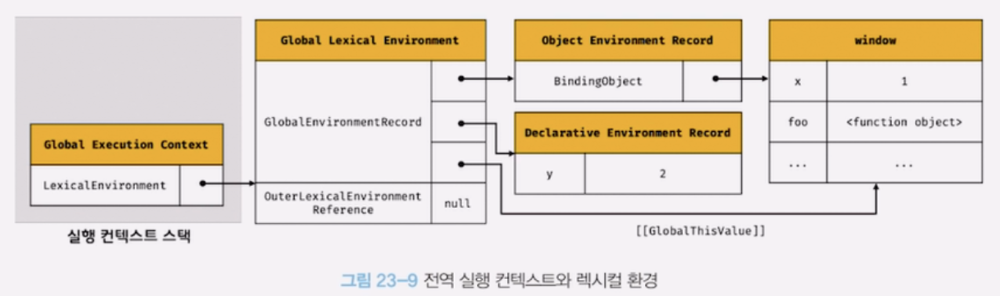

# [JavaScript] 23장 실행 컨텍스트 (23.6 ~ 23.7)

# 23.6 실행 컨텍스트의 생성과 식별자 검색 과정

아래 예제를 통해 실행 컨텍스트가 생성되고 코드 실행 결과가 어떻게 관리되는지 확인

```jsx
var x = 1
const y = 2

function foo(a) {
	var x = 3
	const y = 4

	function bar(b) {
		const z = 5
		console.log(a + b + x + y + z)
	}
	bar(10)
}

foo(20) // 42
```

## 23.6.1 전역 객체 생성

---

전역 객체는 전역 코드가 평가되기 이전에 생성된다. 이때 전역 객체에는 빌트인 전역 프로퍼티와 빌트인 전역함수, 그리고 표준 빌트인 객체가 추가되며 동작 환경(클라이언트 사이드 / 서버 사이드)에 따라 클라이언트 사이드 Web API 또는 특정 환경을 위한 호스트 객체를 포함한다.

전역 객체도 `Object.prototype` 을 상속받는다. 즉, 전역 객체도 프로토타입 체인의 일원이다.

```jsx
// Object.prototype.toString
window.toString() // "[object Window]"

window.__proto__.__proto__.__proto__.__proto__. === Object.prototype // true
```

## 23.6.2 전역 코드 평가

---

소스코드가 로드되면 자바스크립트 엔진은 전역 코드를 평가한다.

### 전역 코드의 평가 과정



1. 전역 실행 컨텍스트 생성
2. 전역 렉시컬 환경 생성
    
    2. 1 전역 환경 레코드 생성
    
    2.1.1 객체 환경 레코드 생성
    
    2.1.2 선언적 환경 레코드 생성
    
    2.2 this 바인딩
    
    2.3 외부 렉시컬 환경에 대한 참조 결정
    

### 1. 전역 실행 컨텍스트 생성


- 먼저 비어있는 전역 실행 컨텍스트를 생성하여 실행 컨텍스트 스택에 푸시한다.
- 이떄 전역 실행 컨텍스트는 실행 컨텍스트 최상위, 즉 실행 중인 실행 컨텍스트가 된다.

### 2. 전역 렉시컬 환경 생성


- 전역 렉시컬 환경(Global Lexical Environment)을 생성하고 전역 실행 컨텍스트에 바인딩한다.
- 23.5절 “렉시컬 환경"에서 살펴보았듯이 렉시컬 환경은 2개의 컴포넌트로 구성된다.
    
    1) 환경 레코드 Envrionment Record
    
    2) 외부 렉시컬 환경에 대한 참조 Outer Lexical Environment Reference
    

### 2.1. 전역 환경 레코드 생성

전역 렉시컬 환경을 구성하는 컴포넌트인 전역 환경 레코드는 전역 변수를 관리하는 전역 스코프, 전역 객체의 빌트인 전역 프로퍼티와 빌트인 전역 함수, 표준 빌트인 객체를 제공한다.

ES5까지는 모든 전역 변수가 전역 객체의 프로퍼티가 되지만 ES6의 let, const 키워드로 선언한 정녁 변수는 전역 객체의 프로퍼티가 되지 않고 개념적인 블록 내에 존재하게 된다.

이처럼 기존의 var 로 선언한 전역변수와 let, const 로 선언한 전역변수를 구분하여 관리하기 위해 **전역 스코프 역할을 하는 전역 환경 레코드**는 **객체 환경 레코드(Object Environment Record)**와 **선언적 환경 레코드(Declarative Environment Record)**로 구성되어 있다. (그림 23-9 참고)

- **객체 환경 레코드**: 기존의 전역 객체가 관리하던 `var` 키워드로 선언한 전역 변수와 함수 선언문으로 정의한 전역 함수, 빌트인 전역 프로퍼티와 빌트인 전역 함수, 표준 빌트인 객체를 관리한다.
- **선언적 환경 레코드**: `let`, `const` 키워드로 선언한 전역 변수를 관리한다.
- 즉, 전역 환경 레코드의 ‘객체 환경 레코드'와 ‘선언적 환경 레코드'는 서로 협력하여 전역 스코프와 전역 객체(전역 변수의 전역 객체 프로퍼티화)를 관리한다.

> **2.1.1 객체 환경 레코드 생성**
> 
> 
> ---
> 
> 전역 환경 레코드를 구성하는 컴포넌트인 객체 환경 레코드는 `BindingObject` 라고 부르는 객체와 연결된다 (23-9 참고)
> `**BindingObject` 는 23.6.1절 “전역 객체 생성"에서 생성된 전역 객체다**
> 
> 
> 
> **전역 코드 평가 과정에서 var 키워드로 선언한 전역 변수와 함수 선언문으로 정의된 전역 함수는 전역 환경 레코드의 객체 환경 레코드에 연결된 `BindingObject` 를 통해 전역 객체의 프로퍼티와 메서드가 된다.
> 그리고 이때 등록된 식별자를 전역 환경 레코드의 객체 환경 레코드에서 검색하면 전역 객체의 프로퍼티를 검색하여 반환한다.**
> 
> → 이것이 var 로 선언한 전역 변수와 함수가 전역 객체의 프로퍼티와 메서드가 되는 매커니즘
> 
> ---
> 
> var 로 선언한 변수 x 는 “선언 단계”와 “초기화 단계"가 동시에 진행된다
> → 이말은 전역 코드 평가 시점에서 객체 환경 레코드에 바인딩된 `BindingObject` 를 통해 전역 객체에 변수 식별자를 키로 등록한 다음, 암묵적으로 undefined 를 바인딩한다는 뜻
> 
> → 이 때문에 var 로 선언한 변수는 코드가 실행될 때 변수 선언문 이전에도 참조할 수 있다. (단 언제나 undefined 가 됨)
> 
> ⇒ 이것이 변수 호이스팅이 발생하는 원인!!
> 

> **2.1.1 선언전 환경 레코드 생성**
> 
> 
> ---
> 
> var 로 선언한 전역 변수와 함수 선언문으로 정의한 전역 함수 이외의 선언, 즉 `let`, `const` 로 선언한 전역 변수는 선언전 환경 레코드에 등록되고 관리된다.
> 
> 
> 
> let, const 로 선언한 전역 변수는 전역 객체의 프로퍼티가 되지 않고 개념적 블록에 속하게 되는데 이것이 선언전 환경 레코드다.
> 
> 또한 const 로 선언한 변수는 “선언 단계"와 “초기화 단계"가 분리되어 진행된다. 따라서 초기화 단계, 즉 런타임에 실행 흐름이 변수 선언문에 도달하기 전까지 일시적 사각지대에 빠지게 된다.
> 
> ```jsx
> let foo = 1
> {
> 	// let, const 키워드로 선언한 변수가 호이스팅되지 않는다면 전역 변수를 참조해야 한다.
> 	// 하지만 let 키워드로 선언한 변수도 여전히 호이스팅이 발생하기 때문에
> 	// 참조 에러(Reference Error) 가 발생한다
> 	console.log(foo) // Reference Error!!
> 	let foo = 2 // 지역 변수
> }
> ```
> 
> let, const 키워드로 선언한 변수도 변수 호이스팅이 발생하는 것은 변함이 없다. 단 let, const 로 선언한 변수는 런타임에 컨트롤이 변수 선언문에 도달하기 전까지 일시적 사각지대에 빠지기 때문에 참조할 수 없다.
> 

### 2.2. this 바인딩

전역 환경 레코드의 [[GlobalThisValue]] 내부 슬롯에 this 가 바인딩된다. 일반적으로 전역 코드에서 this 는 전역 객체를 가리키므로 전역 환경 레코드의 [[GlobalThisValue]] 내부 슬롯에는 전역 객체가 바인딩된다. 전역 코드에서 this 를 참조하면 전역 환경 레코드의 [[GlobalThisValue]] 내부 슬롯에 바인딩되어 있는 객체가 바인됭된다.


참고로 전역 환경 레코드를 구성하는 “객체 환경 레코드"와 “선언적 환경 레코드"에는 this 바인딩이 없다. this 바인딩은 전역 환경 레코드와 함수 환경 레코드에만 존재한다.

### 2.3. 외부 렉시컬 환경에 대한 참조 결정


외부 렉시컬 환경에 대한 참조 (Outer Lexical Environment Reference) 는 현재 평가 중인 소스코드를 포함하는 외부 소스코드의 렉시컬 환경, 즉 상위 스코프를 가리킨다. 이를 통해 단방향 링크드 리스트인 스코프 체인을 구현한다.

전역 코드는 외부 렉시컬 환경에 대한 참조에 null 이 할당된다.

## 23.6.3 전역 코드 실행

---

전역 코드가 순차적으로 실행되기 시작하면 변수 할당문이 실행되어 전역 변수 x, y 에 값이 할당된다.
그리고 foo 함수가 호출된다.


변수 할당문 or 함수 호출문을 실행하기 위해 변수 or 함수 선언문이 선언된 식별자인지 확인하는 것을 **식별자 결정**이라 한다.

식별자 결정을 위해 식별자를 검색할 때는 실행 중인 실행 컨텍스트에서 식별자를 검색하기 시작한다.

- 먼저 현재 실행 중인 컨텍스트에서 식별자를 검색하고,
- 검색할 수 없다면 외부 렉시컬 환경에 대한 참조가 가리키는 렉시컬 환경(=상위 스코프)로 이동하여 식별자를 검색한다.

⇒ 이것이 스코프 체인의 동작원리이며, 전역 렉시컬 환경의 경우 현재 컨텍스트에서 찾을 수 없으면 참조 에러를 내보낸다.

## 23.6.4 foo 함수 코드 평가

---

```jsx
var x = 1
const y = 2

function foo(a) {
	var x = 3
	const y = 4

	function bar(b) {
		const z = 5
		console.log(a + b + x + y + z)
	}
	bar(10)
}

foo(20) // <- 함수 호출 직전
```

위 예제를 다시 살펴보면 현재 전역 코드 평가를 통해 전역 실행 컨텍스트가 생성되었고 전역 코드를 실행하고 있다.
현재 foo 함수를 호출하기 직전이다.

### foo 함수 코드 평가 과정


1. 함수 실행 컨텍스트 생성
2. 함수 렉시컬 환경 생성
    
    2.1. 함수 환경 레코드 생성
    
    2.2. this 바인딩
    
    2.3. 외부 렉시컬 환경에 대한 참조 결정
    

### 1. 함수 실행 컨텍스트 생성

- 먼저 foo 함수 실행 컨텍스트를 생성한다.
- 생성된 함수 실행 컨텍스트는 함수 렉시컬 환경이 완성된 다음 실행 컨텍스트 스택에 푸시된다.
- 이때 foo 함수 실행 컨텍스트는 실행 컨텍스트 스택의 최상위, 즉 실행 중인 실행 컨텍스트가 된다.

### 2. 함수 렉시컬 환경 생성

foo 함수 렉시컬 환경을 생성하고 foo 함수 실행 컨텍스트에 바인딩된다.


23.5절 “렉시컬 환경"에서 살펴보았듯이 렉시컬 환경은 2개의 컴포넌트, 즉 “환경 레코드"와 “외부 렉시컬 환경에 대한 참조"로 구성된다.

### 2.1. 함수 환경 레코드 생성

함수 렉시컬 환경을 구성하는 컴포넌트 중 하나인 “함수 환경 레코드(Function Environment Record)”는 매개변수, arguments 객체, 함수 내부에서 선언한 지역 변수와 중첩 함수를 등록하고 관리한다.


### 2.2. this 바인딩

함수 환경 레코드의 [[ThisValue]] 내부 슬롯에 this 가 바인딩된다. [[ThisValue]] 내부 슬롯에 바인딩될 객체는 22장 “this”에서 살펴보았듯이 함수 호출 방식에 따라 결정된다.

foo 함수는 일반 함수로 호출되었으므로 this 는 전역 객체를 가리킨다. 따라서 함수 환경 레코드의 [[ThisValue]] 내부 슬롯에는 전역 객체가 바인딩된다. foo 함수 내부에서 this 를 참조하면 함수 환경 레코드의 [[ThisValue]] 내부 슬롯에 바인딩되어 있는 객체가 반환된다.


### 2.3. 외부 렉시컬 환경에 대한 참조 결정

외부 렉시컬 환경에 대한 참조에 foo 함수 정의가 평가된 시점에 실행 중인 실행 컨텍스트의 렉시컬 환경의 참조가 할당된다.

foo 함수는 전역 코드에 정의된 전역 함수다. 따라서 foo 함수 정의는 전역 코드 평가 시점에 평가된다.
이 시점의 실행 중인 실행 컨텍스트는 전역 실행 컨텍스트다. 따라서 외부 렉시컬 환경에 대한 참조에는 전역 렉시컬 환경의 참조가 할당된다.


## 23.6.5 foo 함수 코드 실행

---

이제 런타임이 시작되어 foo 함수의 소스코드가 순차적으로 실행되기 시작한다. 매개변수에 인수가 할당되고, 변수 할당문이 실행되어 x, y 에 값이 할당된다. 그리고 함수 bar 가 호출된다.

이때 **식별자 결정을 위해 실행 중인 실행 컨텍스트의 렉시컬 환경에서 식별자를 검색하기 시작한다.**

현재 실행 중인 실행 컨텍스트는 foo 함수 실행 컨텍스트이므로 foo 함수의 렉시컬 환경에서 식별자 x, y를 검색하기 시작하며 해당 식별자를 찾을 수 없으면 외부 렉시컬 환경에 대한 참조가 가리키는 렉시컬 환경(=상위 스코프)로 이동하여 식별자를 검색한다. 검색된 식별자에 값을 바인딩한다.


## 23.6.6 bar 함수 코드 평가

---

```jsx
var x = 1
const y = 2

function foo(a) {
	var x = 3
	const y = 4

	function bar(b) {
		const z = 5
		console.log(a + b + x + y + z)
	}
	bar(10) // <- 함수 호출 직전
}

foo(20)
```

bar 함수가 호출되면 bar 함수 내부로 코드의 제어권이 이동한다. 그리고 bar 함수 코드를 평가하기 시작한다.
실행 컨텍스트와 렉시컬 환경의 생성 과정은 foo 함수 코드 평가와 동일하다. 생성된 bar 함수 실행 컨텍스트와 렉시컬 환경이 구성된다.


## 23.6.7 bar 함수 코드 실행

---

이제 런타임이 시작되어 bar 함수의 소스코드가 순차적으로 실행되기 시작한다. 매개변수에 인수가 할당되고, 변수 할당문이 실행되어 지역 변수 z 에 값이 할당된다.


그리고 `console.log(a + b + x + y + z)`가 실행된다. 이 코드는 다음 순서로 실행된다.

### 1. console 식별자 검색

먼저 console 식별자를 스코프 체인에서 검색한다. 스코프 체인은 현재 실행 중인 실행 컨텍스트의 렉시컬 환경에서 시작하여 외부 렉시컬 환경에 대한 참조로 이어지는 렉시컬 환경의 연속이다. 따라서 식별자를 검색할 때는 언제나 현재 실행 중인 실행 컨텍스트의 렉시컬 환경에서 검색하기 시작한다.

console 식별자를 찾기 위해 계속 스코프 체인 상으로 올라가게 되고 전역 렉시컬 환경으로 이동하여 console 식별자를 검색한다.
전역 렉시컬 환경은 객체 환경 레코드와 선언적 환경 레코드로 구성되어 있다. console 식별자는 객체 환경 레코드의 `BindingObject` 를 통해 전역 객체에서 찾을 수 있다.

### 2. log 메서드

이제 console 식별자에 바인딩된 객체, 즉 console 객체에서 log 메서드를 검색한다. 이때 console 객체의 프로토타입 체인을 통해 메서드를 검색한다. log 메서드는 상속된 프로퍼티가 아니라 console 객체가 직접 소유하는 프로퍼티다.

### 3. 표현식 a + b + x + y + z 의 평가

이제 각각의 a, b, x, y, z 식별자를 렉시컬 환경, 즉 스코프 체인 상에서 검색한다.

### 4. console.log 메서드 호출

표현식 a + b + z + y + z 가 평가되어 생성한 값을 console.log 메서드에 전달하여 호출한다.

## 23.6.8 함수 코드 실행 종료

---

console.log 메서드가 호출되고 종료하면 더는 실행할 코드가 없으므로 bar 함수 코드의 실행이 종료된다.
이때 실행 컨텍스트 스택에서 bar 함수 실행 컨텍스트가 팝되어 제거되고 foo 실행 컨텍스트가 실행 중인 실행 컨텍스트가 된다.

실행 컨텍스트 스택에서 bar 함수 실행 컨텍스트가 제거되었다고 해서 bar 함수 렉시컬 환경까지 즉시 소멸하는 것은 아니다. 렉시컬 환경은 실행 컨텍스트에 의해 참조되기는 하지만 독립적인 객체다. 객체를 포함한 모든 값은 누군가에 의해 참조되지 않을 떄 비로소 가비지 컬렉터에 의해 메모리 공간의 확보가 해제되어 소멸한다.

bar 함수 실행 컨텍스트가 소멸되었다 하더라도 만약 bar 함수 렉시컬 환경을 누군가 참조하고 있다면 bar 함수 렉시컬 환경은 소멸하지 않는다.

## 23.6.9 foo 함수 코드 실행 종료

---

bar 함수가 종료하면 더이 상 실행할 코드가 없으므로 foo 함수 코드의 실행이 종료된다.
이때 실행 컨텍스트 스택에서 foo 함수 실행 컨텍스트가 팝되어 제거되고 전역 실행 컨텍스트가 실행 중인 실행 컨텍스트가 된다.

## 23.6.10 전역 코드 실행 종료

---

foo 함수가 종료되면 더는 실행할 전역 코드가 없으므로 전역 코드의 실행이 종료되고 전역 실행 컨텍스트도 실행 컨텍스트 스택에서 팝되어 실행 컨텍스트 스택에는 아무것도 남아있지 않게 된다.

# 23.7 실행 컨텍스트와 블록 레벨 스코프

15장 “let, const” 에서 살펴보았듯이 var 키워드로 선언한 변수는 오로지 함수의 코드 블록만 지역 스코프로 인정하는 함수 레벨 스코프를 따른다. 하지만 let, const 키워드로 선언한 변수는 모든 코드 블록을 지역 스코프로 인정하는 블록 레벨 스코프를 따른다.

```jsx
let x = 1

if (true) {
	let x = 10
	console.log(x) // 10
}

console.log(x) // 1
```

위 코드에서 if 문의 코드 블록 내에서 let 키워드로 변수가 선언되었다. let 으로 선언했으므로 코드 블록 안의 블록 레벨 스코프가 적용된다. 이를 위해 선언적 환경 레코드를 갖는 렉시컬 환경을 새롭게 생성하여 기존의 전역 렉시컬 환경을 교체한다. 이때 새롭게 생성된 if 문의 코드 블록을 위한 렉시컬 환경의 외부 렉시컬 환경에 대한 참조는 if 문이 실행되기 이전의 전역 렉시컬 환경을 가리킨다.


if 문 코드 블록의 실행이 종료되면 if 문의 코드 블록이 실행되기 이전의 렉시컬 환경으로 되돌린다.


이는 if 문 뿐만 아니라 블록 레벨 스코프를 생성하는 모든 블록문에 적용된다.