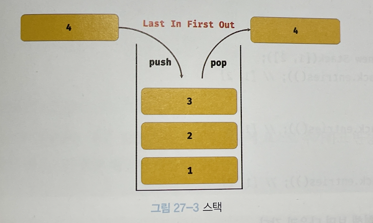
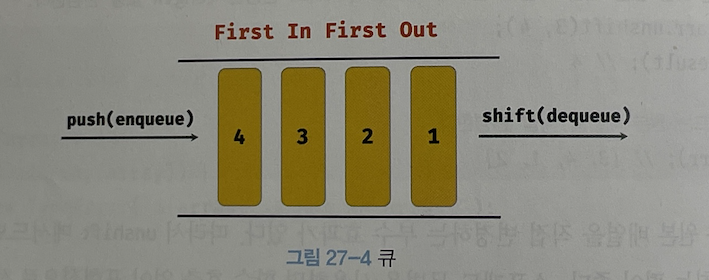
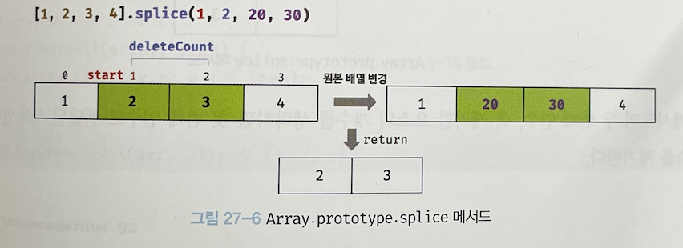

# [JavaScript] Array.method 종류들

# 원본배열을 변경하는 메소드

- **Array.push() : 배열의 맨 뒤에 요소를 추가**
    1. 인수로 전달받은 모든 값을 **원본 배열의 마지막 요소로 추가**하고
    2. **변경된 length 프로퍼티값을 반환**함
    3. **원본 배열을 변경함**
    
    ```jsx
    const arr = [1, 2]
    
    let result = arr.push(3, 4)
    console.log(result)  // 4
    console.log(arr)     // [1, 2, 3, 4]
    
    // 그러나 push 메소드는 성능면에서 좋지 않기 때문에 차라리 이 방법이 더 좋다
    arr[arr.length] = 5
    console.log(arr)     // [1, 2, 3, 4, 5]
    ```
    
    ### 원본 배열을 변경시키지 않고 마지막에 추가하는 방법 (ES6: 스프레드 문법)
    
    ```jsx
    const arr = [1, 2]
    
    const newArr = [...arr, 3]
    console.log(newArr)  // [1, 2, 3]
    ```
    
- **Array.pop() : 배열의 맨 뒤의 요소를 제거**
    1. 배열의 마지막 요소를 제거한 뒤,
    2. 제거한 요소를 리턴함 (원본 배열이 빈 배열이면 undefined 반환)
    3. 원본 배열을 직접 변경
    
    ```jsx
    const arr = [1, 2]
    
    let result = arr.pop()
    
    console.log(result) // 2
    console.log(arr)  // [1]
    ```
    
- **push() 와 pop() 의 관계**
    
    ### **스택(stack) _ 후입선출**
    
    
    
- **Array.unshift() : 배열의 맨 앞에 요소를 추가**
    1. 인수로 전달받은 모든 값을 **원본 배열의 맨 앞에 추가**하고,
    2. **변경된 length 값을 반환**
    3. **원본 배열을 직접 변경함**
    
    ```jsx
    const arr = [1, 2]
    
    let result = arr.unshift(3, 4)
    console.log(result) // 4
    console.log(arr) // [3, 4, 1, 2]
    
    ```
    
    ### 원본 배열을 변경하지 않고 앞에 요소를 추가하는 방법 (ES6: 스프레드 문법)
    
    ```jsx
    const arr [1, 2]
    
    const newArr = [3, 4, ...arr]
    console.log(arr) // [1, 2]
    console.log(newArr) // [3, 4, 1, 2]
    ```
    
- **Array.shift() : 배열의 맨 앞의 요소를 제거**
    1. 원본 배열에서 **첫 번째 요소를 제거**
    2. **제거한 요소를 반환** (원본 배열이 빈 배열이면 undefined 를 반환)
    3. **원본 배열을 직접 변경**
    
    ```jsx
    const arr = [1, 2]
    
    let result = arr.shift()
    console.log(result) // 1
    console.log(arr) // [2]
    ```
    
- **push() 와 shift() 의 관계**
    
    ### 큐(Queue) _ 선입 선출
    
    
    

---

- **Array.splice() : 원본 배열에서 특정 요소를 추가하거나 제거**
    1. 원본 배열의 처음이나 마지막에 요소를 추가하거나 제거함
    2. 원본 배열을 직접 변경함
    
    ### Array.splice( start, deleteCount, items )
    
    - 첫 번째 인자(Start) : 제거를 시작할 인덱스
    - 두 번째 인자(deleteCount) : 제거할 아이템의 개수
    - 세 번째 인자(items): 새로 추가할 요소 ⇒ 배열이 올 수도 있고, 각각 3번째 이상의 파라미터 모두 될 수 있음
    
    ```jsx
    const arr = [1, 2, 3, 4]
    
    const result = arr.splice(1, 2, 20, 30) // 1번째 인덱스부터, 2개의 요소를 제거하고, 20 ,30을 추가함
    
    console.log(result) // [2, 3] => 제거한 요소가 배열로 반환
    console.log(arr) // [1, 20, 30, 4]  => 원본 배열이 변경이 됨
    ```
    
    
    
    ---
    
    - **두 번째 인자 제거할 요소의 개수를 0개로 지정하면 새로운 요소를 삽입함**
        
        ```jsx
        const arr = [1, 2, 3, 4]
        
        const result = arr.splice(1, 0, 100)
        
        console.log(arr)  // [1, 100, 2, 3, 4]
        console.log(result) // []
        ```
        
    - **세 번째 인자 추가할 요소들의 목록을 전달하지 않으면 제거만 함**
        
        ```jsx
        const arr = [1, 2, 3, 4]
        
        const result = arr.splice(1, 2)
        
        console.log(arr) // [1, 4]
        console.log(reuslt) // [2. 3]
        ```
        
    - **첫번째 인자 외에 아무것도 전달하지 않으면 해당 인덱스부터 모든 요소를 제거함**
        
        ```jsx
        const arr = [ 'a', 'b', 'c', 'd']
        
        const result = arr.splice(1)
        
        console.log(arr) // ['a']
        console.log(result) // ['b', 'c', 'd']
        ```
        
    
    ---
    
- **Array.join()**
    
    ```jsx
    const arr = [1, 2, 3, 4]
    
    // 기본 구문자는 콤마(,)이며 생략이 가능함
    // 원본 배열 arr의 모든 요소를 문자열로 변환한 후 기본 구문자로 연결한 문자열을 반환함
    arr.join()   // '1,2,3,4'
    
    // 원본 배열 arr의 모든 요소를 문자열로 변환한 후, 빈 문자열로 연결한 문자열을 반환함
    arr.join('') // '1234'
    
    arr.join(':') // '1:2:3:4'
    ```
    
- **Array.reverse() : 원본 배열의 순서를 반대로 뒤집음**
    
    ```jsx
    const arr = [1, 2, 3]
    const result = arr.reverse()
    
    console.log(arr) // [3, 2, 1] => **원본 배열의 순서가 변경됨**
    console.log(result) // [3, 2, 1] => 리턴된 값 또한 변경된 배열
    ```
    
- **Array.fill() : 인수로 전달된 값으로 배열의 처음부터 끝까지 채움**
    
    ⇒ 원본 배열이 변경됨
    
    ```jsx
    const arr = [1, 2, 3]
    
    arr.fill(0)
    
    console.log(arr) // [0, 0, 0]
    ```
    
    ### Array.fill( 바꿀 인자, 바꾸기 시작할 인덱스?, 바꾸기를 멈출 인덱스? )
    
    ```jsx
    const arr1 = [1, 2, 3]
    
    arr1.file(0, 1) // 인자로 들어온 0으로 1번인덱스부터 마지막까지 다 채운다
    console.log(arr1) // [1, 0, 0]
    
    const arr2 = [1, 2, 3, 4, 5]
    
    arr2.fill(0, 1, 3) // 인자로 들어온 0으로 1번 인덱스부터, 3번 인덱스 전까지 바꾼다
    console.log(arr2)  // [1, 0, 0, 4, 5]
    ```
    
- **Array.flat() : 인수로 전달된 값의 깊이만큼 배열을 평탄화함**
    - 아무값도 전달하지 않으면 기본값은 1
    - EC10 (ECMAScript 2019) 문법
    
    ```jsx
    [1, [2, 3, 4, 5]].flat()  // [1, 2, 3, 4, 5]
    
    // 중첩 배열을 평탄화하는 값의 기본값은 1
    [1, [2, [3, [4]]]].flat()        // [1, 2, [3, [4]]]
    [1, [2, [3, [4]]]].flat(1)       // [1, 2, [3, [4]]]
    
    // 중첩 배열을 값을 2로 전달한 것과, flat() 메소드를 2번 쓴 것은 결과가 같음
    [1, [2, [3, [4]]]].flat(2)       // [1, 2, 3, [4]]
    [1, [2, [3, [4]]]].flat().flat() // [1, 2, 3, [4]]
    
    // flat() 의 값을 Infinity 로 지정하면 완전히 평탄화시킴
    [1, [2, [3, [4]]]].flat(Infinity) // [1, 2, 3, 4]
    ```
    
- **Array.sort() : 배열의 요소를 오름차순으로 정렬함**
    
    ```jsx
    const fruits = ['Banana', 'Orange', 'Apple']
    
    // 오름차순 정렬 (Ascending)
    fruits.sort()
    
    console.log(fruits)  // ['Apple', 'Banana', 'Orange']
    
    // 내림차순 정렬 (Descending)
    fruits.reverse()
    
    console.log(fruits) // ['Orange', 'Banana', 'Apple']
    ```
    
    - 🖐  주의! 숫자 요소로 이루어진 배열은 오름차순, 내림차순이 완벽히 적용되지 않음!
        
        ```jsx
        const points = [40, 100, 1, 5, 2, 25, 10]
        
        points.sort()
        
        console.log(points) // [1, 10, 100, 2, 25, 40, 5]
        ```
        
        ⇒ 이럴 떄는 정렬 순서를 정의하는 비교함수를 인수로 전달해야 함
        
        ```jsx
        const points = [40, 100, 1, 5, 2, 25, 10]
        
        // 숫자 배열의 오름차순 정렬
        points.sort((a, b) => a - b)
        console.log(points)   // [1, 2, 5, 10, 25, 40, 100]
        
        // 숫자 배열의 내림차순 정렬
        points.sort((a, b) => b - a)
        console.log(points)   // [100, 40, 25, 10, 5, 2, 1]
        ```
        

# 원본배열을 변경하지 않는 메소드

- **Array.isArray()**
    
    > 전달된 인자가 배열이면 true 아니면 False 를 반환
    > 
    
    ```jsx
    // true
    Array.isArray([])
    Array.isArray([1, 2])
    Array.isArray(new Array())
    
    // false
    Array.isArray()
    Array.isArray({})
    Array.isArray(null)
    Array.isArray(1)
    ```
    
- **Array.indexOf()**
    
    원본 배열에서 인자로 전달된 요소를 검색하여 인덱스를 반환
    
    - 중복되는 요소가 있다면 첫 번째로 검색된 요소의 인덱스를 반환
    - **인수로 전달한 요소가 없다면 -1을 반환**
    
    ```jsx
    const arr = [1, 2, 2, 3]
    
    arr.indexOf(2)  // 1
    arr.indexOf(4)  // -1
    arr.indexOf(2, 2)   // 2
    ```
    
    > 두번째 인자는 검색을 시작할 인덱스
    **Array.indexOf(찾을 요소, 검색을 시작할 인덱스)**
    > 
- **Array.includes()**
    
    > ES7 에서 도입된 문법
    인자로 들어온 요소가 있다면 true, 없다면 false 를 반환
    > 
    
    ```jsx
    const foods = ['apple', 'banana', 'orange']
    
    foods.includes('orange') // true
    foods.includes('strawberry') // false
    ```
    
    ### Array.includes( 검색할 요소, 검색을 시작할 인덱스? )
    
    ```jsx
    const arr = [1, 2, 3]
    
    // 배열에 요소 1이 포함되어 있는지 1번 인덱스부터 확인함
    arr.includes(1, 1) // false
    
    // 배열에 요소 3이 포함되어 있는지 인덱스2(arr.length -1)부터 확인함
    arr.includes(3, -1) // true
    ```
    

---

- **Array.concat() : 배열의 마지막에 인자를 추가, 새 배열 반환**
    1. 인자로 전달된 값을 **배열의 마지막 요소에 추가**
    2. **새로운 배열을 반환 ( 원본 변경 X ) ⭐️**
    3. 인자로 전달한 값이 배열이면, 배열을 해체하여 새로운 배열의 마지막 요소로 추가
    
    ```jsx
    const arr1 = [1, 2]
    const arr2 = [3, 4]
    
    // 밑에는 각자 개별적인 상황이라고 가정
    
    let result = arr1.concat(arr2)
    console.log(result) // [1, 2, 3, 4]
    
    result = arr1.concat(3)
    console.log(result) // [1, 2, 3]
    
    result = arr1.concat(arr2, 5)
    console.log(result) // [1, 2, 3, 4, 5]
    
    console.log(arr1) // [1, 2]
    ```
    
    ### concat() 메소드는 스프레드 문법으로 대체할 수 있음
    
    ```jsx
    const arr1 = [1, 2]
    const arr2 = [3, 4]
    
    const result = [...arr1, ...arr2]
    console.log(result) // [1, 2, 3, 4]
    ```
    
- **Array.slice() : 인수로 전달된 범위의 요소들을 복사하여 배열로 반환**
    1. 인수로 전달된 범위의 요소들을 복사하여 배열로 반환
    2. 원본 배열은 변경되지 않음
    
    ### Array.slice( start, end )
    
    - 첫 번째 인자(start) : 복사를 시작할 인덱스
        - 음수로 시작하면 끝에서의 인덱스를 나타냄
        - slice(-2) 는 마지막 2개의 요소를 복사하여 배열로 반환함
    - 두 번째 인자(end) : 복사를 종료할 인덱스
        - 이 인덱스에 해당하는 요소는 복사되지 않음
        - 두번째 인자는 생략가능하고, 기본값은 length값
    
    ```jsx
    const arr = [1, 2, 3]
    
    arr.slice(0, 1) // [1] => 1번 인덱스인 2는 포함되지 않음
    arr.slice(1, 2) // [2] => 2번 인덱스인 3은 포함되지 않음
    console.log(arr) // [1, 2, 3] => 원본 배열 변경 X
    ```
    
    ---
    
    - **slice() 로 하나만 오면 해당 인덱스부터 끝까지 모든 요소를 복사함**
        
        ```jsx
        const arr = [1, 2, 3, 4, 5]
        arr.slice(1) // [2, 3, 4, 5]
        ```
        
    - **slice() 의 첫번째 인자가 음수면 배열의 끝에서부터 요소를 복사해 반환**
        
        ```jsx
        const arr = [1, 2, 3, 4 ,5]
        arr.slice(-1) // [5]
        arr.slice(-3) // [3, 4, 5]
        ```
        
    - **인자로 아무것도 오지 않으면 원본 배열을 통째로 복사함 ( = 얕은 배열, 참조까지 복사하지는 않음 )**
        
        ```jsx
        const arr = [1, 2, 3]
        const copy = arr.slice()
        
        console.log(copy) // [1, 2, 3]
        console.log(arr === copy) // false
        ```
        
        **🔵  이때 slice() 메소드는 ‘얕은 복사’ 만 된다!!**
        
        ```jsx
        const arr = [1, 2, 3]
        const copy = arr.slice()
        
        console.log(arr === copy) // false, 둘은 외관만 같아 보일 뿐 다른 메모리를 참조하는 다른 배열이다
        console.log(arr[0] === copy[0]) // true, 하지만 결과적으로 둘의 0번째 인덱스가 가리키는 건 1로 같은 '값'을 가리키고 있다
        ```
        
        > slice(), ...스프레드문법, Object.assign() 은 모두 얕은 복사를 수행함
        깊은 복사를 위해서는 **Lodash 라이브러리의 cloneDeep 메소드**를 사용하면 뚝딱
        > 

# 배열 반복문

- **Array.forEach()**
    
    ```jsx
    const numbers = [1, 2, 3]
    const pows = []
    
    // forEach 메서드는 numbers 배열의 모든 요소를 순회하면서 콜백 함수를 반복 호출한다
    numbers.forEach(item => pows.push(item ** 2))
    console.log(pows)  // [1, 4, 9]
    ```
    
    ### Array.forEach( (item, index, arr) ⇒ {} )
    
    ```jsx
    const myArr = [1, 2, 3]
    
    myArr.forEach((item, index, arr) => {
    	console.log(`요소값: ${item}, 인덱스: ${index}, this: ${JSON.stringify(arr)}`)
    })
    
    /*
    요소값: 1, 인덱스: 0, this: [1, 2, 3]
    요소값: 2, 인덱스: 1, this: [1, 2, 3]
    요고밧: 3, 인덱스: 2, this: [1, 2, 3]
    */
    ```
    
    ### forEach 메서드는 두번째 인자로 this로 사용할 객체를 전달할 수 있음
    
    ```jsx
    class Numbers {
    	numberArray = []
    	muliply(arr) {
    		arr.forEach(function(item) {
    			this.numberArray.push(item*item)
    		}, this)    // => 두번째 인자로 현재 사용될 Numbers 라는 객체를 바인딩해줌. 이거 안해주고 this 사용하면 Undefined 가 뜸
    	}
    }
    
    const numbers = new Numbers()
    numbers.muliply([1, 2, 3])
    console.log(numbers.numbersArray) // [1, 4, 9]
    ```
    
- **Array.map()**
    1. map 메서드는 자신을 호출한 배열의 모든 요소를 순회하며 콜백함수를 실행함
    2. **콜백 함수의 반환값들로 구성된 새로운 배열을 반환함**
    3. 원본 배열은 변경되지 않음
    
    ```jsx
    const numbers = [1, 4, 9]
    
    const roots = numbers.map(item => Math.sqrt(item))
    
    console.log(roots) // [1, 2, 3]
    console.log(numbers) // [1, 4, 9] 원본 배열 변경X
    ```
    
    > **forEach vs map**
    
    forEach 와 map 메서드 모두 자신을 호출한 배열의 모든 요소를 순회하면서 콜백함수를 반복호출함
    하지만 forEach 는 언제나 Undefined 를 반환하는 반면, map 메서드는 콜백함수의 반환값들로 구성된 새로운 배열을 리턴함
    즉, forEach는 단순히 반복문을 대체하기 위한 고차함수이고, map메서드는 요소값을 다른 값으로 매핑mapping한 새로운 배열을 생성하기 위한 고차함수임
    > 
    1. forEach 와 마찬가지로 map() 안에서 받은 콜백은 인자로 item, index, arr 를 전달받음
    2. map() 의 첫번째 인자로 콜백함수가 오면, 두번째 인자로는 this 로 사용할 객체를 전달받음
- **Array.filter()**
    1. 자신을 호출한 배열의 모든 요소를 순회하면서 콜백함수를 반복 실행
    2. **콜백 함수의 반환값이 true인 요소로만 구성된 새로운 배열을 반환**
    3. 원본 배열 변경X
    
    ```jsx
    const numbers = [1, 2, 3, 4, 5]
    
    const odds = numbers.filter(item => item % 2) // 0은 falsy한 값이므로 나머지가 1인 홀수들만 odds 배열에 담김
    console.log(odds) // [1, 3, 5]
    ```
    
    - 중복 요소 제거 ⭐️
        
        ```jsx
        const values = [1, 2, 1, 3, 5, 4, 5, 3, 4, 4]
        
        const result = values.filter((item, i, arr) => arr.indexOf(item) === i)
        console.log(result) // [1, 2, 3, 5, 4]
        ```
        
- **Array.reduce()**
    1. 자신을 호출한 배열의 요소를 순회하며 콜백함수를 반복 실행
    2. **콜백함수의 리턴값을 다음 콜백함수의 첫번째 인자로 전달하면서 콜백함수를 호출해 하나의 결과값을 만들어 반환함**
    3. 원본 배열 변경 X
    
    ### Array.reduce( (accumulator, currentValue, index, array) ⇒ {}, initialValue)
    
    - reduce() 메서드는 첫번째 인자로 콜백함수를, 두번째 인자로 초기값을 받음 (그런데 이 두번쨰 인자 초기값은 옵션이고 생략 가능)
        - 콜백함수의 첫번째 인자는 초기값 또는 이전 콜백함수의 리턴값이 오고,
        - 두번째 인자는 배열 반복을 돌리는 현재요소값,
        - 세번째 인자는 인덱스,
        - 네번째 인자는 reduce() 를 호출한 배열 자체가 옴
    
    ```jsx
    const numbers = [1, 2, 3, 4]
    const sum = numbers.reduce((accumulator, currentValue, index, array) => {
    	return accumulator + currentValue
    }, 0)
    /*
    처음엔 초기값 0과, 현재요소값 1이 더해져서 1 리턴
    리턴된 1과 현재요소값 2가 더해져서 3 리턴
    리턴된 3과 현재요소값 3이 더해져 6 리턴
    리턴된 6과 현재요소값 4가 더해져서 10을 리턴
    */
    console.log(10)
    ```
    
    - 평균 구하기
        
        ```jsx
        const values = [1, 2, 3, 4, 5, 6]
        
        const average = values.reduce((acc, cur, i, {length }) => {
        	// 현재가 마지막 순회라면 지금까지 더한 값을 배열 개수만큼 나누고, 아니라면 계속 더함
        	return i + 1 === length ? (acc + cur) / length : acc + cur
        }, 0)
        
        console.log(average) // 3.5
        ```
        
    - 최대값 구하기
        
        ```jsx
        const values = [1, 2, 3, 4, 5]
        const max = values.reduce((acc, cur) => {
        	return acc > cur ? acc : cur // 리턴값(or기본값)과 현재값을 비교해서 더 큰걸 리턴함
        }, 0)
        
        console.log(max) // 5
        ```
        
        그런데 최대값을 구할 때는 `Math.max()` 메서드를 사용하는 것이 좋음
        
        ```jsx
        const values = [1, 2, 3, 4, 5]
        
        const max = Math.max(...values)
        console.log(max)
        ```
        
    - 중복 요소 제거 (filter메서드를 쓰는 것을 추천)
        
        ```jsx
        const values = [1, 2, 1, 3, 5, 4, 5, 3, 4, 4]
        
        const result = values.reduce((acc, cur, i, arr) => {
        	if (arr.indexOf(cur) === i) acc.push(cur)
        	return acc
        }, [])
        
        console.log(reuslt) // [1, 2, 3, 5, 4]
        ```
        
        > 현재 배열에서 현재값의 인덱스값을 구했을 때 그 현재값이 중복된 값중에 처음이라면 arr.indexOf(cur) 과 인덱스i 값이 같게 됨
        그런데 중복되어서 두번째로 나온 값이라면 arr.indexOf(cur) 과 i 가 다를 수밖에 없음
        이때 arr.indexOf(cur) 과 i 가 같은 경우만 acc 배열로 push()했기 때문에 중복이 제거될 수 밖에 없음
        > 
- **Array.some()**
    1. 자신을 호출한 배열의 요소를 순회하면서 콜백함수를 호출
    2. 요소 중 **하나라도 콜백의 값이 참이면 true** 를 리턴, 전부 거짓이면 false 를 리턴
    3. 빈 배열에서 some 메서드를 호출하면 항상 false
    
    ```jsx
    const arr = [5, 10, 15]
    
    arr.some((item) => item > 10)  // true
    arr.some((item) => item < 0)   // false
    
    const fruits = ['apple', 'banana', 'Orange']
    
    fruits.some(item => item === 'banana')  // true 
    ```
    
- **Array.every()**
    1. 자신을 호출한 배열의 요소를 순회하면서 콜백함수를 호출
    2. **콜백 함수의 반환값이 모두 참이면 true, 하나라도 거짓이면 false 를 리턴**
    3. 빈 배열에서 every 메서드를 호출하면 항상 true
    
    ```jsx
    const arr = [5, 10, 15]
    
    arr.every(item => item > 3)  // ture
    arr.every(item => item > 10) // false
    ```
    
- **Array.find()**
    1. 자신을 호출한 배열의 요소를 순회하면서
    2. 인수로 전달된 콜백함수의 반환값이 true 인 첫번째 요소를 반환함
    3. 콜백함수의 반환값이 true 인 요소가 없다면 undefined 를 반환함
    
    ```jsx
    const players = [
    	{ id: 8, name: 'Lampard' },
    	{ id: 10, name: 'Hazard' },
    	{ id: 19, name: 'Mount' },
    	{ id: 11, name: 'Drogba' },
    ]
    
    players.find(player => player.id === 8)  // { id: 8, name: 'Lampard' }
    ```
    
    **find() 메서드는 배열이 아니라 요소를 반환함**
    
    > filter() 메서드는 콜백의 호출 결과가 true 인요소만 추출한 새로운 배열을 반환함
    따라서 filter() 메서드의 리턴값은 언제나 배열임
    반면 filnd() 메서드는 콜백 함수의 반환값이 true 인 첫번째 요소를 반환하므로 find 의 결과값은 배열이 아닌 해당 요소값임
    > 
- **Array.findIndex()**
    1. 자신을 호출한 배열의 요소를 순회하면서 인수로 전달된 콜백함수를 호출
    2. **반환값이 true 인 요소의 인덱스를 반환함**
    3. 반환값이 true 인 요소가 존재하지 않는다면 -1을 리턴
    
    ```jsx
    const players = [
    	{ id: 8, name: 'Lampard' },
    	{ id: 10, name: 'Hazard' },
    	{ id: 19, name: 'Mount' },
    	{ id: 11, name: 'Drogba' },
    ]
    
    players.findIndex(player => player.id === 8)  // 0
    
    players.findIndex(player => player.name === 'Mount')  // 2
    
    function predicate(key, value) {
    	return item => item[key] === value
    }
    
    players.findIndex(predicate('id', 11))  // 3
    players.findIndex(predicate('name', 'Hazard'))  // 1
    ```