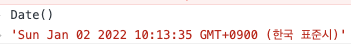

# [JavaScript] Date 객체

> Date 는 생성자 함수임
이 값은 1970년 1월 1일 00:00:00(UTC)을 기점으로 Date 객체가 나타내는 날짜와 시간까지의 밀리초를 나타냄
> 
- **new Date()**
    1. Date 생성자 함수를 인수없이 new 연산자와 함께 호출하면 현재 날짜와 시간을 가지는 Date 객체를 반환함
    2. Date 객체는 내부적으로 날짜와 시간을 나타내는 정수값을 갖지만 Date 객체를 콘솔에 출력하면 기본적으로 날짜와 시간 정보를 출력함
    
    ```jsx
    new Date()  // Sun Jan 02 2022 10:12:48 GMT+0900 (한국 표준시)
    ```
    
    1. Date 생성자 함수를 new 연산자 없이 호출하면 Date 객체를 반환하지 않고 날짜와 시간 정보를 나타내는 문자열을 반환함
    
    
    
- **new Date(ms)**
    
    <aside>
    💡 Date 생성자 함수에 숫자타입의 밀리초를 인수로 전달하면 1979년 1월 1일 00:00:00(UTC)을 기점으로 인수로 전달된 밀리초만큼 경과한 날짜와 시간을 나타내는 Date 객체를 반환함
    
    </aside>
    
    
    
    
    
- **new Date(’date string’)**
    
    <aside>
    💡 Date 생성자 함수에 날짜와 시간을 나타내는 문자열을 인수로 전달하면, 지정된 날짜와 시간을 나타내는 Date 객체를 반환함
    이 때 인수로 전달한 문자열은 Date.parse() 메서드에 의해 해석 가능한 형식이어야 함
    
    </aside>
    
    
    
- **new Date( 연, 월, 일, 시, 분, 초, 밀리초)**
    1. 월까지는 적어야 그에 맞게 리턴해줌
    ( 연까지만 적으면 ms 로 인식함 )
    2. 월은 0부터 시작해서 0이 1월, 1이 2월, 11이 12월임
    
    
    

# Date 메서드

- **Date.now() : 1970년 1월 1일 00:00:00(UTC)을 기점으로 현재 시간까지 경과한 밀리초를 숫자로 반환**
    
    
    
    ⇒ 2022년 1월 2일 (일) 오전 10:23:50 기준
    
- **Date.parse() : 1979년 1월 1일00:00:00(UTC)을 기점으로 인수로 전달된 지정시간 까지의 밀리초를 숫자로 반환함**
    
    
    
- **Date.getFullYear() : Date 객체의 연도를 나타내는 정수를 반환**
    
    
    
- **Date.setFullYear()**
    
    <aside>
    💡 Date 객체에 연도를 나타내는 정수를 설정함
    연도 이외에 옵션으로 일, 월도 설정 가능함
    
    </aside>
    
    ```jsx
    const today = new Date()
    
    // 연도 지정
    today.setFullYear(2000)
    today.getFullYear()  // 2000
    
    // 연도, 월, 일 지정
    today.setFullYear(1996, 4, 11)
    today.getFullYear()  // 1996
    ```
    
- **Date.getMonth() / Date.getDate() / Date.getDay()**
    
    ```jsx
    new Date('1996/04/11').getMonth()   // 4
    
    new Date('1996/04/11').getDate()    // 11
    ```
    
    **Date.getDay() 에서는 일~토요일이 0~6으로 표현됨**
    
    
    
    1996년 04월 11일은 금요일(4)이었다!!
    
- **Date.getHours() / Date.getMinutes() / Date.getSeconds()**
    
    ```jsx
    new Date('2020/07/24/12:00').getHours()   // 12
    
    new Date('2020/07/24/12:30').getMinutes() // 30
    
    new Date('2020/07/24/12:30:10').getSeconds() // 10
    ```
    
- **Date.getTime() : 1979년 1월 1일 00:00:00(UTC)을 기점으로 date객체의 시간까지 경과된 밀리초를 반환**
    
    
    
- **Date.getTimezoneOffset()**
    
    UTC와 Date 객체에 지정된 로캘(locale)시간과의 차이를 **분 단위**로 반환
    
    
    
- **Date.toDateString() : 사람이 읽을 수 있는 형식의 문자열로 Date 객체의 날짜를 반환함**
    
    
    
- **Date.toLocalString() / Date.toLocaleDateString() / Date.toLocaleTimeString()**
    
    **인수로 전달한 로캘을 기준으로 Date 객체의 날짜와 시간을 표현한 문자열을 반환**
    
    인수를 생략한 경우 브라우저가 동작 중인 시스템의 로캘을 적용한다.
    
    