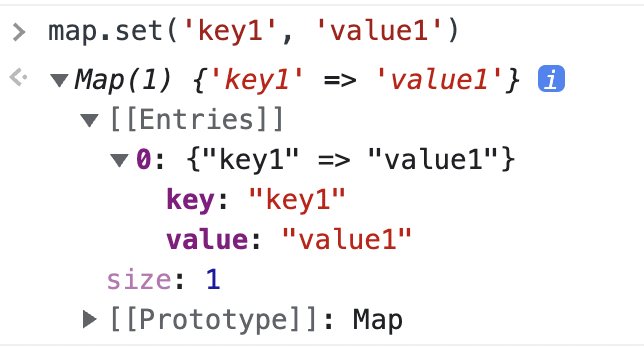

# [JavaScript] 37장 Set과 Map

# 37.1 Set

---

**Set 객체는 중복되지 않는 유일한 값들의 집힙니다.**

Set 객체는 배열과 유사하지만 다음과 같은 차이가 있다.

| 구분 | 배열 | Set 객체 |
| --- | --- | --- |
| 동일한 값을 중복하여 포함할 수 있다. | O | X |
| 요소 순서에 의미가 있다. | O | X |
| 인덱스로 요소에 접근할 수 있다. | O | X |

이러한 Set 객체의 특성은 ‘수학적 집합'의 특성과 일치한다. Set은 수학적 집합을 구현하기 위한 자료구조다.
따라서 Set 을 통해 교집합, 합집합, 차집합, 여집합 등을 구현할 수 있다.

## 37.1.1 Set 객체의 생성

Set 객체는 `Set` 생성자 함수로 생성한다. `Set` 생성자 함수에 인수를 전달하지 않으면 빈 Set 객체가 생성된다.

```jsx
const set = new Set()
console.log(set) // Set(0) {}
```

`**Set` 생성자 함수는 이터러블을 인수로 전달받아 Set 객체를 생성한다. 이 때 이터러블의 중복된 값은 Set 객체에 요소로 저장되지 않는다.**

```jsx
const set1 = new Set([1, 2, 3, 3])
console.log(set1) // Set(3) {1, 2, 3}

const set2 = new Set('hello')
console.log(set2) // Set(4) {"h", "e", "l", "o"}
```

중복을 허용하지 않는 Set 객체의 특성을 활용하여 배열에서 중복된 요소를 제거할 수 있다.

```jsx
// 배열의 중복 요소 제거
const uniq = array => array.filter((v, i, self) => self.indexOf(v) === i)
console.log(uniq([2, 1, 2, 3, 4, 3, 4])) // [2, 1, 3, 4]

// Set 을 사용한 배열의 중복 요소 제거
const uniq = array => [ ...new Set(array) ]
console.log(uniq([2, 1, 2, 3, 4, 3, 4, ])) // [2, 1, 3, 4]
```

## 37.1.2 요소  개수 확인

Set 객체의 요소 개수를 확인할 떄는 `Set.prototype.size` 프로퍼티를 사용한다.

```jsx
const { size } = new Set([1, 2, 3, 3])
console.log(size) // 3
```

`size` 프로퍼티는 setter 함수 없이 getter 함수만 존재하는 접근자 프로퍼티다.
따라서 `size` 프로퍼티에 숫자를 할당하여 Set 객체의 요소 개수를 변경할 수 없다.

## 37.1.3 요소 추가

Set 객체에 요소를 추가할 때는 `Set.prototype.add` 메서드를 사용한다.

```jsx
const set = new Set()
console.log(set) // Set(0) {}

set.add(1)
console.log(set) // Set(1) {}
```

`add` 메서드는 새로운 요소가 추가된 Set 객체를 반환한다. 따라서 `add` 메서드를 호출한 후에 `add` 메서드를 연속적으로 호출할 수 있다.

```jsx
cosnt set = new Set()

set.add(1).add(2)
console.log(set) // Set(2) {1, 2}
```

Set 객체에 중복된 요소의 추가는 허용하지 않는다. 이 떄 에러가 발생하지는 않고 무시된다.

```jsx
cosnt set = new Set()

set.add(1).add(2).add(2)
console.log(set) // Set(2) {1, 2}
```

일치 비교 연산자 `===` 을 사용하면 NaN 과 NaN 을 다르다고 평가한다.

하지만 Set 객체는 NaN 과 NaN 을 같다고 평가하여 중복 추가를 허용하지 않는다.

마찬가지로 +0 과 -0 은 일치비교 연산자 `===` 로 같다고 평가하여 중복 추가를 허용하지 않는다.

```jsx
const set = new Set()

console.log(NaN === NaN) // false
console.log(+0 === -0) // true

// NaN 과 NaN 을 같다고 평가하여 중복 추가를 허용하지 않는다.
set.add(NaN).add(NaN)
console.log(set) // Set(1) {NaN}

// +0 과 -0 을 같다고 평가하여 중복 추가를 허용하지 않는다.
set.add(0).add(-0)
console.log(set) // Set(2) {NaN, 0}
```

Set 객체는 객체나 배열과 같이 자바스크립트의 모든 값을 요소로 저장할 수 있다.

```jsx
const set = new Set()

set
	.add(1)
	.add('a')
	.add(true)
	.add(undefined)
	.add(null)
	.add({})
	.add([])
	.add(() => {})

console.log(set) // Set(8) {1, "a", true, undefined, null, {}, [], () => {}}
```

## 37.1.4 요소 존재 여부 확인

Set 객체에 특정 요소가 존재하는지 확인하려면 `Set.prototype.has` 메서드를 사용한다.
`has` 메서드는 특정 요소의 존재 여부를 불리언 값으로 나타낸다.

```jsx
const set = new Set([1, 2, 3])

console.log(set.has(2)) // true
console.log(set.has(4)) // false
```

## 37.1.5 요소 삭제

Set 객체에 특정 요소를 삭제하려면 `Set.prototype.delete` 메서드를 사용한다.
`delete` 메서드는 삭제 성공 여부를 나타내는 불리언 값을 반환한다.

`delete` 메서드에는 인덱스가 아니라 삭제하려는 요소값을 인수로 전달해야 한다.
Set 객체는 순서에 의미가 없다. 즉 배열과 같이 인덱스를 가지지 않는다.

```jsx
const set = new Set([1, 2, 3])

set.delete(2)
console.log(set) // Set(2) {1, 3}

set.delete(1)
console.log(set) // Set(1) {3}
```

만약 존재하지 않는 Set 객체의 요소를 삭제하려면 에러 없이 무시된다.

`delete` 메서드는 삭제 성공 여부를 나타내는 불리언 값을 반환한다.
따라서 `set.prototype.add` 메서드와 달리 연속적으로 호출할 수 없다.

```jsx
const set = new Set([1, 2, 3])

set.delete(1).delete(2) // TypeError
```

## 37.1.6 요소 일괄 삭제

Set 객체의 모든 요소를 삭제하려면 `Set.prototype.clear` 메서드를 사용한다.

`clear` 메서드는 언제나 undefined 를 반환한다.

```jsx
const set = new Set([1, 2, 3])

set.clear()
console.log(set) // Set(0) {}
```

## 37.1.7 요소 순회

Set 객체의 요소를 순회하려면 `Set.prototype.forEach` 메서드를 사용한다.

`Set.prototype.forEach` 메서드는 Array.prototype.forEach 와 유사하게, 콜백함수와 forEach 메서드의 콜백 함수 내부에서 `this` 로 사용될 객체(옵션)를 인수로 전달한다. 

이때 콜백 함수는 다음과 같이 3개의 인수를 전달받는다.

- 첫번째 인수: 현재 순회 중인 요소값
- 두번째 인수: 현재 순회 중인 요소값
- 세번째 인수: 현재 순회 중인 Set 객체 자체

첫번째 인수와 두번째 인수는 같은 값이다. 이처럼 공작하는 이유는 `Array.prototype.forEach` 메서드와 인터페이스를 통일하기 위함이며 다른 의미는 없다. `Array.prototype.forEach` 메서드는 두번째 인수로 인덱스를 전달받지만 Set 객체는 순서에 의미가 없어 배열과 같이 인덱스를 갖지 않는다.

```jsx
const set = new Set([1, 2, 3])

set.forEach((v, v2, set) => console.log(v, v2, set))
/*
1 1 Set(3) {1, 2, 3}
2 2 Set(3) {1, 2, 3}
3 3 Set(3) {1, 2, 3}
*/
```

**Set 객체는 이터러블이다.**

따라서 `for...of` 문으로 순회할 수 있으며, 스프레드 문법과 배열 디스트럭처링의 대상이 될 수도 있다.

```jsx
const set = new Set([1, 2, 3])

// Set 객체는 Set.prototype 의 Symbol.iterator 메서드를 상속받는 이터러블이다.
console.log(Symbol.iterator in set) // true

// 이터러블인 Set 객체는 for...of 문으로 순회할 수 있다.
for (const value of set) {
	console.log(value) // 1 2 3
}

// 이터러블인 Set 객체는 스프레드 문법의 대상이 될 수 있다.
console.log([...set]) // [1, 2, 3]

// 이터러블인 Set 객체는 배열 디스트럭처링 할당의 대상이 될 수 있다.
const [a, ...rest] = set
console.log(a, rest) // 1, [2, 3]
```

Set 객체는 요소의 순서에 의미를 갖지 않지만 Set 객체를 순회하는 순서는 요소가 추가된 순서를 따른다.

## 37.1.8 집합 연산

Set 객체는 수학적 집합을 구현하기 위한 자료구조다. 따라서 Set 객체를 통해 교집합, 합집합, 차집합 등을 구현할 수 있다.

집합 연산을 수행하는 프로토타입 메서드를 구현하면 다음과 같다.

### 교집합

교집합 A ∩ B 는 집합 A 와 집합 B 의 공통 요소로 구성된다.

```jsx
Set.prototype.intersection = function (set) {
	const result = new Set()

	for (const value of set) {
		// 2개의 set 의 요소가 공통되는 요소이면 교집합의 대상이다.
		if (this.has(value)) result.add(value)
	}

	return result
}

const setA = new Set([1, 2, 3, 4])
const setB = new Set([2, 4])

console.log(setA.intersection(setB)) // Set(2) {2, 4}
console.log(setB.intersection(setA)) // Set(2) {2, 4}
```

다음과 같은 방법으로도 가능하다.

```jsx
Set.prototype.intersection = function(set) {
	return new Set([...this].filter(v => set.has(v)))
}
```

### 합집합

합집합 A ∪ B는 집합 A 와 집합 B 의 중복 없는 모든 요소로 구성된다.

```jsx
Set.prototype.union = function (set) {
	// this(set 객체)를 복사
	const result = new Set(this)

	for (const value of set) {
		// 합집합은 2개의 Set 객체의 모든 요소로 구성된 집합이다. 중복된 요소는 포함되지 않는다.
		result.add(value)
	}

	return result
}

const setA = new Set([1, 2, 3, 4])
const setB = new Set([2, 4])

console.log(setA.union(setB)) // Set(4) {1, 2, 3, 4}
```

다음과 같은 방법으로도 가능하다.

```jsx
Set.prototype.union = function (set) {
	return new Set([...this, ...set])
}
```

### 차집합

차집합 A - B 는 집합 A 에는 존재하지만 집합 B 에는 존재하지 않는 요소로 구성된다.

```jsx
Set.prototype.difference = function (set) {
	// this(Set 객체)를 복사
	const result = new Set(this)

	for (const value of set) {
		// 차집합은 어느 한쪽 집합에는 존재하지만 다른 한쪽 집합에는 존재하지 않는 요소로 구성된 집합이다.
		result.delete(value)
	}

	return result
}

const setA = new Set([1, 2, 3, 4])
const setB = new Set([2, 4])

console.log(setA.diffrence(setB)) // Set(2) {1, 3}
```

다음과 같은 방법으로도 가능하다

```jsx
Set.prototype.difference = function (set) {
	return new Set([...this].filter(v => !set.has(v)))
}
```

### 부분 집합과 상위 집합

집합 A 가 집합 B 에 포함되는 경우 (A⊆B) 집합 A 는 집합 B 의 부분집합이며, 집합 B 는 집합 A 의 상위집합이다.

```jsx
// this 가 subset 의 상위 집합인지 확인한다.
Set.prototype.isSuperset = function (subset) {
	for(const value of subset) {
		// superset 의 모든 요소가 subset 의 모든 요소를 포함하는지 확인
		if (!this.has(value)) return false
	}

	return true
}

const setA = new Set([1, 2, 3, 4])
const setB = new Set([2, 4])

console.log(setA.isSuperset(setB)) // true
console.log(setB.isSuperset(setA)) // false
```

다음과 같은 방법으로도 가능하다.

```jsx
// this 가 subset 의 상위 집합인지 확인한다.
Set.prototype.isSuperset = function (subset) {
	const supersetArr = [...this]
	return [...subset].every(v => supersetArr.includes(v))
}
```

# 37.2 Map

---

**Map 객체는 키와 값의 쌍으로 이루어진 컬렉션이다.**
Map 객체는 객체와 유사하지만 다음과 같은 차이가 있다.

| 구분 | 객체 | Map 객체 |
| --- | --- | --- |
| 키로 사용할 수 있는 값 | 문자열 또는 심벌 값 | 객체를 포함한 모든 값 |
| 이터러블 | X | O |
| 요소 개수 확인 | Object.keys(obj).length | map.size |

## 37.2.1 Map 객체의 생성

Map 객체는 `Map` 생성자 함수로 생성한다. `Map` 생성자 함수에 인수를 전달하지 않으면 빈 Map 객체가 생성된다.

```jsx
const map = new Map()
console.log(map) // Map(0) {}
```

`**Map` 생성자 함수는 이터러블을 인수로 받아 Map 객체를 생성한다. 이 때 인수로 전달되는 이터러블은 키와 값의 쌍으로 이루어진 요소로 구성되어야 한다.**

```jsx
const map1 = new Map(['key1', 'value1'], ['key2', 'value2'])
console.log(map1) // Map(2) {"key1" => "value1", "key2" => "value2"}

const map2 = new Map([1, 2]) // TypeError
```

`Map` 생성자 함수의 인수로 전달한 이터러블에 중복된 키를 갖는 요소가 존재하면 값이 덮어써진다.
따라서 Map 객체에는 중복된 키를 갖는 요소가 존재할 수 없다.

```jsx
const map = new Map([['key1', 'value1'], ['key1', 'value2']])
console.log(map) // Map(1) {'key1' => 'value2'}
```

## 37.2.2 요소 개수 확인

Map 객체의 요소 개수를 확인할 때는 `Map.prototype.size` 프로퍼티를 사용한다.

```jsx
const { size } = new Map([['key1', 'value1'], ['key2', 'value2']])
console.log(size) // 2
```

`size` 프로퍼티는 setter 함수 없이 getter 함수만 존재하는 접근자 프로퍼티다.
따라서 `size` 프로퍼티에 숫자를 할당하여 Map 객체의 요소 개수를 변경할 수 없다.

## 37.2.3 요소 추가

Map 객체에 요소를 추가할 때는 `Map.prototype.set` 메서드를 사용한다.

```jsx
const map = new Map()
console.log(map) // Map(0) {}

map.set('key1', 'value1')
console.log(map) // Map(1) {'key1' => 'value1}
```

`set` 메서드는 새로운 요소가 추가된 Map 객체를 반환한다. 따라서 `set` 메서드를 호출한 후에 `set` 메서드를 연속적으로 호출할 수 있다.

Map 객체에는 중복된 키를 갖는 요소가 존재할 수 없기 때문에 중복된 키를 갖는 요소를 추가하면 값이 덮어씌어진다.

```jsx
const map = new Map()

map.set('key1', 'value1').set('key1', 'value2')

console.log(map) // Map(1) {'key1' => 'value2'}
```

`Set 객체` 와 마찬가지로 `Map 객체` 또한 NaN 과 NaN 을 같다고 평가하며 +0 과 -0 등의 중복 추가를 허용하지 않는다.

```jsx
const map = new Map()

map.set(NaN, 'value1').set(NaN, 'value2')
console.log(map) // Map(1) {NaN => 'value2'}
```

객체는 문자열 또는 심벌 값만 키로 사용할 수 있지만, **Map 객체는 키 타입에 제한이 없다.
따라서 객체를 포함한 모든 값을 키로 사용할 수 있다. 이는** Map 객체와 일반 객체의 가장 두드러지는 차이점이다.

```jsx
const map = new Map()

const lee = { name: 'Lee' }
const kim = { name: 'Kim' }

// 객체도 key 로 사용할 수 있다.
map.set(lee, 'developer').set(kim, 'developer')

console.log(map) // Map(2) { {name: 'Lee'} => 'developer', {name: 'Kim'} => 'developer' }
```

## 37.2.4 요소 취득

Map 객체에서 특정 요소를 취득하려면 `Map.prototype.get` 메서드를 사용한다.
`get` 메서드의 인수로 키를 전달하면 Map 객체에서 인수로 전달한 키를 갖는 값을 반환한다.
Map 객체에서 인수로 전달한 키를 갖는 요소가 존재하지 않으면 undefined 를 반환한다.

```jsx
const map = new Map()

const lee = { name: 'Lee' }
const kim = { name: 'Kim' }

map.set(lee, 'developer').set(kim, 'developer')

console.log(map.get(lee)) // developer
console.log(map.get('key')) // undefined
```

## 37.2.5 요소 존재 여부 확인

Map 객체에 특정 요소가 존재하는지 확인하려면 `Map.prototype.has` 메서드를 사용한다.
`has` 메서드는 특정 요소의 존재 여부를 타나내는 불리언 값을 반환한다.

```jsx
const lee = { name: 'Lee' }
const kim = { name: 'Kim' }

const map = new Map([[lee, 'developer'], [kim, 'designer']])

console.log(map.has(lee)) // true
console.log(map.has('key')) // false
```

## 37.2.6 요소 삭제

Map 객체의 요소를 삭제하려면 `Map.prototype.delete` 메서드를 사용한다.
`delete` 메서드는 삭제 성공 여부를 나타내는 불리언 값을 반환한다.

```jsx
const lee = { name: 'Lee' }
const kim = { name: 'Kim' }

const map = new Map([[lee, 'developer'], [kim, 'designer']])

map.delete(kim)
console.log(map) // Map(1) { {name: 'Lee'} => 'developer'}
```

만약 존재하지 않는 키로 Map 객체의 요소를 삭제하려 하면 에러 없이 무시된다.

또한 `delete` 메서드는 삭제 성공 여부를 나타내는 불리언 값을 반환한다. 따라서 `set` 메서드와 달리 연속적으로 호출할 수 없다.

## 37.2.7 요소 일괄 삭제

```jsx
const lee = { name: 'Lee' }
const kim = { name: 'Kim' }

const map = new Map([[lee, 'developer'], [kim, 'designer']])

map.clear()
console.log(map) // Map(0) {}
```

## 37.2.8 요소 순회

Map 객체의 요소를 순회하려면 `Map.prototype.forEach` 메서드를 사용한다.
`Map.prototype.forEach` 메서드는 Array.prototype.forEach 메서드와 유사하게 forEach 메서드의 콜백 함수 내부에서 `this` 로 사용될 객체(옵션)를 인수로 전달한다.

이때 콜백 함수는 다음과 같이 3개의 인수를 전달받는다.

- 첫번째 인수: 현재 순회 중인 요소값
- 두번쨰 인수: 현재 순회 중인 요소키
- 세번째 인수: 현재 순회 중인 Map 객체 자체

```jsx
const lee = { name: 'Lee' }
const kim = { name: 'Kim' }

const map = new Map([[lee, 'developer'], [kim, 'designer']])

map.forEach((v, k, map) => console.log(v, k, map) )
/*
developer {name: 'Lee'} Map(2) { {name: 'Lee'} => 'developer', {name: 'Kim'} => 'designer' }
designer {name: 'Kim'} Map(2) { {name: 'Lee'} => 'developer', {name: 'Kim'} => 'designer' }
*/
```

**Map 객체는 이터러블이다.**

따라서 for...of 문으로 순회할 수 있으며, 스프레드 문법과 배열 디스트럭처링 할당의 대상이 될 수도 있다.

```jsx
const lee = { name: 'Lee' }
const kim = { name: 'Kim' }

const map = new Map([[lee, 'developer'], [kim, 'designer']])

// Map 객체는 Map.prototype 의 Symbol.iterator 메서드를 상속받는 이터러블이다.
console.log(Symbol.iterator in map) // true

// 이터러블인 Map 객체는 for...of문으로 순회할 수 있다.
for (const entry of Map) {
	console.log(entry) // [{name: 'Lee'}, 'developer'] [{name: 'Kim'}, 'designer']
}

// 이터러블인 Map 객체는 스프레드 문법의 대상이 될 수 있다.
console.log([...map])
// [[{name: 'Lee'}, 'developer'], [{name: 'Kim'}, 'designer']]

// 이터러블인 Map 객체는 배열 디스트럭처링 할당의 대상이 될 수 있다.
const [a, b] = map
console.log(a, b) // [{name: 'Lee'}, 'developer'] [{name: 'Kim'}, 'designer']
```

Map 객체는 이터러블이면서 동시에 이터레이터인 객체를 반환하는 메서드를 제공한다.

| Map 메서드 | 설명 |
| --- | --- |
| Map.prototype.keys | Map 객체에서 요소키를 값으로 갖는 이터러블이면서 동시에 이터레이터인 객체를 반환한다. |
| Map.prototype.values | Map 객체에서 요소값을 값으로 갖는 이터러블이면서 동시에 이터레이터인 객체를 반환한다. |
| Map.prototype.entries | Map 객체에서 요소키와 요소값을 값으로 갖는 이터러블이면서 동시에 이터레이터인 객체를 반환한다. |

> 새로 알게된것 TIL (2022.04.03 일)
> 
> 
> ---
> 
> 1. Set 객체는 수학적 집합을 나타내기 위한 자료구조라는 것을 알았고, 때문에 중복을 허용하지 않는다.
> 일반적으로는 일치 비교 연산자 === 로 불일치 하는 것도 때에 따라 일치하게 나타나서 중복이 되지 않도록 한다는 것을 알았다.
> 
> 1. Set 객체와 Map 객체는 기본적으로 이터러블이기 때문에 for...of문, 전개연산자, 배열 구조분해 할당이 가능하다는 것을 알았다.
> 
> 1. Map 생성자 함수를 호출해서 만든 Map 객체는 이렇게 생겼다.
>     
>     
>     
>     `[[Entries]]` 라는 내부슬롯으로 숫자로 슬롯이 구분되어 있고, 아마도 이는 Map 이 이터러블이기 때문에 정수로 된 프로퍼티 키를 갖고 있으며 그 값으로 각 entry 마다 key와 value 를 가진 형태다
>     이거에 접근하거나 삭제, 순회 등을 하려면 직접 접근하는 것이 아니라 `get`, `delete`, `forEach` 등의 메서드를 사용해야 한다.
>     
> 
> 1. Map 객체에 keys 메서드를 쓰면 요소키를 값으로 갖는 이터러블이면서 동시에 이터레이터인 객체를 반환한다.
>     
>     
>     
>     
>     
>     이렇게 요소key 를 값으로 갖는 이터레이터면서 이터러블인 객체를 반환한다.
>     
>     
>     
>     그래서 이렇게 이터레이터를 생성해서 `next` 메서드를 쓸 수도 있고 이터레이션 리절트 객체를 반환한다.
>     어떻게 써먹을 수 있는 방법이 언젠가는 있지 않을까
>     
> 
> 
> 
> `Map.prototype.values` 메서드도 요소값을 가지고 이터레이터면서 이터러블인 객체를 반환하고, 마찬가지로 `next` 메서드로 리절트 객체를 반환한다.
>