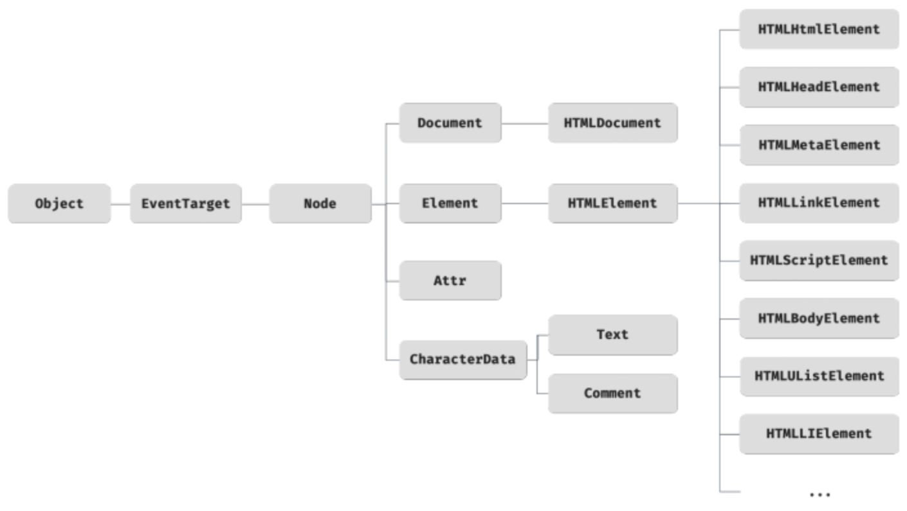

# [JavaScript] 39장 DOM (39.1 ~ 39.2)

383절 “HTML 파싱과 DOM 생성"에서 살펴보았듯이 브라우저의 렌더링 엔진은 HTML 문서를 파싱하여 브라우저가 이해할 수 있는 자료구조인 DOM을 생성한다. `**DOM(Document Object Model)` 은 HTML 문서의 계층적 구조와 정보를 표현하며 이를 제어할 수 있는 API, 즉 프로퍼티와 메서드를 제공하는 트리 자료구조다.**

# 39.1 노드

## 39.1.1 HTML 요소와 노드 객체

---

HTML 요소(HTML Element)는 HTML 문서를 구성하는 개별적인 요소를 의미한다.
HTML 요소는 렌더링 엔진에 의해 파싱되어 DOM 을 구성하는 요소 노드 객체로 변환된다.
이때 HTML 요소의 어트리뷰트는 어트리뷰트 노드로, HTML 요소의 텍스트 콘텐츠는 텍스트 노드로 변환된다.

HTML 문서는 HTML 요소들의 집합으로 이뤄지며, HTML 요소는 중첩관계를 갖는다.
즉, HTML 요소의 콘텐츠 영역(시작 태그와 종료 태그 사이)에는 텍스트뿐만 아니라 다른 HTML 요소도 포함될 수 있다.

이 때 HTML 요소 간에는 중첩 관계에 의해 계층적인 부자 관계가 형성된다. 이러한 HTML 요소 간의 부자 관계를 반영하여 HTML 문서의 구성 요소인 HTML 요소를 객체화한 모든 노드 객체들을 트리 자료 구조로 구성한다.

### 트리 자료구조

트리 자료구조(tree data structure)는 노드들의 계층 구조로 이뤄진다. 즉, 트리 자료구조는 부모 노드와 자식 노드로 구성되어 노드 간의 계층적 구조(부자, 형제 관계)를 표현하는 비선형 자료구조를 말한다.

- 트리 자료구조는 하나의 최상위 노드에서 시작한다.
    
    최상위 노드는 부모 노드가 없으며, 루트 노드(root node)라 한다.
    루트 노드는 0개 이상의 자식 노드를 갖는다.
    
- 자식 노드가 없는 노드를 리프 노드(left node)라 한다.

⇒ 노드 객체들로 구성된 자료구조를 **DOM(Document Object Model)**이라 한다. 노드 객체의 트리로 구조화되어 있기 때문에 DOM 을 **DOM 트리**라고 부르기도 한다.

## 39.1.2 노드 객체의 타입

---

DOM 은 노드 객체의 계층적인 구조로 구성된다.

노드 객체는 총 12개 종류(노드 타입)가 있으며, 이중에서 중요한 노드 타입은 다음과 같이 4가지다.

### 문서 노드 document node

문서 노드는 DOM 트리에 최상위에 존재하는 루트 노드로서 `document` 객체를 가리킨다.

→ `document` 객체는 브라우저가 렌더링한 HTML 문서 전체를 가리키는 객체
→ 전역 객체 `window` 의 `document` 프로퍼티에 바인딩되어 있다.

- 모든 script 는 분리되어 있더라도 하나의 전역 객체 `window` 를 공유하므로 HTML 문서당 `document` 객체는 유일하다.
- 문서 노드, 즉 `document` 객체는 DOM 트리의 루트 노드이므로 DOM 트리의 노드들에 접근하기 위한 진입접 역할을 한다.

### 요소 노드 element node

요소 노드는 HTML 요소를 가리키는 객체다.

요소 노드는 HTML 요소 간의 중첩에 의해 부자 관계를 가지며, 이 부자 관계를 통해 정보를 구조화한다. 따라서 요소 노드는 문서으 ㅣ구조를 표현한다.

### 어트리뷰트 노드 attribute node

어트리뷰트 노드는 HTML 요소의 어트리뷰트를 가리키는 객체다.

- 어트리뷰트가 지정된 HTML 요소의 요소 노드와 연결되어 있음
    
    → 즉, 어트리뷰트 노드는 부모 노드가 없으므로 요소 노드의 형제 노드도 아니다.
    
    → 따라서 어트리뷰트 노드에 접근하여 어트리뷰트를 참조하거나 변경하려면 먼저 요소 노드에 접근해야 한다.
    

### 텍스트 노드 text node

텍스트 노드는 HTML 요소의 텍스트를 가리키는 객체다.

- 요소 노드가 문서의 구조를 표현한다면 텍스트 노드는 문서의 정보를 표현한다.
- 텍스트 노드는 요소 노드의 자식 노드이며, 자식 노드를 가질 수 없는 리프 노드(left node)다.
- 즉, 텍스트 노드는 DOM 트리의 최종단이다.

⇒ 따라서 텍스트 노드에 접근하려면 먼저 부모 노드인 요소 노드에 접근해야 한다.

## 39.1.3 노드 객체의 상속 구조

---

DOM 은 HTML 문서의 계층적 구조와 정보를 표현하고, 이를 제어할 수 있는 API 를 제공하기 때문에, **DOM 을 구성하는 노드 객체는 자신의 구조와 정보를 제어할 수 있는 DOM API 를 사용할 수 있다.**



위 그림과 같이 모든 노드 객체는 `Object`, `EventTarget`, `Node` 인터페이스를 상속받는다.
추가적으로 문서 노드는 `Document`, `HTMLDocument` 인터페이스를 상속받고 어트리뷰트 노드는 `Attr`, 텍스트 노드는 `CharacterData` 인터페이스를 상속받는다.
요소 노드는 `Element` 인터페이스를 상속받으며 추가적으로 종류별 인터페이스를 상속받는다.

- 프로토탕비 체인 관점에서 살펴본 input 엘리먼트
    
    
    
    input 요소를 파싱하여 객체화한 Input 요소 노드 객체는 HTMLInputElement, HTMLElement, Element, Node, EventTarget, Object 의 prototype 에 바인딩되어 있는 프로토타입 객체를 상속받는다.
    
    **즉 input 요소 노드 객체는 프로토타입 체인에 있는 모든 프로토타입의 프로퍼티나 메서드를 상속받아 사용할 수 있다.**
    

### 이런 노드 객체의 상속구조로 인한 특징

1. 노드 객체에는 노드 객체의 종류, 즉 노드 타입에 상관없이 모든 노드 객체가 공통으로 가지는 기능이 있다.
    1. 모든 노드 객체는 공통적으로 이벤트를 발생시킬 수 있다.
        
        Ex) EventTarget.addEventListener, EventTarget.removeEventListener 등
        
    2. 모든 노드 객체는 트리 자료구조의 노드로서 공통적으로 트리 탐색 기능이나 노드 정보 제공 기능을 갖는다.
        
        Ex) Node.parentNode, Node.childNodes, Node.nodeType, Node.nodeName 등
        
2. 반대로 HTML 요소 종류에 따라 고유한 기능도 있다.
    1. 예시로, input 요소에는 value 프로퍼티가 필요하지만, div 요소에는 value 프로퍼티가 필요하지 않다.
    2. 이 경우 필요한 기능을 제공하는 인터페이스(HTMLInputElement, HTMLDivElement)가 HTML 요소의 종류에 따라 각각 다르다.

**DOM 은 HTML 문서의 계층적 구조와 정보를 표현하는 것은 물론 노드 객체의 종료, 즉 노드 타입에 따라 필요한 기능을 프로퍼티와 메서드의 집합인 DOM API로 제공한다. 이 DOM API 를 통해 HTML 의 구조나 내용 또는 스타일 등을 동적으로 조작할 수 있다.**

# 39.2 요소 노드 취득

HTML 의 구조나 내용 또는 스타일 등을 동적으로 조작하려면 먼저 요소 노드를 취득해야 한다.
요소 노드의 취득은 HTML 요소를 조작하는 시작점이다. 이를 위해 DOM 은 요소 노드를 취득할 수 있는 다양한 메서드를 제공한다.

## 39.2.1 id 를 이용한 요소 노드 취득

---

`Document.prototype.getElementById` 메서드는 인수로 전달한 id 어트리뷰트 값을 갖는 하나의 요소 노드를 탐색하여 반환한다.

```jsx
const $elem = document.getElementById('banana')
```

- id 값은 문서 내에서 유일한 값이어야 하며, class 어트리뷰트와는 달리 공백 문자로 구분하여 여러 개의 값을 가질 수 없다.
- 만약 인수로 전달된 Id 값을 갖는 HTML 요소가 존재하지 않는 경우 `getElementById` 메서드는 null 을 반환한다.
- id 값을 할당한 변수가 동일한 이름으로 전역변수가 이미 선언되어 있으면, 이 전역 변수에 해당 노드 객체가 재할당되지 않는다.

## 39.2.2 태그 이름을 이용한 요소 노드 취득

---

`Document.prototype.getElementsByTagName` 또는 `Element.prototype.getElementsByTagName` 메서드는 인수로 전달한 태그 이름을 갖는 **“모든”** 요소 노드들을 탐색하여 반환한다.

`**getElementsByTagName` 메서드는 여러 개의 요소 노드 객체를 갖는 DOM 컬렉션 객체인 `HTMLCollection` 객체를 반환한다.**

```jsx
const #elems = document.getElementsByTagName('li')

// 취득한 모든 요소 노드의 style.color 프로퍼티 값을 변경한다
// HTMLCollection 객체를 배열로 변환하여 순회하여 color 프로퍼티 값을 변경한다.
[ ...$elems ].forEach(elem => { elem.style.color = 'red' })
```

- `**getElementsByTagName` 메서드가 반환하는 DOM 컬렉션 객체인 `HTMLCollection` 객체는 유사 배열 객체이면서 이터러블이다.**
- HTML 문서의 모든 요소 노드를 취득하려면 `getElementsByTagName` 메서드의 인수로 `'*'` 를 전달한다.
    
    ```jsx
    const $all = document.getElementByTagName('*')
    ```
    

- Document 가 아닌 특정 Element 에서 `getElementsByTagName` 를 호출하면 특정 요소 노드의 자손 노드 중에서 요소 노드를 탐색하여 반환한다.
    
    ```jsx
    const $listFromDocument = document.getElementsByTagName('li')
    
    const $fruits = document.getElementById('fruits')
    const $listFormFruits = $fruits.getElementsByTagName('li')
    ```
    
    만약 인수로 전달된 태그 이름을 갖는 요소가 없으면 `getElementsByTagName` 메서드는 빈 HTMLCollection 객체를 반환한다.
    

## 39.3.3 class 를 이용한 요소 노드 취득

---

`Document.prototype.getElementsByClassName` 또는 `Element.prototype.getElementsByClassName` 메서드는 인수로 전달한 class 값을 갖는 모든 요소 노드들을 탐색하여 반환한다.

`**getElementsByClassName` 메서드 또한 여러 개의 요소 노드 객체를 갖는 DOM 컬렉션 객체인 `HTMLCollection` 객체를 반환한다.**

```jsx
const $elems = document.getElementsByClassName('fruit')
```

- `getElementsByTagName` 메서드와 마찬가지로 `getElementsByClassName` 메서드는 `document` 를 통해 호출하면 DOM 전체 요소를 탐색, `Element` 를 통해 호출하면 특정 요소 노드의 자손 노드 중에서 탐색하여 반환한다.
- 만약 인수로 전달된 class 값을 갖는 요소가 존재하지 않는 경우 `getElementsByClassName` 메서드는 빈 HTMLCollection 객체를 반환한다.

## 39.2.4 CSS 선택자를 이용한 요소 노드 취득

---

CSS 선택자는 스타일을 적용하고자 하는 HTML 요소를 특정할 때 사용하는 문법이다.

`Document.prototype.querySelector` 또는 `Element.prototype.querySelector` 메서드는 인수로 전달한 CSS 선택자를 만족시키는 하나의 요소 노드를 탐색하여 반환한다.

```jsx
const #elem = document.querySelector('.banana')
```

- 인수로 전달한 CSS 선택자를 만족시키는 요소 노드가 여러 개인 경우 첫 번째 요소 노드만 반환한다.
- 인수로 전달한 CSS 선택자를 만족시키는 요소 노드가 존재하지 않는 경우 null 을 반환한다.
- 인수로 전달한 CSS 선택자가 문법에 맞지 않는 경우 DOMException 에러가 발생한다.

`Document.prototype.querySelectorAll` 또는 `Element.prototype.querySelelctorAll` 메서드는 인수로 전달한 CSS 선택자를 만족시키는 모든 요소 노드를 탐색하여 반환한다.

`**querySelectorAll` 메서드는 여러 개의 요소 노드 객체를 갖는 DOM 컬렉션 객체인 `NodeList` 객체를 반환한다. `NodeList` 객체는 유사 배열 객체이면서 이터러블이다.**

```jsx
const $elems = document.querySelectorAll('ul > li')

$elems.forEach(elem => { elem.style.color = 'blue' })
```

- HTML 문서의 모든 요소 노드를 취득하려면 `querySelectorAll` 메서드의 인수로 전체 선택자 `'*'` 를 전달한다.

⇒ `**querySelector` 메서드와 `querySelectorAll` 메서드는 마찬가지로 Element 에서 호출하면 특정 요소 노드의 자손 노드 중에서 요소 노드를 탐색하여 반환한다.**

> CSS 문법 선택자 `querySelector` 메서드와 `querySelectorAll` 메서드는 일반적으로 `getElementById` 또는 `getElementsBy...` 메서드보다 다소 느린 것으로 알려져 있다.
> 
> 
> 따라서 id 값으로 어트리뷰트를 찾을 때는 `getEmenetById` 메서드를 사용하고 그 외의 경우에는 `querySelector` 또는 `querySelectorAll` 메서드를 사용하는 것을 권장한다.
> 

## 39.2.5 특정 요소 노드를 취득할 수 있는지 확인

---

`Element.prototype.matches` 메서드는 인수로 전달한 CSS 선택자를 통해 특정 요소 노드를 취득할 수 있는지 확인한다.

```jsx
const $apple = document.querySelector('.apple')

console.log($apple.matches('#fruits > li.apple')) // true
console.log($apple.matches('#fruits > li.banana')) // false
```

## 39.2.6 HTMLCollection 과 NodeList

---

DOM 컬렉션 객체인 `HTMLCollection` 과 `NodeList` 는 DOM API 가 여러 개의 결과값을 반환하기 위한 DOM 컬렉션 객체다.
**HTMLCollection 과 NodeList 는 모두 유사 배열 객체이면서 이터러블이다.**
→ 따라서 for...of 문으로 순회할 수 있으며, 스프레드 문법을 사용하여 간단히 배열로 변환할 수 있다.

### HTMLCollection 과 NodeList 의 중요한 특징

- 바로 노드 객체의 상태 변화를 실시간으로 반영하는 **살아있는(live) 객체**라는 점!
    - HTMLCollection 은 언제나 live 객체로 동작한다.
    - 단, NodeList 는 대부분의 경우 노드 객체의 상태 변화를 실시간으로 반영하지 않고 과거의 정적 상태를 유지하는 non-live 객체로 동작하지만, 경우에 따라서는 live 객체로 동작할 때가 있다.

### HTMLCollection

`getElementsByTagName`, `getElementsByClassName` 메서드가 반환하는 HTMLCollection 객체는 노드 객체의 상태 변화를 실시간으로 반영하는 **살아있는 DOM 컬렉션 객체**다.
따라서 HTMLCollection 객체를 살아있는 live 객체라고 부르기도 한다.

- HTMLCollection 객체가 live 객체이기 때문에 주의해야 할 점
    
    ```html
    <head>
    	<style>
    		.red { color: red; }
    		.blue { color: blue; }
    	</style>
    </head>
    <body>
    	<ul id="friuts">
    		<li class="red">Apple</li>
    		<li class="red">Banana</li>
    		<li class="red">Orange</li>
    	</ul>
    	<script>
    		const $elems = document.getElementsByClassName('red')
    
    		for (let i = 0; i < $elems.length; i++) {
    			$elems[i].className = 'blue'
    		}
    	</script>
    </body>
    ```
    
    > 위 예제의 경우 모든 `li` 요소가 클래스가 ‘blue’ 로 변경되어야 할 것 같지만, 실제로 두번째 li 인 ‘Banana’ 는 빨간색으로 남는다.
    > 
    > 1. 첫번째 순회(i === 0) 때 첫번째 elem 인 Apple li 요소의 클래스가 ‘blue’로 변경된다
    >     1. 이 때 HTMLCollection 객체는 live 객체이므로 Apple li 요소의 클래스가 ‘blue’로 변경됨과 동시에 $elems 컬렉션 객체의 요소가 2개로 줄어들어 버린다.
    > 2. 두번째 순회(i === 1) 때 $elems 객체의 요소가 2개로 줄었으므로 $elems[1] 은 세번째 li 요소인 ‘Orange’ 요소가 된다.
    > 3. 세번째 순회(i === 3) 때 $elems 객체의 요소가 1개로 줄었고 $elems.length 가 1이 되었으므로 반복이 종료되어 두번째 li 요소인 ‘Banana’ li 요소만 클래스가 ‘red’인 채로 남게 된다.
    
    ### 이에 대한 해결책은?
    
    1. for 문을 역방향으로 순회
        
        ```jsx
        for (let i = $elems.length -1; i >= 0; i--) {
        	$elems[i].className = 'blue'
        }
        ```
        
    2. while 문을 사용하여 HTMLCollection 객체에 노드 객체가 남아있지 않을 때까지 무한 반복
        
        ```jsx
        let i = 0
        while ($elems.length > i) {
        	$elems[i].className = 'blue'
        }
        ```
        
    3. (best) HTMLCollection 객체 자체를 사용하지 않고 배열로 변환하여 고차 함수를 사용
        
        ```jsx
        [...$elems].forEach(elem => elem.className = 'blue')
        ```
        

### NodeList

HTMLCollection 객체의 부작용을 해결하기 위해 `getElemensByTagName`, `getElemensByClassName` 메서드 대신 `querySelectorAll` 메서드를 사용하는 방법도 있다.

`querySelectorAll` 메서드는 DOM 컬렉션 객체인 NodeList 객체를 반환한다.
⇒ NodeList 객체는 실시간으로 노드 객체의 상태 변경을 반영하지 않는 non-live 객체다.

```jsx
// querySeelctorAll 은 DOM 컬렉션 객체인 NodeList 를 반환한다
const $elemes = document.querySelectorAll('.red')

// NodeList 객체는 NodeList.prototype.forEach 메서드를 상속받아 사용할 수 있다.
$elems.forEach(elem => elem.className = 'blue')
```

NodeList 객체는 대부분의 경우 노드 객체의 상태 변경을 실시간으로 반영하지 않고 과거의 정적 상태를 유지하는 non-live 객체로 동작한다. **하지만 childNodes 프로퍼티가 반환하는 NodeList 객체는 HTMLCollection 객체와 같이 실시간으로 노드 객체의 상태 변경을 반영하는 live 객체로 동작하므로 주의가 필요하다.**

따라서 노드 객체의 상태 변경과 상관없이 안전하게 DOM컬렉션을 사용하려면 HTMLCollection 이나 NodeList 객체를 배열로 변환하여 사용하는 것이 권장된다.