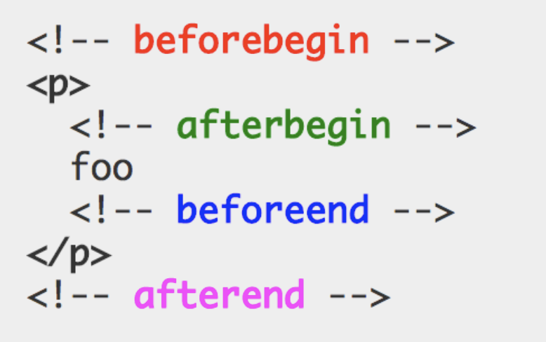

# [JavaScript] 39장 DOM (39.6)

# 39.6 DOM 조작

DOM 조작은 새로운 노드를 생성하여 DOM 에 추가하거나 기존 노드를 삭제 또는 교체하는 것을 말한다.

DOM 조작에 의해 DOM 에 새로운 노드가 추가되거나 삭제되면 리플로우와 리페인트가 발생하는 원인이 되므로 성능에 영향을 준다. 따라서 복잡한 컨텐츠를 다루는 DOM 조작은 성능 최적화를 위해 주의해서 다루어야 한다.

## 39.6.1 innerHTML

---

`Element.prototype.innerHTML` 프로퍼티는 setter 와 getter 모두 존재하는 접근자 프로퍼티로서 요소 노드의 HTML 마크업을 취득하거나 변경한다. 요소 노드의 `innerHTML` 프로퍼티를 참조하면 요소 노드의 컨텐츠 영역(시작태그와 종료태그 사이) 내에 포함된 모든 HTML 마크업을 문자열로 반환한다.

`textContent` 프로퍼티는 HTML 마크업을 무시하고 텍스트만 반환하지만 `innerHTML` 프로퍼티는 HTML 마크업이 포함된 문자열을 그대로 반환한다.

요소 노드의 `innerHTML` 프로퍼티에 문자열을 할당하면 요소 노드의 모든 자식 노드가 제거되고 할당한 문자열에 포함되어 있는 HTML 마크업이 파싱되어 요소 노드의 자식 노드로 DOM 에 반영된다. 그러나 `innerHTML` 을 이용한 DOM 조작은 크로스 사이트 스크립팅 공격에 취약하다는 단점도 존재한다.

<aside>
💻 **HTML 새니티제이션 (HTML sanitization)**

---

HTML 새니티제이션은 사용자로부터 입력받은 데이터에 의해 발생할 수 있는 크로스 사이트 스크립팅 공격을 예방하기 위해 잠재적 위험을 제거하는 기능을 말한다. 새니티제이션 함수를 직접 구현할 수도 있겠지만 `DOMPurify` 라이브러리를 사용하는 것을 권장한다.

DOMPurify 는 다음과 같이 잠재적 위험을 내포한 HTML 마크업을 새니티제이션(살균)하여 잠재적 위협을 제거한다.

```jsx
DOMPurify.sznitize('')
```

</aside>

`innerHTML` 프로퍼티의 또 다른 단점은 요소 노드의 `innerHTML` 프로퍼티에 HTML 마크업 문자열을 할당할 경우 기존의 모든 자식 노드를 제거하고 할당한 HTML 마크업 문자열을 파싱하여 DOM 을 변경한다는 것이다.

```jsx
$fruits.innerHTML += '<li class="banana">Banana</li>'

// $fruits.innerHTML = $fruits.innerHTML + '<li class="banana">Banana</li>' 의 축약표현
```

이렇게 할 경우 기존 자식 노드를 유지할 수 있다. 그러나 이는 그닥 효율적이지 않다.

뿐만 아니라 `innerHTML` 프로퍼티는 새로운 요소를 삽입할 때 삽입될 위치를 지정할 수 없다는 단점 또한 가지고 있다.

## 39.6.2 insertAdjacentHTML 메서드

---

`Element.prototype.insertAdjacentHTML(position, DOMString)` 메서드는 기존 요소를 제거하지 않으면서 위치를 지정해 새로운 요소를 삽입한다.

`inserAdjacentHTML` 메서드는 두번째 인수로 전달한 HTML 마크업 문자열(DOMString)을 파싱하고 그 결과로 생성된 노드를 첫번째 인수로 전달한 위치(position)에 삽입하여 DOM에 반영한다.
첫번째 인수로 전달할 수 있는 문자열은 `'beforebegin'`, `'afterbegin'`, `'beforeend'`, `afterend'` 4가지가 있다.



`inserAdjacentHTML` 메서드는 기존 요소에 영향을 주지 않고 새로 삽입될 요소만을 파싱하여 자식 요소로 추가하므로 `innerHTML 프로퍼티`보다 효율적이고 빠르다.

단, `innerHTML` 프로퍼티와 마찬가지로 `inserAdjacentHTML` 메서드는 HTML 마크업 문자열을 파싱하므로 크로스 사이트 스크립트 공격에 취약하다는 점은 동일하다.

## 39.6.3 노드 생성과 추가

---

지금까지 살펴본 `innerHTML` 프로퍼티와 `inserAdjacentHTML` 메서드는 HTML 마크업 문자열을 파싱하여 노드를 생성하고 DOM 에 반영한다. DOM 은 노드를 직접 생성/삽입/삭제/치환하는 메서드도 제공한다.

### 요소 노드 생성

`Document.prototype.createElement(tagName)` 메서드는 요소 노드를 생성하여 반환한다.

`createElement` 메서드의 매개변수 tagName 에는 태그 이름을 나타내는 문자열을 인수로 전달한다.

- 아래처럼 `createElement` 메서드로 생성한 요소 노드는 기존 DOM에 추가되지 않고 홀로 존재하는 상태가 된다.
    
    ```jsx
    // 요소 노드 생성
    const $li = document.createElement('li')
    ```
    
    즉, `createElement` 메서드는 요소 노드를 생성할 뿐 DOM 에 추가하지는 않는다.
    따라서 이후에 생성된 요소 노드를 DOM 에 추가하는 처리가 별도로 필요하다.
    
- 그리고 `createElement` 메서드로 생성한 요소 노드는 아무런 자식 노드를 가지고 있지 않다.
따라서 요소 노드의 자식 노드인 텍스트 노드도 없는 상태다.
    
    ```jsx
    console.log($li.childNodes) // NodeList []
    ```
    

### 텍스트 노드 생성

`Document.prototype.createTextNode(text)` 메서드는 텍스트 노드를 생성하여 반환한다.

`createTextNode` 메서드의 매개변수 text 에는 텍스트 노드의 값으로 사용할 문자열을 인수로 전달한다.

- 텍스트 노드는 요소 노드의 자식 노드이지만 `createTextNode` 메서드로 생성한 텍스트 노드는 홀로 존재하는 상태가 된다.
    
    ```jsx
    const textNode = document.createTextNode('Banana')
    ```
    
- 즉, `createElement` 메서드와 마찬가지로 `createTextNode` 메서드는 텍스트 노드를 요소 노드에 추가하는 처리가 별도로 필요하다.

### 텍스트 노드를 요소 노드의 자식 노드로 추가

`Node.prototypoe.appendChild(childNode)` 메서드는 매개변수 childNode 에게 인수로 전달한 노드를 `appendChild` 메서드를 호출한 노드의 마지막 자식 노드로 추가한다.

- `appendChild` 메서드의 인수로 `createTextNode` 메서드로 생성한 텍스트 노드를 전달하면 `appendChild` 메서드를 호출한 노드의 마지막 자식 노드로 텍스트 노드가 추가된다.
    
    ```jsx
    $li.appendChild(textNode) // 텍스트 노드를 $li 요소 노드의 마지막 자식 노드로 추가
    ```
    
    (그러나 $li 요소는 여전히 DOM 에 추가되지 않고 홀로 존재하는 상태)
    
- 그러나 위 예제처럼 요소 노드에 자식 노드가 하나도 없는 경우에는 텍스트 노드를 생성하여 요소 노드의 자식 노드로 텍스트 노드를 추가하는 것보다 `textContext` 프로퍼티를 사용하는 편이 더욱 간편하다.
    
    ```jsx
    $li.appendChild(document.createTextNode('Banana')
    
    $li.textContext = 'Banana'
    ```
    

### 요소 노드를 DOM에 추가

`Node.prototype.appendChild` 메서드를 사용하여 텍스트 노드와 부자 관계로 연결한 요소 노드를 부모 요소 노드의 마지막 자식 요소로 추가한다.

```jsx
$fruits.appendChild($li)
```

이 과정에서 비로소 새롭게 생성한 요소 노드가 DOM 에 추가된다. 기존의 DOM 에 요소 노드를 추가하는 처리는 이 과정 뿐이다.

위 예제는 단 하나의 요소 노드를 생성하여 DOM 에 한번 추가하므로 DOM 은 한번 변경된다.

이 때 리플로우와 리페인트가 실행된다.

## 39.6.4 복수의 노드 생성과 추가

---

복수의 요소 노드를 생성하여 DOM 에 여러번 추가하면 그만큼 여러번 DOM 이 변경되므로 성능이 많이 들고 그만큼 비효율적이므로 DOM 에 요소 노드를 반복적으로 추가하는 것은 좋지 않다.

**때문에 여러변 변경을 피하기 위해 컨테이너 요소를 만들고 한번만 추가하는 방식을 사용하는 것도 좋다.**

```jsx
const $fruits = document.getElementById('fruits')

// 컨테이너 요소 생성
const $container = document.createElement('div')

['Apple', 'Banana', 'Orange'].forEach(text => {
	// 1. 요소 노드 생성
	const $li = document.createElement('li')

	// 2. 텍스트 노드 생성
	const textNode = document.createTextNode(text)

	// 3. 텍스트 노드를 $li 요소 노드의 자식 노드로 추가
	$li.appendChild(textNode)

	// 4. $li 요소 노드를 컨테이너 요소의 마지막 자식 노드로 추가
	$container.appendChild($li)
})

// 5. 컨테이너 요소 노드를 $fruits 요소 노드의 마지막 자식 노드로 추가
$fruits.appendChild($container)
```

위 예제는 한번만 DOM 을 변경했지만 불필요한 div 요소를 추가했다는 부작용이 있다.

이 경우 `DocumentFragment` 노드를 통해 해결할 수 있다.

`DocumentFragment` 노드는 문서, 요소, 어트리뷰트, 텍스트 노드와 같은 노드 객체의 일종으로, 부모 노드가 없어서 기존 DOM 과는 별도로 존재한다는 특징이 있다. `DocumentFragment` 노드는 위 예제의 컨테이너 요소와 같이 자식 노드들의 부모 노드로서 별도으 ㅣ서브 DOM 을 구성하여 기존 DOM 에 추가하기 위한 용도로 사용한다.
(리액트의 `React.Fragment` 와 비슷한 것 같다)

## 39.6.5 노드 삽입

---

### 마지막 노드로 추가

`Node.prototype.appendChild` 메서드는 인수로 전달받은 노드를 자신을 호출한 노드의 마지막 자식 노드로 DOM 에 추가한다.

이 때 노드를 추가할 위치를 지정할 수 없고 언제나 마지막 자식 노드로 추가한다.

### 지정한 위치에 삽입

`Node.prototype.insertBefore(newNode, childNode)`  메서드는 첫번째 인수로 전달받은 노드를 두번째 인수로 전달받은 노드 앞에 삽입한다.

```jsx
// $li 요소 노드를 $fruits 요소 노드의 마지막 자식 요소 앞에 삽입
$fruits.insertBefore($li, $fruits.lastElementChild)
```

- 두번째 인수로 전달받은 노드는 반.드.시 `insertBefore` 메서드를 호출한 노드의 자식 노드여야 한다.
- 두번째 인수로 전달받은 노드가 null 이면 첫번째 인수로 전달받은 `insertBefore` 메서드를 호출한 노드의 마지막 자식 노드로 추가된다.
⇒ 즉 `appendChild` 메서드처럼 동작한다.

## 39.6.6 노드 이동

---

DOM 에 이미 존재하는 노드를 `appendChild` 또는 `insertBefore` 메서드를 사용하여 DOM 에 다시 추가하면 현재 위치에서 노드를 제거하고 새로운 위치에 노드를 추가한다.
즉, 노드가 이동한다.

```jsx
const $fruits = document.getElementById('fruits')

// 이미 존재하는 요소 노드를 취득
const [$apple, $banana, ] = $fruits.children

// 이미 존재하는 $apple 요소 노드를 $fruits 요소 노드의 마지막 노드로 이동
$fruits.appendChild($apple) // Banana - Orange - Apple

// 이미 존재하는 $banana 요소 노드를 $fruits 요소의 마지막 자식 노드 앞으로 이동
$fruits.insertBefore($banana, $fruits.lastElementChild) // Orange - Banana - Apple
```

## 39.6.7 노드 복사

---

`Node.prototype.cloneNode([deep: true | false])` 메서드는 노드의 사본을 생성하여 반환한다.

depp 에 true 를 인수로 전달하면 노드를 깊은 복사하여 모든 자손 노드가 포함된 사본을 생성하고,
false 를 인수로 전달하거나 생략하면 노드를 얕은 복사하여 노드 자신만의 사본을 생성한다.

얕은 복사로 생성된 요소 노드는 자손 노드를 복사하지 않으므로 텍스트 노드도 없다.

```jsx
const $fruits = document.getElementById('fruits')
const $apple = $fruits.firstElementChild

// $apple 요소를 얕은 복사하여 사본을 생성. 텍스트 노드가 없는 사본이 생성된다.
const $shallowClone = $apple.cloneNode()
// 사본 요소 노드에 텍스트 추가
$shallowClone.textContent = 'Banana'
// 사본 요소 노드를 $fruits 요소 노드의 마지막 노드로 추가
$fruits.appendChild($shallowClone)

// $fruits 요소를 깊은 복사하여 모든 자손 노드가 포함된 사본을 생성
const $deepClone = $fruits.cloneNode(true)
// tkqhs dyth shemfmf $ㄹ겨ㅑㅅㄴ dyth shemdml akwlakr shemfh cnrk
$fruits.appendChild($deepClone)
```

## 39.6.8 노드 교체

---

`Node.prototype.replaceChild(newChild, oldChild)` 메서드는 자신을 호출한 노드의 자식 노드를 다른 노드로 교체한다.

- 첫번째 매개변수 newChild 에는 교체할 새로운 노드를 인수로 전달하고,
- 두번째 매개변수 oldChild 에는 이미 존재하는 교체될 노드를 인수로 전달한다.
oldChild 매개변수에 인수로 전달한 노드는 `replaceChild` 메서드를 호출한 노드의 자식 노드여야 한다.

즉, `replaceChild` 메서드는 자신을 호출한 노드의 자식 노드인 oldChild 노드를 newChild 노드로 교체한다.
이때 oldChild 노드는 DOM 에서 제거된다.

```jsx
$fruits.appendChild($newChild, $fruits.firstElementChild)
```

## 39.6.9 노드 삭제

---

`Node.prototype.removeChild(child)` 메서드는 child 매개변수에 인수로 전달한 노드를 DOM 에서 삭제한다.

인수로 전달한 노드는 `removeChild` 메서드를 호출한 노드의 자식 노드여야 한다.

```jsx
$fruits.removeChild($fruits.lastElementChild)
```