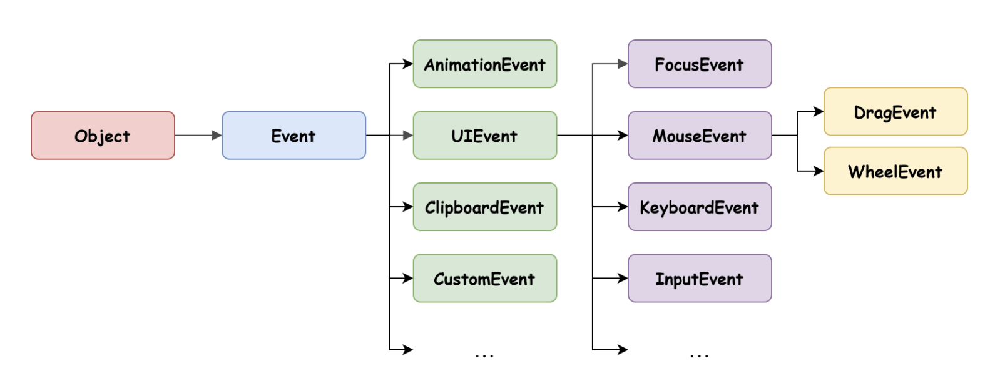

# [JavaScript] 40장 이벤트 (40.5 ~ 40.6)

# 40.5 이벤트 객체

이벤트가 발생하면 이벤트에 관련한 다양한 정보를 담고 있는 이벤트 객체가 동적으로 생성된다.
**생성된 이벤트 객체는 이벤트 핸들러의 첫 번째 인수로 전달된다.**

```jsx
function showCoords(e) {
	$msg.textContent = `clientX: ${e.clinetX}, clientY: ${e.clientY}`
}
```

클릭 이벤트에 의해 생성된 이벤트 객체는 이벤트 핸들러의 첫 번째 인수로 전달되어 매개변수 e 에 암묵적으로 할당된다.
이는 브라우저가 이벤트 핸들러를 호출할 때 이벤트 객체를 인수로 전달하기 때문이다.

이벤트 핸들러 어트리뷰트의 경우 이벤트 객체를 전달받으려면 첫 번째 매개변수 이름이 반드시 `event` 여야 한다.

```jsx
function onclick(event) {
	showCoords(event)
}
```

## 40.5.1 이벤트 객체의 상속 구조

---

이벤트가 발생하면 이벤트 타입에 따라 다양한 타입의 이벤트 객체가 생성된다.



위 그림의 `Event`, `UIEvent`, `MouseEvent` 등 모두는 생성자 함수다. 따라서 다음과 같이 생성자 함수를 호출하여 이벤트 객체를 생성할 수 있다.

```jsx
// Event 생성자 함수를 호출하여 foo 이벤트 타입의 Event 객체를 생성한다.
let e = new Event('foo')
console.log(e)
// Event {isTrusted: false, type: "foo", target: null, ...}

e = new FocusEvent('focus')
console.log(e)
// FocusEvent {isTrusted: false, relatedTarget: null, view: null, ...}
```

이처럼 이벤트가 발생하면 암묵적으로 생성되는 이벤트 객체도 생성자 함수에 의해 생성된다.
그리고 생성된 이벤트 객체는 생성자 함수와 더불어 생성되는 프로토타입으로 구성된 프로토타입 체인의 일원이 된다.

`**Event` 인터페이스는 DOM 내에서 발생한 이벤트에 의해 생성되는 이벤트 객체다.**

`Event` 인터페이스에는 모든 이벤트 객체의 공통 프로퍼티가 정의되어 있고 FocusEvent, MouseEvent, KeyboardEvent, WheelEvent 같은 하위 인터페이스에는 이벤트 타입에 따라 고유한 프로퍼티가 정의되어 있다.

## 40.5.2 이벤트 객체의 공통 프로퍼티

---

`Event` 인터페이스, 즉 `Event.prototype` 에 정의되어 있는 이벤트 관련 프로퍼티는 UIEvent, CustomEvent, MouseEvent 등 모든 파생 이벤트 객체에 상속된다. 즉, `Evnet` 인터페이스의 이벤트 관련 프로퍼티는 모든 이벤트 객체가 상속받는 공통 프로퍼티다.

| 공통 프로퍼티 | 설명 | 타입 |
| --- | --- | --- |
| type | 이벤트 타입 | string |
| target | 이벤트를 발생시킨 DOM 요소 | DOM 요소 노드 |
| currentTarget | 이벤트 핸들러가 바인딩된 DOM 요소 | DOM 요소 노드 |
| eventPhase | 이벤트 전파 단계
0: 이벤트 없음, 1: 캡처링 단계, 2: 타깃 단계: 3, 버블링 단계 | number |
| bubbles | 이벤트를 버블링으로 전파하는지 여부. 다음 이벤트는 bubbles: false 로 버블링하지 않는다.
- 포커스 이벤트 focus/blur
- 리소스 이벤트 load/unload/abort/error
- 마우스 이벤트 dblclick/mouseenter/mouseleave | boolean |
| defaultPrevented | preventDefault 메서드를 호출하여 이벤트를 취소했는지 여부 | boolean |
| isTrusted | 사용자의 행위에 의해 발생한 이벤트인지 여부.
예를 들어 click 메서드 또는 dispatchEvent 메서드를 통해 인위적으로 발생시킨 이벤트인 경우 isTrusted 는 false 다. | booelan |
| timeStamp | 이벤트가 발생한 시각(1970/01/01/00:00:00부터 경과한 밀리초) | number |

## 40.5.3 마우스 정보 취득

---

click, dblclick, mousedown, mouseup, mousemove, mouseenter, mouseleave 이벤트가 발생하면 생성되는 `MouseEvent` 타입의 이벤트 객체는 다음과 같은 고유의 프로퍼티를 갖는다.

- 마우스 포인터의 좌표 정보를 나타내는 프로퍼티
: screenX/Y, clientX/Y, pageX/Y, offsetX/Y
- 버튼 정보를 나타내는 프로퍼티
: altKey, ctrlKey, shiftKey, button

## 40.5.4 키보드 정보 취득

---

keydown, keyup, keypress 이벤트가 발생하면 생성되는 `KeyboardEvent` 타입의 이벤트 객체는 altKey, ctrlKey, shiftKey, metaKey, keyCode 같은 고유의 프로퍼티를 갖는다.

Keycode 프로퍼티는 폐지되었으므로 key 프로퍼티를 사용할 것을 권장한다.
자세한 내용은 여기서 

[KeyboardEvent.key - Web APIs | MDN](https://developer.mozilla.org/en-US/docs/Web/API/KeyboardEvent/key)

# 40.6 이벤트 전파

DOM 트리 상에 존재하는 DOM 요소 노드에서 발생한 이벤트는 DOM 트리를 통해 전파된다.
이를 **이벤트 전파(event propagation)**이라고 한다.

어떤 요소를 클릭하면 클릭이벤트가 발생하며, **이때 생성된 이벤트 객체는 이벤트를 발생시킨 DOM 요소인 이벤트 타깃(event target)을 중심으로 DOM 트리를 통해 전파된다.**
이벤트 전파는 이벤트 객체가 전파되는 방향에 따라 다음과 같이 3단계로 구분할 수 있다.


- 캡처링 단계(capturing pahse): 이벤트가 상위 요소에서 하위 요소 방향으로 전파
- 타깃 단계(target phase): 이벤트가 이벤트 타깃에 도달
- 버블링 단계(bubbling phase): 이벤트가 하위 요소에서 상위 요소 방향으로 전파

```html
<ul id="frtuis">
	<li id="apple">Apple</li>
	<li id="banana">Banana</li>
	<li id="orange">Orange</li>
</ul>
```

```jsx
const $fruits = document.getElementById('fruits')

// $fruits 요소의 하위 요소인 li 요소를 클릭한 경우
$fruits.addEventListener('click', e => {
	console.log(`이벤트 단계: ${e.eventPhase}`) // 3: 버블링 단계
	console.log(`이벤트 타깃: ${e.target}`) // [object HTMLLIElement]
	console.log(`커런트 타깃: ${e.currentTarget}`) // [object HTMLUListElement]
})
```

위의 예제는 Ul 요소에 이벤트 핸들러를 바인딩하고 ul 요소의 하위 요소인 li 요소를 클릭해서 이벤트를 발생시키는 경우다.
이 때 [event.target](http://event.target) 은 li 요소이고, event.currentTarget 은 ul 요소다.

li 요소를 클릭하면 클릭 이벤트가 발생하여 클릭 이벤트 객체가 생성되고 클릭된 li 요소가 이벤트 타깃이 된다.

- 이때 클릭 이벤트 객체는 window 에서 시작해 이벤트 타깃 방향으로 전파된다. 이것이 캡처링 단계다.
- 이후 이벤트 객체는 이벤트를 발생시킨 이벤트 타깃에 도달한다. 이것이 타깃 단계다.
- 이후 이벤트 객체는 이벤트 타깃에서 시작해 window 방향으로 전파된다. 이것이 버블링 단계다.

**이벤트 핸들러 어트리뷰트/프로퍼티 방식으로 등록한 이벤트는 타깃 단계와 버블링 단계의 이벤트만 캐치할 수 있다.**

**하지만 `addEventListener` 방식으로 등록한 이벤트 핸들러는 타깃/버블링 단계 뿐만 아니라 캡처링 단계의 이벤트도 선별적으로 캐치할 수 있다.**

→ 캡처링 단계의 이벤트를 캐치하려면, `addEventListener` 메서드의 3번째 인수로 true 를 전달해야 한다.
→ 3번째 인수를 생략하거나 false 를 전달하면 타깃/버블링 단계의 이벤트만 캐치할 수 있다.

```html
<ul id="frtuis">
	<li id="apple">Apple</li>
	<li id="banana">Banana</li>
	<li id="orange">Orange</li>
</ul>
```

```jsx
const $fruits = document.getElementById('fruits')
const $banana = document.getElementById('banana')

// $fruits 요소의 하위 요소인 li 요소를 클릭한 경우 캡처링 단계의 이벤트를 캐치한다.
$fruits.addEventListener('click', e => {
	console.log(`이벤트 단계: ${e.eventPhase}`) // 1: 캡처링 단계
	console.log(`이벤트 타깃: ${e.target}`) // [object HTMLLIElement]
	console.log(`커런트 타깃: ${e.currentTarget}`) // [object HTMLUListElement]
}, true)
// 타깃 단계의 이벤트를 캐치한다.
$banana.addEventListener('click', e => {
	console.log(`이벤트 단계: ${e.eventPhase}`) // 2: 타깃 단계
	console.log(`이벤트 타깃: ${e.target}`) // [object HTMLLIElement]
	console.log(`커런트 타깃: ${e.currentTarget}`) // [object HTMLUListElement]
})
// 버블링 단계의 이벤트를 캐치한다.
$fruits.addEventListener('click', e => {
	console.log(`이벤트 단계: ${e.eventPhase}`) // 3: 버블링 단계
	console.log(`이벤트 타깃: ${e.target}`) // [object HTMLLIElement]
	console.log(`커런트 타깃: ${e.currentTarget}`) // [object HTMLUListElement]
})
```

**이처럼 이벤트는 이벤트를 발생시킨 이벤트 타깃은 물론 상위 DOM 요소에서도 캐치할 수 있다.**

즉, DOM 트리를 통해 전파되는 이벤트는 이벤트 패스(event path, 이벤트가 통과하는 DOM 트리 상의 경로, Event.prototype.composedPath 메서드로도 확인 가능)에 위치한 모든 DOM 요소에서 캐치할 수 있다.

대부분의 이벤트는 캡처링/버블링을 통해 전파된다. 하지만 다음 이벤트는 버블링을 통해 전파되지 않는다.
이 이벤트들은 버블링을 통해 이벤트는 전파하는지 여부를 나타내는 이벤트 객체의 공통 프로퍼티 `event.bubbles` 값이 모두 false 다.

- 포커스 이벤트: focus/blur
- 리소스 이벤트: load/unload/abort/error
- 마우스 이벤트: mouseenter/mouseleave

위 이벤트는 버블링되지 않으므로 이벤트 타깃의 상위 요소에서 위 이벤트를 캐치하려면 캡처링 단계의 이벤트를 캐치해야 한다.