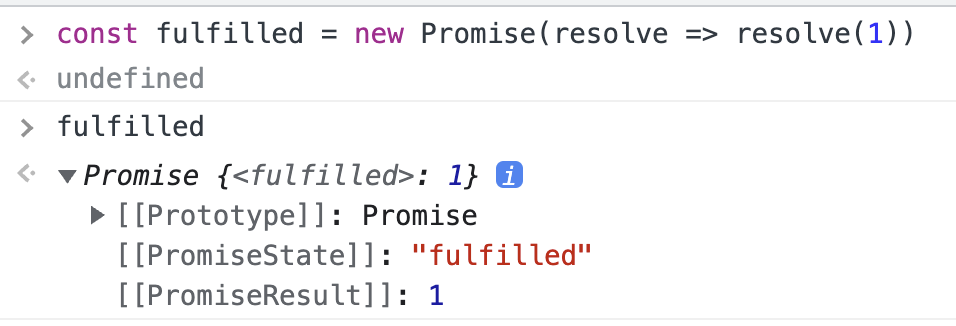

# [JavaScript] 45장 프로미스

자바스크립트는 비동기 처리를 위한 하나의 패턴으로 콜백 함수를 사용하지만, 콜백 패턴은 콜백 지옥으로 인해 가독성이 나쁘고 에러 처리가 곤란하여 여러개의 비동기 처리를 한번에 하는데 한계가 있다.

ES6 에서는 비동기 처리를 위한 또 다른 패턴으로 프로미스(Promise)를 도입했다.

# 45.1 비동기 처리를 위한 콜백 패턴의 단점

## 45.1.1 콜백 헬

---

```jsx
let todos

// GET 요청을 위한 비동기 함수
cnost get = url => {
	cnost xhr = new XMLHttpRequest()
	xhr.open('GET', url)
	xhr.send()

	xhr.onload = () => {
		if (xhr.status === 200) {
			// 1) 서버의 응답을 상위 스코프의 변수에 할당한다.
			todos = JSON.parse(xhr.response)
		} else {
			console.error(`${xhr.status} ${xhr.statusText}`)
		}
	}
}

// id 가 1인 post 를 취득
get('http://....')
console.log(todos) // 2) undefined
```

이는 기대되로 동작하지 않는다. xhr.onload 이벤트 핸들러 프로퍼티에 바인딩한 이벤트 핸들러는 언제나 `2) console.log` 가 종료한 이후에 호출된다. 따라서 2) 의 시점에는 아직 전역 변수 todos 에 서버의 응답 겨로가가 할당되기 이전이다.

**왜냐하면 xhr.onload 이벤트 핸들러는 load 이벤트가 발생하면 일단 태스크 큐에 저장되어 대기하다가, 콜 스택이 비면 루프에 의해 콜 스택으로 푸시되어 실행한다.** 따라서 xhr.onload 이벤트 핸들러가 실행되는 시점은 콜 스택이 빈 상태여야 하므로 2) console.log 가 이미 종료된 이후다. 따라서 todos 는 undefined 가 된다.

**이처럼 비동기 함수는 비동기 처리 결과를 외부에 반환할 수 없고, 상위 스코프의 변수에 할당할 수도 없다.
따라서 비동기 함수으 ㅣ처리 결과에 대한 후속 처리는 비동기 함수 내부에서 수행해야 한다.**
이떄 비동기 함수를 범용적으로 사용하기 위해 비동기 함수에 비동기 처리 결과에 대한 후속 처리를 수행하는 콜백함수를 전달하는 것이 일반적이다.
필요에 따라 비동기 처리가 성공하면 호출될 콜백함수와 실패시 호출될 콜백함수를 전달할 수 있다.

그런데 이처럼 콜백이 계속 중첩되다보면 복잡도가 높아지고 가독성은 떨어지는 콜백 지옥이 펼쳐진다.

## 45.1.2 에러 처리의 한계

---

비동기 처리를 위한 콜백 패턴의 가장 큰 문제점은 에러 처리가 곤란하다는 것이다.

```jsx
try {
	setTimeout(() => { throw new Error('Error!') }, 1000)
} catch(e) {
	console.error('캐치한 에러', e)
}
```

그런데 위 코드는 try 블록 내에서 발생한 에러를 catch 코드 블록내에서 캐치해내지 못한다.

왜냐면 비동기 함수인 setTimeout 이 호출되면 실행 컨텍스트가 생성되어 콜스택에 푸시되어 실행되지만, 비동기 콜백의 호출을 기다리지 않고 콜스택에서 팝되어 제거된다. 이후 타이머가 완료되어 setTImeout 의 콜백이 태스크 큐로 푸시되고 콜스택이 비어졌을 때 이벤트 루프에 의해 콜 스택으로 푸시되어 실행된다.

# 45.2 프로미스의 생성

`Promise` 생성자 함수를 new 연산자와 함께 호출하면 프로미스(Promise 객체)를 생성한다. ES6 dptj ehdlqehls `Promise` 는 호스트 객체가 아닌 ECMAScript 사양에 정의된 표준 빌트인 객체다.

`Promise` 생성자 함수는 비동기 처리를 수행할 콜백 함수(ECMAScript 사양에서는 `executor` 함수라고 부름)를 인수로 전달받는데 이 콜백함수는 `resolve` 와 `reject` 함수를 인수로 전달받음

```jsx
// 프로미스 생성
const promise = new Promise((resolve, reject) => {
	// Promise 함수의 콜백 함수 내부에서 비동기 처리를 수행한다.
	if (/* 비동기 처리 성공 */) {
		resolve('result')
	} else { /* 비동기 처리 실패 */
		reject('failure reason')
	}
})
```

`Promise` 생성자 함수가 인수로 전달받은 콜백 함수 내부에서 비동기 처리를 수행한다.
이떄 비동기 처리가 성공하면 콜백 함수의 인수로 전달받은 resolve 함수를 호출하고, 실패하면 reject 함수를 호출한다.
이를 적용하면 아래와 같다.

```jsx
// GET 요청을 위한 비동기 함수
const promiseGet = url => {
	return new Promise((resolve, reject) => {
		const xhr = new XMLHttpRequest()
		xhr.open('GET', url)
		xhr.send()

		xhr.onload = () => {
			if (xhr.status === 200) {
				resolve(JSON.parse(xhr.response))
			} else {
				reject(new Error(xhr.status))
			}
		}
	})
}

// promiseGet 함수는 프로미스를 반환한다.
promiseGet('http://....')
```

비동기 함수는 promiseGet 은 함수 내부에서 프로미스를 생성하고 반환한다.
비동기 처리는 `Promise` 생성자 함수가 인수로 전달받은 콜백 함수 내부에서 수행한다.
만약 비동기 처리가 성공하면 비동기 처리 결과를 resolve 함수에 인수로 전달하면서 호출하고, 실패시 에러를 reject 함수에 인수로 전달하면서 호출한다.

- pending: 비동기 처리가 아직 수행되지 않은 상태
- 비동기 처리 성공: resolve 함수를 호출해 프로미스를 fulfilled 상태로 변경한다.
- 비동기 처리 실패: reject 함수를 호출해 프로미스를 rejected 상태로 변경한다.

> **비동기 처리 fulfilled & rejected**
> 
> 
> ---
> 
> 
> 
> 비동기 처리가 성공하면 프로미스는 pending 상태에서 fulfilled 상태로 변화한다. 그리고 비동기 처리 결과인 1을 값으로 갖는다.
> 
> 
> 
> 비동기 처리가 실패하면 프로미스는 pending 상태에서 rejected 상태로 변화한다. 그리고 비동기 처리 결과인 Error 객체를 값으로 갖는다.
> 
> **즉, 프로미스는 비동기 처리 상태와 처리 결과를 관리하는 객체다**
> 

# 45.3 프로미스의 후속 처리 메서드

**프로미스의 비동기 처리 상태가 변화하면 후속 처리 메서드에 인수로 전달한 콜백함수가 선택적으로 호출된다.** 이때 후속 처리 메서드의 콜백 함수에 프로미스의 처리 결과가 인수로 전달된다.

모든 후속 처리 메서드는 프로미스를 반환하며, 비동기로 동작한다. 프로미스의 후속 처리 메서드는 다음과 같다.

## 45.3.1 Promise.prototype.then

---

`then` 메서드는 두개의 콜백 함수를 인수로 전달받는다

1. 첫번째 콜백 함수는 프로미스가 fulfilled 상태(resolve 함수가 호출된 상태)가 되면 호출된다. 이떄 콜백 함수는 프로미스의 비동기 처리 결과를 인수로 전달받는다
2. 두번째 콜백함수는 프로미스가 rejected 상태(rejected 함수가 호출된 상태)가 되면 호출된다. 이때 콜백 함수는 프로미스의 에러를 인수로 전달받는다.

```jsx
// fulfilled
new Promise(resolve => resolve('fulfilled'))
	.then(v => console.log(v), e => console.error(e)) // fulfilled

// rejected
new Promise((_, reject) => reject(new Error('rejected')))
	.then(v => console.log(v), e => console.error(e)) // Error: rejected
```

`then` 메서드는 언제나 프로미스를 반환한다. 만약 `then` 메서드의 콜백 함수가 프로미스를 반환하면 그 프로미스를 그대로 반환하고, 콜백 함수가 프로미스가 아닌 값을 반환하면 그 값을 암묵적으로 resolve 또는 reject 하여 프로미스를 생성해 반환한다.

## 45.3.2 Promise.prototype.catch

---

`catch` 메서드는 한개의 콜백 함수를 인수로 전달받는다. `catch` 메서드의 콜백 함수는 프로미스가 rejected 상태인 경우만 호출된다.

```jsx
// rejected
new Promise((_, reject) => reject(new Error('rejected')))
	.catch(e => console.log(e)) // Error: rejected
```

`catch` 메서드는 then(undefined, onRejected)과 동일하게 동작한다. 따라서 `then` 메서드와 마찬가지로 언제나 프로미스를 반환한다.

## 45.3.3 Promise.prototype.finally

---

`finally` 메서드는 한 개의 콜백 함수를 인수로 전달받는다. `finally` 메서드의 콜백 함수는 프로미스의 성공 또는 실패와 상관 없이 무조건 하번 호출된다.

`finally` 메서드는 프로미스의 상태와 상관없이 공통적으로 수행해야 할 처리 내용이 있을 때 유용하다. `finally` 메서드도 then/catch 메서드와 마찬가지로 언제나 프로미스를 반환한다.

```jsx
new Promise(() => {})
	.finally(() => console.log('finally')) // finally
```

# 45.4 프로미스의 에러 처리

45.1.2절 “에러 처리의 한계에서 살펴보았듯이 비동기 처리를 위한 콜백 페턴은 에러 처리가 곤란하다는 문제가 있다. 프로미스는 에러를 문제없이 처리할 수 있다.

```jsx
const wrongUrl = 'http://wrong'

promiseGet(wrongUrl)
	.then(res => console.log(res), err => console.error(err))

또는

promiseGet(wrongUrl)
	.then(res => console.log(res))
	.catch(err => console.error(err))
```

then 메서드의 두번쨰 인자로 catch 구문을 넣을 수 있지만, 가독성이 떨어진다.

그러나 catch 메서드를 모든 then 메서드 호출 이후에 호출하면 비동기 처리에서 발생한 에러 뿐만 아니라 then 메서드 내부에서 발생한 에러까지 모두 캐치할 수 있다.

# 45.5 프로미스 체이닝

프로미스 이후 then → then → catch → finally 등으로 메서드를 연속적으로 호출하는 것을 프로미스 체이닝이라 한다.

프로미스는 프로미스 체이닝을 통해 비동기 처리 결과를 전달받아 후속 처리를 하므로 비동기 처리를 위한 콜백 패턴에서 콜백 헬이 발생하지 않는다. 그러나 프로미스도 콜백 패턴을 사용하긴 한다.

콜백 패턴은 가독성이 좋지 않아 ES8 에서 도입된 `async/awiat` 패턴을 통해 해결할 수 있다. `async/awiat` 를 사용하면 프로미스의 후속 처리 메서드 없이 마치 동기 처리처럼 프로미스가 처리 결과를 반환하도록 구현할 수 있다.

# 45.6 프로미스의 정적 메서드

`Promise` 는 주로 생성자 함수로 사용되지만 함수도 객체이므로 메서드를 가질 수 있다.

## 45.6.1 Promise.resolve / Promise.reject

---

`Promise.resolve` 와 `Promise.reject` 메서드는 이미 존재하는 값을 래핑하여 프로미스를 생성하기 위해 사용한다.

`Promise.resolve` 메서드는 인수로 전달받은 값을 resolve 하는 프로미스를 생성한다.

```jsx
// 배열을 resolve 하는 프로미스를 생성
const resolvedPromise = Promise.resolve([1, 2, 3])
resolvedPromise.then(console.log) // [1, 2, 3]
```

위 예제는 다음과 예제와 동일하게 동작한다.

```jsx
const resolvedPromise = new Promise(resolve => resolve([1, 2, 3]))
resolvedPromise.then(console.log) // [1, 2, 3]
```

```jsx
// 에러 객체를 reject 하는 프로미스를 생성
const rejectedPromise = Promise.reject(new Error('Error!'))
rejectedPromise.catch(console.log) // Error: Error!
```

위 에제는 다음의 예제와 동일하게 동작한다.

```jsx
const rejectedPromise = new Promise((_, reject) => reject(new Error('Error!')))
rejectedPromise.catch(console.log) // Error: Error!
```

## 45.6.2 Promise.all

---

`Promise.all` 메서드는 여러 개의 비동기 처리를 모두 병렬(parallel)처리할 때 사용한다.

```jsx
const requestData1 = () => new Promise(resolve => setTimout(() => resolve(1), 3000))
const requestData2 = () => new Promise(resolve => setTimeout(() => resolve(2), 2000))
const requestData3 = () => new Promise(resolve => setTimout(() => resolve(3), 1000))

// 세 개의 비동기 처리를 순차적으로 처리
const res = []
requestData1()
	.then(data => {
		res.push(data)
		return requestData2()
	})
	.then(data => {
		res.push(data)
		return requestData3()
	})
	.then(data => {
		res.push(data)
		console.log(res) // [1, 2, 3]
	})
	.catch(console.error) 
```

위 예제는 세 개의 비동기 처리를 순차적으로 처리한다. 그런데 뒤 예제의 경우 비동기 처리는 서로 의존하지 않고 개별적으로 수행된다. 즉, 앞선 비동기 처리 결과를 다음 비동기 처리가 사용하지 않는다. 따라서 위 예제의 경우 세 개의 비동기 처리를 순차적으로 처리할 필요가 없다.

⇒ 이떄 `Promise.all` 메서드는 여러 개의 비동기 처리를 모두 병렬 처리할 때 사용한다

```jsx
const requestData1 = () => new Promise(resolve => setTimout(() => resolve(1), 3000))
const requestData2 = () => new Promise(resolve => setTimeout(() => resolve(2), 2000))
const requestData3 = () => new Promise(resolve => setTimout(() => resolve(3), 1000))

// 세 개의 비동기 처리를 병렬로 처리
Promise.all([requestData1(), requestData2(), requestData3()])
	.then(console.log) // [1, 2, 3] 약 3초 소요
	.catch(console.error)
```

`**Promise.all` 메서드는 프로미스를 요소로 갖는 배열 등의 이터러블을 인수로 저달받는다. 그리고 전달받은 모든 프로미스가 모두 fulfilled 상태가 되면 모든 처리 결과를 배열에 저장해 새로운 프로미스를 반환한다.**

또한 인수로 전달받은 배열의 프로미스가 하나라도 rejected 상태가 되면 나머지 프로미스가 fulfilled 상태가 되는 것을 기다리지 않고 즉시 종료한다.

```jsx
Promise.all([
	1, // Promise.resolve(1)
	2, // Promise.resolve(2)
	3 // Promise.resolve(3)
])
	.then(console.log( // [1, 2, 3]
	.catch(console.log)
```

`Promise.all` 메서드는 인수로 전달받은 이터러블의 요소가 프로미스가 아닌 경우 `Promise.resolve` 메서드를 통해 프로미스로 래핑한다.

## 45.6.3 Promise.race

---

`Promise.race` 메서드는 `Promise.all` 메서드와 동일하게 프로미스를 요소로 갖는 배열 등의 이터러블을 인수로 전달받는다.

`Promise.race` 메서드는 `Promise.all` 메서드처럼 모든 fulfilled 상태가 되는 것을 기다리지 않고, 먼저 fulfilled 상태가 된 프로미스의 처리 결과를 resolve 하는 새로운 프로미스를 반환한다.

```jsx
Promise.race([
	new Promise(resolve => setTimeout(() => resolve(1), 3000)), // 1
	new Promise(resolve => setTimeout(() => resolve(2), 2000)), // 2
	new Promise(resolve => setTimeout(() => resolve(3), 1000)), // 3
])
	.then(console.log) // 3
	.catch(console.log)
```

프로미스가 rejected 상태가 되면 `Promise.all` 메서드와 동일하게 처리된다.

즉, `Promise.race` 메서드는 전달된 프로미스가 하나라도 rejected 상태가 되면 에러를 reject 하는 새로운 프로미스를 즉시 반환한다.

## 45.6.4 Promise.allSettled

---

`Promise.allSettled` 메서드는 프로미스를 요소로 갖는 배열 등의 이터러블을 인수로 전달받는다. 그리고 전달받은 프로미스가 모두 settled상태(비동기 처리가 수행된 상태, fulfilled 또는 rejected)가 되면 처리 결과를 배열로 반환한다.
ES11 에 도입된 `Promise.allSettled` 메서드는IE를 제외한 대부분의 모던 브라우저에서 지원한다.

```jsx
Promise.allSettled([
	new Promise(resolve => setTimeout(() => resolve(1), 2000)),
	new Promise((_, reject) => setTimeout(() => reject(new Error('Error!')), 1000))
]).then(console.log)
/*
	{status: "fulfilled", value: 1},
	{status: "rejected", reason: Error: Error! at <anonymous>:3.54}
*/
```

`Promise.allSettled` 메서드가 봔한한 배열에는 fulfilled 또는 rejected 상태와는 상관없는 `Promise.allSettled` 메서드가 인수로 전달받은 모든 프로미스들의 처리 결과가 모두 담겨있다.

- 프로미스가 fulfilled 상태인 경우 비동기 처리 상태를 나타내는 Status 프로퍼티와 처리 결과를 나타내는 value 프로퍼티를 갖는다
- 프로미스가 rejected 상태인 경우 비동기 처리 상태를 나타내는 status 프로퍼티와 에러를 나타내는 reason 프로퍼티를 갖는다.

## 45.7 마이크로태스크 큐

---

```jsx
setTimtout(() => console.log(1), 0)

Promise.resolve()
	.then(() => console.log(2))
	.then(() => console.log(3))
```

프로미스의 후속 처리 메서드도 비동기로 동작하므로 1 → 2 → 3의 순으로 출력될 것처럼 보이지만 2 → 3 → 1의 순으로 출력된다.
그 이유는 프로미스의 후속 처리 메서드의 콜백 함수는 태스크 큐가 아니라 마이크로태스크 큐에 저장되기 때문이다.

마이크로태스크 큐는 태스크 큐와는 별도의 큐다. 마이크로태스크 큐에는 프로미스의 후속 처리 메서드의 콜백 함수가 일시 저장된다. 그 외의 비동기 함수의 콜백 함수나 이벤트 핸들러는 태스크 큐에 일시 저장된다.

콜백 함수나 이벤트 핸들러를 일시 저장한다는 점에서 태스크 큐와 동일하지만 **마이크로태스크 큐는 태스크 큐보다 우선순위가 높다.**

즉, 이벤트 루프는 콜 스택이 비면 먼저 마이크로태스크 큐에서 대기하고 있는 함수를 가져와 실행한다. 이후 마이크로태스크 큐가 비면 태스크 큐에서 대기하고 있는 함수를 가져와 실행한다.

## 45.8 fetch

---

fetch 함수는 XMLHttpRequest 객체와 마찬가지로 HTTP 요청 전송 기능을 제공하는 클라이언트 사이드 Web API다. fetch 함수는 XMLHttpRequest 객체보다 사용법이 간단하고 프로미스를 지원하기 때문에 비동기 처리를 위한 콜백 패턴의 단점에서 자유롭다. fetch 함수는 인터넷 익스플로러를 제외한 대부분의 모던 브라우저에서 제공한다.

fetch 함수에는 HTTP 요청을 전송할 URL과 HTTP 요청 메서드, HTTP 요청 헤더, 페이로드 등을 설정한 객체를 전달한다.

```jsx
const promise = fetch(url [, options])
```

**fetch 함수는 HTTP 응답을 나타내는 Response 객체를 래핑한 Promise 객체를 반환한다.**

`Response.ptototype` 에는 Response 객체에 포함되어 있는 HTTP 응답 몸체를 위한 다양한 메서드를 제공한다.

### fetch 함수 사용시 주의점

```jsx
const wrongUrl = 'http://wrong'

// 부적절한 URL 이 지정되었기 때문에 404 Not Found 에러가 발생한다.
	.then(() => console.log('ok'))
	.catch(() => console.log('error'))
```

부적절한 URL 이 지정되었기 때문에 404 Not Found 에러가 발생하고 catch 후속 처리 메서드가 실행될 것처럼 보이지만 콘솔에는 ‘ok’가 출력된다.

**fetch 함수가 반환하는 프로미스는 기본적으로 404 Not Found 나 500 Interval Server Error 와 같은 HTTP 에러가 발생해도 에러를 reject 하지 않고 불리언 타입의 ok 상태를 false 로 설정한 Response 객체를 resolve 한다. 오프라인 등의 네트워크 장애나 CORS 에러에 의해 요청이 완료되지 못한 경우에만 프로미스를 reject 한다**

따라서 fetch 함수를 사용할 때는 다음과 같이 fetch 함수가 반환한 프로미스가 resolve 한 불리언 타입의 ok 상태를 확인해 명시적으로 에러를 처리할 필요가 있다.

```jsx
const wrongUrl = 'http://wrong'

fetch(wrongUrl)
	.then(res => {
		if (!res.ok) throw new Error(res.statusText)
		return res.json()
	})
	.then(todo => console.log(todo))
	.catch(err => console.error(err))
```

참고로 `axios` 는 모든 HTTP 에러를 reject 하는 프로미스를 반환한다. 따라서 모든 에러를 catch 에서 처리할 수 있어 편리하다